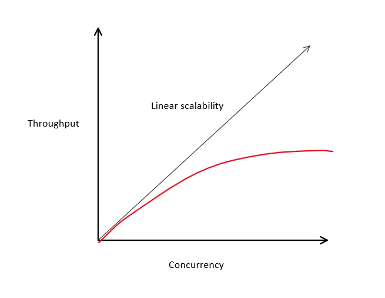

> [Based on this CognitiveClass learning path](https://cognitiveclass.ai/learn/reactive-architecture-advanced)

# Building Scalable Systems

> We should look at how we solve problems in the real world as this will provide us with inspiration for solving software problems

## Consistency, Availability, Scalability

- A system is considered scalable if it can meet an increase in demand while remaining responsive
- A system is consistent if all members have the same view or state
- A system remains available if it can continue to respond despite some failure

## Performance vs Scalability

- Related but different
- Performance optimizes response time per request
- Scalability optimizes the ability to handle many requests at the same time

To identify what's being measured you can use the following:

-  x/second - both
-  x at once - scalability
-  time per x - performance

Scalability has no theoretical limit whereas performance has a lower limit, when building reactive systems we choose to focus on scalability more than performance

## Consistency

In distributed systems a common issue we end up with is two parts of the systems disagreeing on a specific piece of information or state. Ther are a few different ways we can approach resolving this issue:

- Embed additional information/metadata such as a timestep
- Add another observer and make use of a vote
- Always assume a specific observer/node is correct/incorrect

### The Problem wit Distributed Systems

- Separated by space
- Physics has an upper limit on speed
- There is a time required to reach consensus
  - In this time, state may have changed

Due to the aboce, we end up in a case where the receiver of information is always dealing with stale data. Due to this we focus on using eventual consistency

### Eventual Consistency

> Eventual consistency gaurantees that, in the absence of new updates, all access to a specific piece of data will eventually return the most recent value

Types of consistency:

- Eventual Consistency
- Causal Consistency
- Sequentually Consistency
- (others)

Monolithic systems are based on **Strong Consistency** and not eventual

Each of the above models has a set of tradeoffs

### Strong Consistency

> Strong consistency means that an update to a piece of data needs an agreement from all nodes before it becomes visible

Distributed systems _can_ provide strong consistency

- Physics prevents strong consistency, so we implement mechanisms to simulate it
- Tie a distributed problem to a non-distributed resource
- Can be the source of contention in a distributed system

A lock is a way we can do this, we introduce a non-distributed element to our system and changes must go through the lock

## Contention

- Any two things that contend for a resource are in competition
- Others must wait for a winner in contention
- As the number of things in competing increases, the time to free up resources increase
- As load increases, operation time increases

> Amdahl's law states that the max improvement gained by parallel processing is limited by contention thereby limiting our overall throughput

- Improvements are limited to code that can be parallelized
- Contention limits parallelization and therefore reduces improvements

If we keep increasing we may see diminishing returns on parallelization

### Effect of Coherency Delay

- In a distributed system, synchronizing state is done using crosstalk or gossip
- Each node in a system sends messages to each other node informing them of any state change
- Cohernecy delay is the amount of time it takes for synchronization to complete
- Increasing the number of nodes increases the coherency delay increases

> Gunther's universal scalabiity lay builds on Amdahl's law and states that increasing concurrency can have negative returns due to contention and coherency delay

- Accounts for coherency delay
- Coherency delay results in negative returns
- As the system scales up, coordination between nodes exceeds any benefits

### Laws of Scalability

- Amdahl's Law and Gunther's Law show that linear scalability is usually not possible
- Linear scalability requires statelessness and isolation
- Reactive systems understand these limitations and try to minimize the impact

- Reduce contention by:  
  - Isolate locks
  - Elminate transactions
  - Avoid blocking operations
- Mitigate coherency delays:
  - Embrace eventual consistency
  - Build autonomy

The goal is to reduce things that prevent scalability

## CAP Theorem

- Distributed systems must account for this
- A distributed system cannot provide more than two of:
  - **C**onsistency
  - **A**vailability
  - **P**artition Tolerance

Distributed systems have to pick between CP or AP. For a system to be CA that implies that the system is not distributed as it does not need to be partition tolerant

### Partition Tolerance

> System continues to operate despite an arbitrary number of messages being dropped by the network

- No distributed system is safe from partitions
- Can occur due to network
- Occur when a node goes down
- Can be short of long-lived
- CAP is about what happens when a partition occurs

### Dealing with Partitions

When a partition occurs a distributed system has two options:

- AP - sacrifice consistency, allow wrties to both sides of the partition, when resolved you will need to merge data
- CP - sacrifice availability, disable or terminate one side of the partition, during the partition some or all data will be unavailable

