# Machine Learning with Python

[Based on this Cognitive Class Course](https://cognitiveclass.ai/courses/machine-learning-with-python/)

## Labs

The Labs for the course are located in the `Labs` folder are from CognitiveClass and are licensed under MIT

## Intro to ML

Machine learning is a field of computer science that gives computers the ability to learn without being explicitly progammed

Some popular techniques are:

- *Regression* for predicting continuous values
- *Classification* for predicting a class/category
- *Clustering* for finding structure of data and summarization
- *Associations* for finding items/events that co-occur
- *Anomaly detection* is used for finding abnormal/unusual cases
- *Sequence mining* is for predicting next values
- *Dimension reduction* for reducing the size of data
- *Recommendation systems*

We have a few different buzzwords

- AI
    - Computer Vision
    - Language processing
    - Creativity
- Machine learning
    - Field of AI
    - Experience based
    - Classification
    - Clustering
    - Neural Networks
- Deep Learning
    - Specialized case of ML
    - More automation than most ML

### Python for Machine Learning

Python has many different libraries for machine learning such as

- NumPy
- SciPy
- Matplotlib
- Pandas
- Scikit Learn
 
### Supervised vs Unsupervised

Supervised learning involves us supervising a machine learning model. We do this by teaching the model with a labelled dataset

There are two types of supervised learning, namely Classification and Regression

Unsupervised learning is when the model works on its own to discover information about data using techniques such as Dimension Reduction, Density Estimation, Market Basket Analysis, and Clustering


- Supervised
    - Classification
    - Regression
    - More evaluation methods
    - Controlled environment
- Unsupervised
     - Clustering
     - Fewer evaluation methods
     - Less controlled environment
 

## Regression

Regression makes use of two different variables

- Dependent - Predictors $X$
- Independent - Target $Y$

With Regression our $X$ values need to be continuous, but the $Y$ values can be either continuous, discrete, or categorical

There are two types of regression:

- Simple Regression
    - Simple Linear Regression
    - Simple Non-Linear Regression
    - Single $X$
- Multiple Regression
    - Multiple Linear Regression
    - Multiple Non-Linear Regression
    - Multiple $X$

Regression is used when we have continuous data and is well suited to predicting  continuous data

There are many regression algorithms such as

- Ordinal regression
- Poisson regression
- Fast forest quartile regression
- Linear, polynomial, lasso, stepwise, and ridge regression
- Bayesian linear regression
- Neural network regression
- Decision forest regression
- Boosted decision tree regression
- K nearest neighbors (KNN)

Each of which are better suited to some circumstances than to others

### Simple Linear Regression

In SLR we have two variables, one dependent, and one independent. The target variable ($y$) can be either be continuous or categorical, but the predictor ($x$) must be continuous

To get a better idea of whether SLR is appropriate we can simply do a plot of $x$ vs $y$ and find the line which will be the best fit for the data

The line is represented by the following equation

$$
y=\theta_0+\theta_1x_1
$$

The aim of SLE is to adjust the $\theta$ values to minimize the residual error in our data and find the best fit

$$
MSE=\frac{1}{n}\Sigma_{i=1}^n(y_i-\hat y_i)^2
$$

#### Estimating Parameters

We have two options to estimate our parameters, given an SLR problem

Estimate $\theta_0$ and $\theta_1$ using the following equations

$$
\theta_1 = \frac{\Sigma_{i=1}^n(x_i-\bar x)(y_i-\bar y)}{\Sigma_{i=1}^n(x_i-\bar x)^2}
$$

$$
\theta_0=\bar y-\theta_1\bar x
$$

We can use these values to make predictions with the equation

$$
\hat y=\theta_0+\theta_1x_1
$$

#### Pros

- Fast
- Easy to Understand
- No tuning needed

#### Lab
##### Import Necessary Libraries


```python
%reset -f
import pandas as pd
import matplotlib.pyplot as plt
import pandas as pd
import pylab as pl
import numpy as np
%matplotlib inline
```

##### Import Data


```python
df = pd.read_csv('https://s3-api.us-geo.objectstorage.softlayer.net/cf-courses-data/CognitiveClass/ML0101ENv3/labs/FuelConsumptionCo2.csv')
df.head()
```


<div>
<style scoped>
    .dataframe tbody tr th:only-of-type {
        vertical-align: middle;
    }

    .dataframe tbody tr th {
        vertical-align: top;
    }

    .dataframe thead th {
        text-align: right;
    }
</style>
<table border="1" class="dataframe">
  <thead>
    <tr style="text-align: right;">
      <th></th>
      <th>MODELYEAR</th>
      <th>MAKE</th>
      <th>MODEL</th>
      <th>VEHICLECLASS</th>
      <th>ENGINESIZE</th>
      <th>CYLINDERS</th>
      <th>TRANSMISSION</th>
      <th>FUELTYPE</th>
      <th>FUELCONSUMPTION_CITY</th>
      <th>FUELCONSUMPTION_HWY</th>
      <th>FUELCONSUMPTION_COMB</th>
      <th>FUELCONSUMPTION_COMB_MPG</th>
      <th>CO2EMISSIONS</th>
    </tr>
  </thead>
  <tbody>
    <tr>
      <th>0</th>
      <td>2014</td>
      <td>ACURA</td>
      <td>ILX</td>
      <td>COMPACT</td>
      <td>2.0</td>
      <td>4</td>
      <td>AS5</td>
      <td>Z</td>
      <td>9.9</td>
      <td>6.7</td>
      <td>8.5</td>
      <td>33</td>
      <td>196</td>
    </tr>
    <tr>
      <th>1</th>
      <td>2014</td>
      <td>ACURA</td>
      <td>ILX</td>
      <td>COMPACT</td>
      <td>2.4</td>
      <td>4</td>
      <td>M6</td>
      <td>Z</td>
      <td>11.2</td>
      <td>7.7</td>
      <td>9.6</td>
      <td>29</td>
      <td>221</td>
    </tr>
    <tr>
      <th>2</th>
      <td>2014</td>
      <td>ACURA</td>
      <td>ILX HYBRID</td>
      <td>COMPACT</td>
      <td>1.5</td>
      <td>4</td>
      <td>AV7</td>
      <td>Z</td>
      <td>6.0</td>
      <td>5.8</td>
      <td>5.9</td>
      <td>48</td>
      <td>136</td>
    </tr>
    <tr>
      <th>3</th>
      <td>2014</td>
      <td>ACURA</td>
      <td>MDX 4WD</td>
      <td>SUV - SMALL</td>
      <td>3.5</td>
      <td>6</td>
      <td>AS6</td>
      <td>Z</td>
      <td>12.7</td>
      <td>9.1</td>
      <td>11.1</td>
      <td>25</td>
      <td>255</td>
    </tr>
    <tr>
      <th>4</th>
      <td>2014</td>
      <td>ACURA</td>
      <td>RDX AWD</td>
      <td>SUV - SMALL</td>
      <td>3.5</td>
      <td>6</td>
      <td>AS6</td>
      <td>Z</td>
      <td>12.1</td>
      <td>8.7</td>
      <td>10.6</td>
      <td>27</td>
      <td>244</td>
    </tr>
  </tbody>
</table>
</div>


##### Data Exploration


```python
df.describe()
```


<div>
<style scoped>
    .dataframe tbody tr th:only-of-type {
        vertical-align: middle;
    }

    .dataframe tbody tr th {
        vertical-align: top;
    }

    .dataframe thead th {
        text-align: right;
    }
</style>
<table border="1" class="dataframe">
  <thead>
    <tr style="text-align: right;">
      <th></th>
      <th>MODELYEAR</th>
      <th>ENGINESIZE</th>
      <th>CYLINDERS</th>
      <th>FUELCONSUMPTION_CITY</th>
      <th>FUELCONSUMPTION_HWY</th>
      <th>FUELCONSUMPTION_COMB</th>
      <th>FUELCONSUMPTION_COMB_MPG</th>
      <th>CO2EMISSIONS</th>
    </tr>
  </thead>
  <tbody>
    <tr>
      <th>count</th>
      <td>1067.0</td>
      <td>1067.000000</td>
      <td>1067.000000</td>
      <td>1067.000000</td>
      <td>1067.000000</td>
      <td>1067.000000</td>
      <td>1067.000000</td>
      <td>1067.000000</td>
    </tr>
    <tr>
      <th>mean</th>
      <td>2014.0</td>
      <td>3.346298</td>
      <td>5.794752</td>
      <td>13.296532</td>
      <td>9.474602</td>
      <td>11.580881</td>
      <td>26.441425</td>
      <td>256.228679</td>
    </tr>
    <tr>
      <th>std</th>
      <td>0.0</td>
      <td>1.415895</td>
      <td>1.797447</td>
      <td>4.101253</td>
      <td>2.794510</td>
      <td>3.485595</td>
      <td>7.468702</td>
      <td>63.372304</td>
    </tr>
    <tr>
      <th>min</th>
      <td>2014.0</td>
      <td>1.000000</td>
      <td>3.000000</td>
      <td>4.600000</td>
      <td>4.900000</td>
      <td>4.700000</td>
      <td>11.000000</td>
      <td>108.000000</td>
    </tr>
    <tr>
      <th>25%</th>
      <td>2014.0</td>
      <td>2.000000</td>
      <td>4.000000</td>
      <td>10.250000</td>
      <td>7.500000</td>
      <td>9.000000</td>
      <td>21.000000</td>
      <td>207.000000</td>
    </tr>
    <tr>
      <th>50%</th>
      <td>2014.0</td>
      <td>3.400000</td>
      <td>6.000000</td>
      <td>12.600000</td>
      <td>8.800000</td>
      <td>10.900000</td>
      <td>26.000000</td>
      <td>251.000000</td>
    </tr>
    <tr>
      <th>75%</th>
      <td>2014.0</td>
      <td>4.300000</td>
      <td>8.000000</td>
      <td>15.550000</td>
      <td>10.850000</td>
      <td>13.350000</td>
      <td>31.000000</td>
      <td>294.000000</td>
    </tr>
    <tr>
      <th>max</th>
      <td>2014.0</td>
      <td>8.400000</td>
      <td>12.000000</td>
      <td>30.200000</td>
      <td>20.500000</td>
      <td>25.800000</td>
      <td>60.000000</td>
      <td>488.000000</td>
    </tr>
  </tbody>
</table>
</div>


```python
cdf = df[['ENGINESIZE','CYLINDERS','FUELCONSUMPTION_COMB','CO2EMISSIONS']]
cdf.head(10)
```


<div>
<style scoped>
    .dataframe tbody tr th:only-of-type {
        vertical-align: middle;
    }

    .dataframe tbody tr th {
        vertical-align: top;
    }

    .dataframe thead th {
        text-align: right;
    }
</style>
<table border="1" class="dataframe">
  <thead>
    <tr style="text-align: right;">
      <th></th>
      <th>ENGINESIZE</th>
      <th>CYLINDERS</th>
      <th>FUELCONSUMPTION_COMB</th>
      <th>CO2EMISSIONS</th>
    </tr>
  </thead>
  <tbody>
    <tr>
      <th>0</th>
      <td>2.0</td>
      <td>4</td>
      <td>8.5</td>
      <td>196</td>
    </tr>
    <tr>
      <th>1</th>
      <td>2.4</td>
      <td>4</td>
      <td>9.6</td>
      <td>221</td>
    </tr>
    <tr>
      <th>2</th>
      <td>1.5</td>
      <td>4</td>
      <td>5.9</td>
      <td>136</td>
    </tr>
    <tr>
      <th>3</th>
      <td>3.5</td>
      <td>6</td>
      <td>11.1</td>
      <td>255</td>
    </tr>
    <tr>
      <th>4</th>
      <td>3.5</td>
      <td>6</td>
      <td>10.6</td>
      <td>244</td>
    </tr>
    <tr>
      <th>5</th>
      <td>3.5</td>
      <td>6</td>
      <td>10.0</td>
      <td>230</td>
    </tr>
    <tr>
      <th>6</th>
      <td>3.5</td>
      <td>6</td>
      <td>10.1</td>
      <td>232</td>
    </tr>
    <tr>
      <th>7</th>
      <td>3.7</td>
      <td>6</td>
      <td>11.1</td>
      <td>255</td>
    </tr>
    <tr>
      <th>8</th>
      <td>3.7</td>
      <td>6</td>
      <td>11.6</td>
      <td>267</td>
    </tr>
    <tr>
      <th>9</th>
      <td>2.4</td>
      <td>4</td>
      <td>9.2</td>
      <td>212</td>
    </tr>
  </tbody>
</table>
</div>


```python
viz = cdf[['CYLINDERS','ENGINESIZE','CO2EMISSIONS','FUELCONSUMPTION_COMB']]
viz.hist()
plt.show()
```


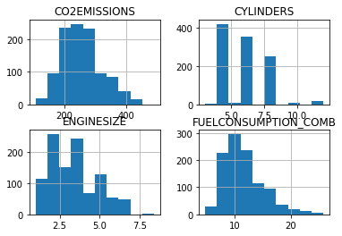


```python
plt.title('CO2 Emission vs Fuel Consumption')
plt.scatter(cdf.FUELCONSUMPTION_COMB, cdf.CO2EMISSIONS,  color='blue')
plt.xlabel("FUELCONSUMPTION_COMB")
plt.ylabel("Emission")
plt.show()
```


```python
plt.title('CO2 Emission vs Engine Size')
plt.scatter(cdf.ENGINESIZE, cdf.CO2EMISSIONS,  color='blue')
plt.xlabel("Engine size")
plt.ylabel("Emission")
plt.show()
```


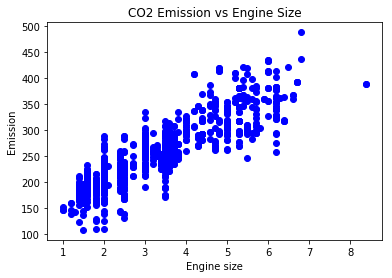


```python
plt.title('CO2 Emission vs Cylinders')
plt.scatter(cdf.CYLINDERS, cdf.CO2EMISSIONS, color='blue')
plt.xlabel("Cylinders")
plt.ylabel("Emission")
plt.show()
```


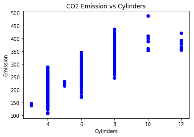


##### Test-Train Split

We need to split our data into a test set and a train set


```python
tt_mask = np.random.rand(len(df)) < 0.8
train = cdf[tt_mask].reset_index()
test = cdf[~tt_mask].reset_index()
```

##### Simple Regression Model

We can look at the distribution of the Engine Size in our training and test set respectively as follows


```python
plt.title('CO2 Emissions vs Engine Size for Test and Train Data')
plt.scatter(train.ENGINESIZE, train.CO2EMISSIONS,color='blue',label='train')
plt.scatter(test.ENGINESIZE, test.CO2EMISSIONS,color='red',label='test')
plt.xlabel("Engine size")
plt.ylabel("Emission")
plt.legend()
plt.show()
```


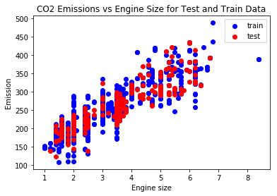


##### Modeling


```python
from sklearn import linear_model
```


```python
lin_reg = linear_model.LinearRegression()
train_x = train[['ENGINESIZE']]
train_y = train[['CO2EMISSIONS']]

test_x = test[['ENGINESIZE']]
test_y = test[['CO2EMISSIONS']]
```


```python
lin_reg.fit(train_x, train_y)
```


    LinearRegression(copy_X=True, fit_intercept=True, n_jobs=1, normalize=False)


```python
'Coefficients: ' + str(lin_reg.coef_) + ' Intercept: ' + str(lin_reg.intercept_)
```


    'Coefficients: [[ 39.30964622]] Intercept: [ 124.8710344]'


We can plot the line on our data to see the fit


```python
plt.title('CO2 Emissions vs Engine Size, Training and Fit')
plt.scatter(train.ENGINESIZE, train.CO2EMISSIONS,color='blue',label='train')
plt.plot(train_x, lin_reg.coef_[0,0]*train_x + lin_reg.intercept_[0],color='red',label='regression')
plt.xlabel("Engine size")
plt.ylabel("Emission")
plt.legend()
plt.show()
```


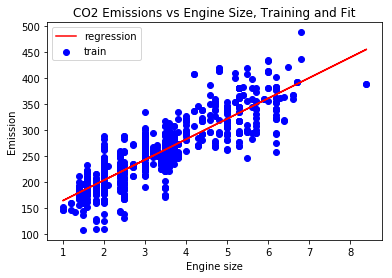


##### Model Evaluation

###### Import Packages


```python
from sklearn.metrics import r2_score
```

###### Predict the CO2 Emissions


```python
predicted_y = lin_reg.predict(test_x)
```

###### Display Results


```python
results = pd.DataFrame()

results[['ENGINESIZE']] = test_x
results[['ACTUALCO2']] = test_y
results[['PREDICTEDCO2']] = pd.DataFrame(predicted_y)
results[['ERROR']] = pd.DataFrame(np.abs(predicted_y - test_y))
results[['SQUAREDERROR']] = pd.DataFrame((predicted_y - test_y)**2)

results.head()
```


<div>
<style scoped>
    .dataframe tbody tr th:only-of-type {
        vertical-align: middle;
    }

    .dataframe tbody tr th {
        vertical-align: top;
    }

    .dataframe thead th {
        text-align: right;
    }
</style>
<table border="1" class="dataframe">
  <thead>
    <tr style="text-align: right;">
      <th></th>
      <th>ENGINESIZE</th>
      <th>ACTUALCO2</th>
      <th>PREDICTEDCO2</th>
      <th>ERROR</th>
      <th>SQUAREDERROR</th>
    </tr>
  </thead>
  <tbody>
    <tr>
      <th>0</th>
      <td>5.9</td>
      <td>359</td>
      <td>356.797947</td>
      <td>2.202053</td>
      <td>4.849037</td>
    </tr>
    <tr>
      <th>1</th>
      <td>2.0</td>
      <td>230</td>
      <td>203.490327</td>
      <td>26.509673</td>
      <td>702.762771</td>
    </tr>
    <tr>
      <th>2</th>
      <td>2.0</td>
      <td>230</td>
      <td>203.490327</td>
      <td>26.509673</td>
      <td>702.762771</td>
    </tr>
    <tr>
      <th>3</th>
      <td>2.0</td>
      <td>214</td>
      <td>203.490327</td>
      <td>10.509673</td>
      <td>110.453230</td>
    </tr>
    <tr>
      <th>4</th>
      <td>5.2</td>
      <td>409</td>
      <td>329.281195</td>
      <td>79.718805</td>
      <td>6355.087912</td>
    </tr>
  </tbody>
</table>
</div>


###### Model Evaluation


```python
MAE = np.mean(results[['ERROR']])
MSE = np.mean(results[['SQUAREDERROR']])
R2  = r2_score(test_y, predicted_y)

print("Mean absolute error: %.2f" % MAE)
print("Residual sum of squares (MSE): %.2f" % MSE)
print("R2-score: %.2f" % R2)
```

    Mean absolute error: 22.83
    Residual sum of squares (MSE): 826.28
    R2-score: 0.78


### Multiple Linear Regression

In reality multiple independent variables will define a specific target. MLR is simply an extension on the SLR Model

MLR is useful for solving problems such as

- Define the impact of independent variables on effectiveness of prediction
- Predicting the impact of change in a specific variable

MLR makes use of multiple predictors to predict the target value, and is generally of the form


$$
\hat y=\theta_0 + \theta_1x_1 + \theta_2x_2 + \theta_3x_3 + ... + \theta_nx_n
$$

$$
\hat y=\theta^TX
$$

$\theta$ is a vector of coefficients which are multiplied by $x$, these are called the parameters or weight vectors, and $x$ is the feature set, the idea with MLR is to predict the best-fit hyperplane for our data

#### Estimating Parameters

We have a few ways to estimate the best parameters, such as

- Ordinary Least Squares
    - Linear algebra
    - Not suited to large datasets
- Gradient Descent
    - Good for large datasets
- Other methods are available to do this as well

#### How Many Variables?

Making use of more variables will generally increase the accuracy of the model, howevre using too many variables without good justification can lead to us overfitting the model

We can make use of categorical variables if we convert them to numerric values

MLR assumes that we have a linear relationship between the dependent and independent variables

### Model Evaluation

We have to perform regression evaluation when building a model

#### Train/Test Joint

We make use of our data to train our model, and then compare the predicted values to the actual values of our model

The error of the model is the average of the actual and predicted values for the model

This approach has a high training accuracy, but a lower out-of-sample accuracy

Aiming for a very high training accuracy can lead to overfitting to the training data resulting in poor out-of-sample data

#### Train/Test Split

We split our data into a portion for testing and a portion for training, these two sets are mutually exclusive and allow us to get a good idea of what our out-of-sample accuracy will be

Generally we would train our data with the testing data afterwards in order to increase our accuracy

##### K-Fold Cross-Validation

This makes use of us splitting the dataset into different pieces, and using every combination of test/train datasets in order to get a more aggregated fit

#### Evaluation Metrics

Evaluation metrics are used to evaluate the performance of a model, metrics provide insight into areas of the model that require attention

##### Errors

In the context of regression, error is the difference between the data points and the valuedetermined by the model

Some of the main error equations are defined below


$$
MAE=\frac{1}{n}\Sigma_{i=1}^n|y_i-\hat y_i|
$$


$$
MSE=\frac{1}{n}\Sigma_{i=1}^n(y_i-\hat y_i)^2
$$


$$
RMSE=\sqrt{\frac{1}{n}\Sigma_{i=1}^n(y_i-\hat y_i)^2}
$$

$$
RAE=\frac{\Sigma_{i=1}^n|y_i-\hat y_i|}{\Sigma_{i=1}^n|y_i-\bar y_i|}
$$

$$
RSE=\frac{\Sigma_{i=1}^n(y_i-\hat y_i)^2}{\Sigma_{i=1}^n(y_i-\bar y_i)^2}
$$

##### Fit

$R^2$ helps us see how closely our data is represented by a specific regression line, and is defined as

$$
R^2=1-RSE
$$

Or

$$
R^2=1-\frac{\Sigma_{i=1}^n(y_i-\hat y_i)^2}{\Sigma_{i=1}^n(y_i-\bar y_i)^2}
$$

A higher $R^2$ represents a better fit

### Non-Linear Regression

Not all data can be predicted using a linear regression line, we have many diferent regression lines to fit more complex data

#### Polynomial Regression

Polynomial Regression is a method with which we can fit a polynomial to our data, it is still possible for us to define a polynomial regression by transforming it into a multi-variable linear regression problem as follows

Given the polynomial

$$
\hat y=\theta_0+\theta_1x+\theta_2x^2+\theta_3x^3
$$

We can create new variables which represent the different powers of our initial variable

$$
x_1=x
$$

$$
x_2=x^2
$$

$$
x_3=x^3
$$

Therefore resulting in the following linear equation

$$
\hat y=\theta_0+\theta_1x_1+\theta_2x_2+\theta_3x_3
$$

#### Other Non-Linear Regression

Non-Linear Regression can be of many forms as well, including any other mathematical relationships that we can define

For more complex NLR problems it can be difficult to evaluate the parameters for the equation

#### Lab

There are many different model types and equations shown in the Lab Notebook aside from what I have here

##### Import the Data

Using China's GDP data


```python
df = pd.read_csv('https://s3-api.us-geo.objectstorage.softlayer.net/cf-courses-data/CognitiveClass/ML0101ENv3/labs/china_gdp.csv')
df.head()
```


<div>
<style scoped>
    .dataframe tbody tr th:only-of-type {
        vertical-align: middle;
    }

    .dataframe tbody tr th {
        vertical-align: top;
    }

    .dataframe thead th {
        text-align: right;
    }
</style>
<table border="1" class="dataframe">
  <thead>
    <tr style="text-align: right;">
      <th></th>
      <th>Year</th>
      <th>Value</th>
    </tr>
  </thead>
  <tbody>
    <tr>
      <th>0</th>
      <td>1960</td>
      <td>5.918412e+10</td>
    </tr>
    <tr>
      <th>1</th>
      <td>1961</td>
      <td>4.955705e+10</td>
    </tr>
    <tr>
      <th>2</th>
      <td>1962</td>
      <td>4.668518e+10</td>
    </tr>
    <tr>
      <th>3</th>
      <td>1963</td>
      <td>5.009730e+10</td>
    </tr>
    <tr>
      <th>4</th>
      <td>1964</td>
      <td>5.906225e+10</td>
    </tr>
  </tbody>
</table>
</div>


```python
x_data, y_data = (df[['Year']], df[['Value']])
```

##### Plotting the Data


```python
plt.title('China\'s GDP by Year')
plt.plot(x_data, y_data, 'o')
plt.ylabel('GDP')
plt.xlabel('Year')
plt.show()
```


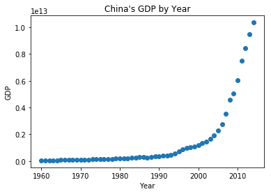


##### Defining a Fit

Next we can try to approximate a curve that we think will fit the data we have, we can use a sigmoid, as defined below

$$
\hat{Y} = \frac1{1+e^{\beta_1(X-\beta_2)}}
$$

$\beta_1$ : Controls the curve's steepness,

$\beta_2$ : Slides the curve on the x-axis.


```python
def sigmoid(x, b_1, b_2):
     y = 1 / (1 + np.exp(-b_1*(x-b_2)))
     return y
```

The above function can be seen to be


```python
X = np.arange(-5.0, 5.0, 0.1)
Y = sigmoid(X, 1, 1)

plt.title('Sigmoid')
plt.plot(X,Y) 
plt.ylabel('Dependent Variable')
plt.xlabel('Indepdendent Variable')
plt.show()
```


Next let's try to fit this to the data with some example values


```python
b_1 = 0.10
b_2 = 1990.0

#logistic function
y_pred = sigmoid(x_data, b_1 , b_2)

#plot initial prediction against datapoints
plt.title('Approximating NLR with Sigmoid')
plt.plot(x_data, y_pred*15000000000000.)
plt.plot(x_data, y_data, 'ro')
plt.show()
```


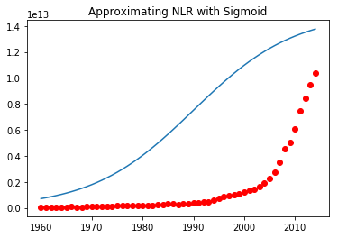


##### Data Normalization

Let's normalize our data so that we don't need to multiply by crazy numbers as before


```python
# for some reason this seems to be the only way the conversion
# from a dataframe works as desired
# the normalization from the labs are as such:
# xdata =x_data/max(x_data)
# ydata =y_data/max(y_data)
x_norm = (np.array(x_data)/max(np.array(x_data))).transpose()[0]
y_norm = (np.array(y_data)/max(np.array(y_data))).transpose()[0]
```

##### Finding the Best Fit

Next we can import `curve_fit` to help us fit the the curve to our data


```python
from scipy.optimize import curve_fit
```


```python
popt, pcov = curve_fit(sigmoid, x_norm, y_norm)
print(" beta_1 = %f, beta_2 = %f" % (popt[0], popt[1]))
print(popt)
print(pcov)
```

     beta_1 = 690.453017, beta_2 = 0.997207
    [ 690.45301712    0.99720713]
    [[  1.52273887e+03  -2.88115957e-04]
     [ -2.88115957e-04   7.25956452e-09]]


And we can plot the result as follows


```python
x = np.linspace(1960, 2015, 55)
x = x/max(x)
y = sigmoid(x, *popt)

plt.title('Sigmoid Fit of Data')
plt.plot(x_norm, y_norm, 'ro', label='data')
plt.plot(x,y, linewidth=3.0, label='fit')
plt.legend()
plt.ylabel('GDP')
plt.xlabel('Year')
plt.show()
```


##### Model Accuracy


```python
from sklearn.metrics import r2_score

# split data into train/test
mask = np.random.rand(len(df)) < 0.8
train_x = x_norm[mask]
test_x = x_norm[~mask]
train_y = y_norm[mask]
test_y = y_norm[~mask]

# build the model using train set
popt, pcov = curve_fit(sigmoid, train_x, train_y)

# predict using test set
y_hat = sigmoid(test_x, *popt)

# evaluation
print("Mean absolute error: %.2f" % np.mean(np.absolute(y_hat - test_y)))
print("Residual sum of squares (MSE): %.2f" % np.mean((y_hat - test_y) ** 2))
print("R2-score: %.2f" % r2_score(y_hat , test_y) )
```

    Mean absolute error: 0.03
    Residual sum of squares (MSE): 0.00
    R2-score: 0.53


## Classification

Classification is a supervised learning approach which is a means of splitting data into discrete classes

The target atribute is a categorical value with discrete values

Classification will determine the class label for a specific test case

Binary as well as multi-class classification methods are available

### Learning Algorithms

Many learning algorithms are available for classification such as

- Decision trees
- Naive Bayes
- KNN
- Logistic Regression
- Neural Networks
- SVM

### Evaluation Metrics

We have a few different evaluation metrics for classification

#### Jaccard Index

We simply measure which fraction of our predicted values $\hat y$ intersect with the actual values $y$

$$
J(y,\hat y)=\frac{|y\cap\hat y|}{|y\cup\hat y|}=\frac{|y\cap\hat y|}{|y|+|\hat y|-|y\cap\hat y|} 
$$

#### F1 Score

This is a measure which makes use of a confusion matrix and compares the predictions vs actual values for each class

In the count of binary classification this will give us our True Positives, False Positives, True Negatives and False Negatives

We can define some metrics for each class with the following

$$ 
Precision=\frac{TP}{TP+FP}
$$

$$
Recall=\frac{TP}{TP+FN}
$$

$$
F1=2\frac{Precision\times Rcall}{Precision+Recall}
$$

F1 varies between 0 and 1, with 1 being the best

The accuracy for a classifier is the average accuracy of each of its classes

#### Log Loss

The log loss is the performance of a classifier where the predicted output is a probability between 1 and 0


$$
y\cdot log(\hat y)+(1-y)\cdot log(1-\hat y)
$$

Better classifiers have a log loss closer to zero

### K-Nearest Neighbor

KNN is a method of determining class based on the training datapoints that sit near our test datapoint based on the fact that closer datapoints are more important than those further away in predicting a specific value

#### Algorithm

1. Pick a value for K
2. Calculate distance of unknown case from known cases
3. Select k observations
4. Predict the value based on the most common observaton value

We can make use of euclidean distance to calculate the distance between our continuous values, and a voting system for discrete data

Using a low K value can lead to overfitting, and using a very high value can lead to us underfitting

In order to find the optimal K value we do multiple tests by continuously increasing our K value and measuring the accuracy for that K value

Furthermore KNN can also be used to predict continuous values (regression) by simply having a target variable and predictors that are continuous

#### Lab

##### Import Libraries


```python
import itertools
import matplotlib.pyplot as plt
from matplotlib.ticker import NullFormatter
import matplotlib.ticker as ticker
from sklearn import preprocessing
```

##### Import Data

The dataset being used is one in which demographic data is used to define a customer service group, these being as follows

| Value | Category      |
| ----- | ------------- |
| 1     | Basic Service |
| 2     | E-Service     |
| 3     | Plus Service  |
| 4     | Total Service |


```python
df = pd.read_csv('https://s3-api.us-geo.objectstorage.softlayer.net/cf-courses-data/CognitiveClass/ML0101ENv3/labs/teleCust1000t.csv')
```


```python
df.head()
```


<div>
<style scoped>
    .dataframe tbody tr th:only-of-type {
        vertical-align: middle;
    }

    .dataframe tbody tr th {
        vertical-align: top;
    }

    .dataframe thead th {
        text-align: right;
    }
</style>
<table border="1" class="dataframe">
  <thead>
    <tr style="text-align: right;">
      <th></th>
      <th>region</th>
      <th>tenure</th>
      <th>age</th>
      <th>marital</th>
      <th>address</th>
      <th>income</th>
      <th>ed</th>
      <th>employ</th>
      <th>retire</th>
      <th>gender</th>
      <th>reside</th>
      <th>custcat</th>
    </tr>
  </thead>
  <tbody>
    <tr>
      <th>0</th>
      <td>2</td>
      <td>13</td>
      <td>44</td>
      <td>1</td>
      <td>9</td>
      <td>64.0</td>
      <td>4</td>
      <td>5</td>
      <td>0.0</td>
      <td>0</td>
      <td>2</td>
      <td>1</td>
    </tr>
    <tr>
      <th>1</th>
      <td>3</td>
      <td>11</td>
      <td>33</td>
      <td>1</td>
      <td>7</td>
      <td>136.0</td>
      <td>5</td>
      <td>5</td>
      <td>0.0</td>
      <td>0</td>
      <td>6</td>
      <td>4</td>
    </tr>
    <tr>
      <th>2</th>
      <td>3</td>
      <td>68</td>
      <td>52</td>
      <td>1</td>
      <td>24</td>
      <td>116.0</td>
      <td>1</td>
      <td>29</td>
      <td>0.0</td>
      <td>1</td>
      <td>2</td>
      <td>3</td>
    </tr>
    <tr>
      <th>3</th>
      <td>2</td>
      <td>33</td>
      <td>33</td>
      <td>0</td>
      <td>12</td>
      <td>33.0</td>
      <td>2</td>
      <td>0</td>
      <td>0.0</td>
      <td>1</td>
      <td>1</td>
      <td>1</td>
    </tr>
    <tr>
      <th>4</th>
      <td>2</td>
      <td>23</td>
      <td>30</td>
      <td>1</td>
      <td>9</td>
      <td>30.0</td>
      <td>1</td>
      <td>2</td>
      <td>0.0</td>
      <td>0</td>
      <td>4</td>
      <td>3</td>
    </tr>
  </tbody>
</table>
</div>


##### Data Visualization and Analysis

We can look at the number of customers in each class


```python
df.custcat.value_counts()
```


    3    281
    1    266
    4    236
    2    217
    Name: custcat, dtype: int64


```python
df.hist()
plt.show()
```


We can take a closer look at income with


```python
df.income.hist(bins=50)
plt.title('Income of Customers')
plt.xlabel('Frequency')
plt.ylabel('Income')
plt.show()
```


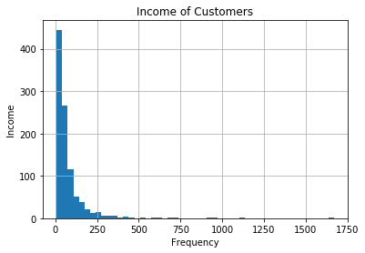


##### Features

To use `sklearn` we need to convert our data into an array as follows


```python
df.columns
```


    Index(['region', 'tenure', 'age', 'marital', 'address', 'income', 'ed',
           'employ', 'retire', 'gender', 'reside', 'custcat'],
          dtype='object')


```python
# X = df.loc[:, 'region':'reside'].values
# Y = df.loc[:,'custcat'].values
X = df.loc[:, 'region':'reside']
Y = df.loc[:,'custcat']
```


```python
X.head()
```


<div>
<style scoped>
    .dataframe tbody tr th:only-of-type {
        vertical-align: middle;
    }

    .dataframe tbody tr th {
        vertical-align: top;
    }

    .dataframe thead th {
        text-align: right;
    }
</style>
<table border="1" class="dataframe">
  <thead>
    <tr style="text-align: right;">
      <th></th>
      <th>region</th>
      <th>tenure</th>
      <th>age</th>
      <th>marital</th>
      <th>address</th>
      <th>income</th>
      <th>ed</th>
      <th>employ</th>
      <th>retire</th>
      <th>gender</th>
      <th>reside</th>
    </tr>
  </thead>
  <tbody>
    <tr>
      <th>0</th>
      <td>2</td>
      <td>13</td>
      <td>44</td>
      <td>1</td>
      <td>9</td>
      <td>64.0</td>
      <td>4</td>
      <td>5</td>
      <td>0.0</td>
      <td>0</td>
      <td>2</td>
    </tr>
    <tr>
      <th>1</th>
      <td>3</td>
      <td>11</td>
      <td>33</td>
      <td>1</td>
      <td>7</td>
      <td>136.0</td>
      <td>5</td>
      <td>5</td>
      <td>0.0</td>
      <td>0</td>
      <td>6</td>
    </tr>
    <tr>
      <th>2</th>
      <td>3</td>
      <td>68</td>
      <td>52</td>
      <td>1</td>
      <td>24</td>
      <td>116.0</td>
      <td>1</td>
      <td>29</td>
      <td>0.0</td>
      <td>1</td>
      <td>2</td>
    </tr>
    <tr>
      <th>3</th>
      <td>2</td>
      <td>33</td>
      <td>33</td>
      <td>0</td>
      <td>12</td>
      <td>33.0</td>
      <td>2</td>
      <td>0</td>
      <td>0.0</td>
      <td>1</td>
      <td>1</td>
    </tr>
    <tr>
      <th>4</th>
      <td>2</td>
      <td>23</td>
      <td>30</td>
      <td>1</td>
      <td>9</td>
      <td>30.0</td>
      <td>1</td>
      <td>2</td>
      <td>0.0</td>
      <td>0</td>
      <td>4</td>
    </tr>
  </tbody>
</table>
</div>


```python
Y.head()
```


    0    1
    1    4
    2    3
    3    1
    4    3
    Name: custcat, dtype: int64


##### Normalize Data

For alogrithms like KNN which are distance based it is useful to normalize the data to have a zero mean and unit variance, we can do this using the `sklearn.preprocessing` package


```python
X = preprocessing.StandardScaler().fit(X).transform(X.astype(float))
print(X[0:5])
```

    [[-0.02696767 -1.055125    0.18450456  1.0100505  -0.25303431 -0.12650641
       1.0877526  -0.5941226  -0.22207644 -1.03459817 -0.23065004]
     [ 1.19883553 -1.14880563 -0.69181243  1.0100505  -0.4514148   0.54644972
       1.9062271  -0.5941226  -0.22207644 -1.03459817  2.55666158]
     [ 1.19883553  1.52109247  0.82182601  1.0100505   1.23481934  0.35951747
      -1.36767088  1.78752803 -0.22207644  0.96655883 -0.23065004]
     [-0.02696767 -0.11831864 -0.69181243 -0.9900495   0.04453642 -0.41625141
      -0.54919639 -1.09029981 -0.22207644  0.96655883 -0.92747794]
     [-0.02696767 -0.58672182 -0.93080797  1.0100505  -0.25303431 -0.44429125
      -1.36767088 -0.89182893 -0.22207644 -1.03459817  1.16300577]]


##### Test/Train Split

Next we can split our model into a test and train set using `sklearn.model_selection.train_test_split()`


```python
from sklearn.model_selection import train_test_split
```


```python
ran = 4
X_train, X_test, Y_train, Y_test = train_test_split(X,Y,test_size=0.2,random_state=ran)
```


```python
print('Train: ', X_train.shape, Y_train.shape)
print('Test: ', X_test.shape, Y_test.shape)
```

    Train:  (800, 11) (800,)
    Test:  (200, 11) (200,)


##### Classification

We can then make use of the KNN classifier on our data


```python
from sklearn.neighbors import KNeighborsClassifier as knn_classifier
```

We will use an intial value of 4 for k, but will later evaluate different k values


```python
k = 4
```


```python
knn = knn_classifier(n_neighbors=k)
knn.fit(X_train, Y_train)
```


    KNeighborsClassifier(algorithm='auto', leaf_size=30, metric='minkowski',
               metric_params=None, n_jobs=1, n_neighbors=4, p=2,
               weights='uniform')


```python
Y_hat = knn.predict(X_test)
print(Y_hat[0:5])
```

    [1 1 3 2 4]


##### Model Evaluation


```python
from sklearn import metrics
print("Train set Accuracy: ", metrics.accuracy_score(Y_train, knn.predict(X_train)))
print("Test set Accuracy: ", metrics.accuracy_score(Y_test, Y_hat))
```

    Train set Accuracy:  0.5475
    Test set Accuracy:  0.32


##### Other K Values

We can do this for additional K values to look at how the accuracy is affected


```python
k_max = 100
mean_acc = np.zeros((k_max))
std_acc = np.zeros((k_max))
ConfustionMx = [];
for n in range(1,k_max + 1):
    
    #Train Model and Predict  
    knn = knn_classifier(n_neighbors = n).fit(X_train,Y_train)
    Y_hat = knn.predict(X_test)
    mean_acc[n-1] = metrics.accuracy_score(Y_test, Y_hat)

    std_acc[n-1] = np.std(Y_hat == Y_test)/np.sqrt(Y_hat.shape[0])
    
print(mean_acc)
```

    [ 0.3    0.29   0.315  0.32   0.315  0.31   0.335  0.325  0.34   0.33
      0.315  0.34   0.33   0.315  0.34   0.36   0.355  0.35   0.345  0.335
      0.35   0.36   0.37   0.365  0.365  0.365  0.35   0.36   0.38   0.385
      0.395  0.395  0.38   0.37   0.365  0.385  0.395  0.41   0.395  0.395
      0.395  0.38   0.39   0.375  0.365  0.38   0.375  0.375  0.365  0.36   0.36
      0.365  0.37   0.38   0.37   0.37   0.37   0.36   0.35   0.36   0.355
      0.36   0.36   0.36   0.34   0.34   0.345  0.35   0.35   0.355  0.365
      0.355  0.355  0.365  0.37   0.37   0.37   0.35   0.35   0.35   0.35   0.36
      0.355  0.33   0.32   0.345  0.345  0.345  0.335  0.345  0.355  0.345
      0.345  0.34   0.34   0.335  0.345  0.325  0.315  0.31 ]


```python
plt.title('Accuracy vs K')
plt.plot(range(1,k_max + 1),mean_acc,'g')
plt.fill_between(range(1,k_max + 1),mean_acc - 1 * std_acc,mean_acc + 1 * std_acc, alpha=0.10)
plt.legend(('Accuracy ', '+/- 3xstd'))
plt.ylabel('Accuracy')
plt.xlabel('Number of Neighbors (K)')
plt.tight_layout()
plt.show()
```


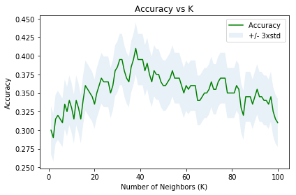


The maximum accuracy can be found to be


```python
print('Max Accuracy: {}, K={}'.format(max(mean_acc),mean_acc.argmax() + 1))
```

    Max Accuracy: 0.41, K=38


##### Test Sample

It can be noted that the accuracy and optimal value varies based on the `random_state` parameter in the `train_test_split` function used when doing the test/train split

##### Retrain with All Data

We can retrain the model to use all the data at the determined optimal value and look at the in-sample accuracy


```python
k = mean_acc.argmax()
knn = knn_classifier(n_neighbors=k)
knn.fit(X, Y)
print("In-Sample Accuracy: ", metrics.accuracy_score(Y, knn.predict(X)))
```

    In-Sample Accuracy:  0.425


### Decision Trees

Decision Trees allow us to make use of discrete and continuous predictors to find a discrete target

Decision trees test a condition and branch off based on the result, eventually leading to a specific outcome/decision

#### Algorithm

1. Choose a dataset
2. Calculate the significance of an attribute in splitting the data
3. Split the data based on the value of the attribute
4. Go to **1**

We aim to have resulting nodes that are high in purity. A higher purity increases predictiveness/significance

Recursive partitining is used to decrease the impurity/entropy in the resulting nodes

Entropy is a measurement of randomness

If samples are equally mixed, the entropy is 1, if the samples are pure, the entropy is 1

$$
Entropy(v)=P(v)-log(P(v))
$$

The best tree is the one that results in the most information gain after the split

$$
Gain(S,A) = Entropy(S)-\Sigma_v\frac{|S_v|}{|S|}Entropy(S_v)
$$            

#### Lab

##### Import Libraries


```python
import numpy as np 
import pandas as pd
from sklearn.tree import DecisionTreeClassifier
```

##### Import Data


```python
df = pd.read_csv('https://s3-api.us-geo.objectstorage.softlayer.net/cf-courses-data/CognitiveClass/ML0101ENv3/labs/drug200.csv')
```


```python
print(df.shape)
df.head()
```

    (200, 6)


<div>
<style scoped>
    .dataframe tbody tr th:only-of-type {
        vertical-align: middle;
    }

    .dataframe tbody tr th {
        vertical-align: top;
    }

    .dataframe thead th {
        text-align: right;
    }
</style>
<table border="1" class="dataframe">
  <thead>
    <tr style="text-align: right;">
      <th></th>
      <th>Age</th>
      <th>Sex</th>
      <th>BP</th>
      <th>Cholesterol</th>
      <th>Na_to_K</th>
      <th>Drug</th>
    </tr>
  </thead>
  <tbody>
    <tr>
      <th>0</th>
      <td>23</td>
      <td>F</td>
      <td>HIGH</td>
      <td>HIGH</td>
      <td>25.355</td>
      <td>drugY</td>
    </tr>
    <tr>
      <th>1</th>
      <td>47</td>
      <td>M</td>
      <td>LOW</td>
      <td>HIGH</td>
      <td>13.093</td>
      <td>drugC</td>
    </tr>
    <tr>
      <th>2</th>
      <td>47</td>
      <td>M</td>
      <td>LOW</td>
      <td>HIGH</td>
      <td>10.114</td>
      <td>drugC</td>
    </tr>
    <tr>
      <th>3</th>
      <td>28</td>
      <td>F</td>
      <td>NORMAL</td>
      <td>HIGH</td>
      <td>7.798</td>
      <td>drugX</td>
    </tr>
    <tr>
      <th>4</th>
      <td>61</td>
      <td>F</td>
      <td>LOW</td>
      <td>HIGH</td>
      <td>18.043</td>
      <td>drugY</td>
    </tr>
  </tbody>
</table>
</div>


##### Split X and Y Values


```python
X_headers = ['Age','Sex','BP','Cholesterol','Na_to_K']
X = df[X_headers]
X.head()
```


<div>
<style scoped>
    .dataframe tbody tr th:only-of-type {
        vertical-align: middle;
    }

    .dataframe tbody tr th {
        vertical-align: top;
    }

    .dataframe thead th {
        text-align: right;
    }
</style>
<table border="1" class="dataframe">
  <thead>
    <tr style="text-align: right;">
      <th></th>
      <th>Age</th>
      <th>Sex</th>
      <th>BP</th>
      <th>Cholesterol</th>
      <th>Na_to_K</th>
    </tr>
  </thead>
  <tbody>
    <tr>
      <th>0</th>
      <td>23</td>
      <td>F</td>
      <td>HIGH</td>
      <td>HIGH</td>
      <td>25.355</td>
    </tr>
    <tr>
      <th>1</th>
      <td>47</td>
      <td>M</td>
      <td>LOW</td>
      <td>HIGH</td>
      <td>13.093</td>
    </tr>
    <tr>
      <th>2</th>
      <td>47</td>
      <td>M</td>
      <td>LOW</td>
      <td>HIGH</td>
      <td>10.114</td>
    </tr>
    <tr>
      <th>3</th>
      <td>28</td>
      <td>F</td>
      <td>NORMAL</td>
      <td>HIGH</td>
      <td>7.798</td>
    </tr>
    <tr>
      <th>4</th>
      <td>61</td>
      <td>F</td>
      <td>LOW</td>
      <td>HIGH</td>
      <td>18.043</td>
    </tr>
  </tbody>
</table>
</div>


```python
Y = df[['Drug']]
Y.head()
```


<div>
<style scoped>
    .dataframe tbody tr th:only-of-type {
        vertical-align: middle;
    }

    .dataframe tbody tr th {
        vertical-align: top;
    }

    .dataframe thead th {
        text-align: right;
    }
</style>
<table border="1" class="dataframe">
  <thead>
    <tr style="text-align: right;">
      <th></th>
      <th>Drug</th>
    </tr>
  </thead>
  <tbody>
    <tr>
      <th>0</th>
      <td>drugY</td>
    </tr>
    <tr>
      <th>1</th>
      <td>drugC</td>
    </tr>
    <tr>
      <th>2</th>
      <td>drugC</td>
    </tr>
    <tr>
      <th>3</th>
      <td>drugX</td>
    </tr>
    <tr>
      <th>4</th>
      <td>drugY</td>
    </tr>
  </tbody>
</table>
</div>


##### Create Numeric Variables

We need to get numeric variables for X as `sklearn` does not support string categorization (according to the guy in the course anyway)


```python
from sklearn import preprocessing
```


```python
X_arr = np.array(X)

encoder = preprocessing.LabelEncoder()
encoder.fit(['F','M'])
X_arr[:,1] = encoder.transform(X_arr[:,1])

encoder.fit(['LOW','NORMAL','HIGH'])
X_arr[:,2] = encoder.transform(X_arr[:,2])

encoder.fit(['NORMAL','HIGH'])
X_arr[:,3] = encoder.transform(X_arr[:,3])

print(X_arr[0:5])
```

    [[23 0 0 0 25.355]
     [47 1 1 0 13.093]
     [47 1 1 0 10.113999999999999]
     [28 0 2 0 7.797999999999999]
     [61 0 1 0 18.043]]


```python
X_encoded = pd.DataFrame(data=X_arr, columns=X_headers)
X_encoded.head()
```


<div>
<style scoped>
    .dataframe tbody tr th:only-of-type {
        vertical-align: middle;
    }

    .dataframe tbody tr th {
        vertical-align: top;
    }

    .dataframe thead th {
        text-align: right;
    }
</style>
<table border="1" class="dataframe">
  <thead>
    <tr style="text-align: right;">
      <th></th>
      <th>Age</th>
      <th>Sex</th>
      <th>BP</th>
      <th>Cholesterol</th>
      <th>Na_to_K</th>
    </tr>
  </thead>
  <tbody>
    <tr>
      <th>0</th>
      <td>23</td>
      <td>0</td>
      <td>0</td>
      <td>0</td>
      <td>25.355</td>
    </tr>
    <tr>
      <th>1</th>
      <td>47</td>
      <td>1</td>
      <td>1</td>
      <td>0</td>
      <td>13.093</td>
    </tr>
    <tr>
      <th>2</th>
      <td>47</td>
      <td>1</td>
      <td>1</td>
      <td>0</td>
      <td>10.114</td>
    </tr>
    <tr>
      <th>3</th>
      <td>28</td>
      <td>0</td>
      <td>2</td>
      <td>0</td>
      <td>7.798</td>
    </tr>
    <tr>
      <th>4</th>
      <td>61</td>
      <td>0</td>
      <td>1</td>
      <td>0</td>
      <td>18.043</td>
    </tr>
  </tbody>
</table>
</div>


##### Train/Test Split


```python
from sklearn.model_selection import train_test_split
```


```python
X_train, X_test, Y_train, Y_test = train_test_split(X_encoded, Y, test_size = 0.3)
print('Training: X : {}, Y : {}'.format(X_train.shape,Y_train.shape))
print('Testing: X : {}, Y : {}'.format(X_test.shape,Y_test.shape))
```

    Training: X : (140, 5), Y : (140, 1)
    Testing: X : (60, 5), Y : (60, 1)


##### Decision Tree


```python
drug_tree = DecisionTreeClassifier(criterion='entropy', max_depth = 4)
drug_tree
```


    DecisionTreeClassifier(class_weight=None, criterion='entropy', max_depth=4,
                max_features=None, max_leaf_nodes=None,
                min_impurity_decrease=0.0, min_impurity_split=None,
                min_samples_leaf=1, min_samples_split=2,
                min_weight_fraction_leaf=0.0, presort=False, random_state=None,
                splitter='best')


```python
drug_tree.fit(X_train, Y_train)
```


    DecisionTreeClassifier(class_weight=None, criterion='entropy', max_depth=4,
                max_features=None, max_leaf_nodes=None,
                min_impurity_decrease=0.0, min_impurity_split=None,
                min_samples_leaf=1, min_samples_split=2,
                min_weight_fraction_leaf=0.0, presort=False, random_state=None,
                splitter='best')


##### Prediction


```python
Y_predicted = drug_tree.predict(X_test)
```


```python
print(Y_predicted[0:5])
print(Y_test[0:5])
```

    ['drugY' 'drugY' 'drugA' 'drugY' 'drugC']
          Drug
    123  drugY
    88   drugY
    100  drugA
    179  drugY
    47   drugC


##### Evaluation


```python
from sklearn import metrics
```


```python
print('Decision Tree Accuracy: ', metrics.accuracy_score(Y_test, Y_predicted))
```

    Decision Tree Accuracy:  1.0


##### Visalization


```python
!pip install pydotplus
import matplotlib.pyplot as plt
from sklearn.externals.six import StringIO
import pydotplus
import matplotlib.image as mpimg
from sklearn import tree
```

    Requirement not upgraded as not directly required: pydotplus in /opt/conda/envs/DSX-Python35/lib/python3.5/site-packages
    Requirement not upgraded as not directly required: pyparsing>=2.0.1 in /opt/conda/envs/DSX-Python35/lib/python3.5/site-packages (from pydotplus)


```python
dot_data = StringIO()
filename = 'drug_decision_tree.png'
feature_names = X_headers
target_names = df['Drug'].unique().tolist()
```


```python
out = tree.export_graphviz(drug_tree, 
                           feature_names=feature_names, 
                           out_file=dot_data, 
                           class_names=target_names, 
                           filled=True, 
                           special_characters=True, 
                           rotate=False)
```


```python
graph = pydotplus.graph_from_dot_data(dot_data.getvalue())
graph.write_png(filename)
```


    True


```python
img = mpimg.imread(filename)
plt.figure(figsize=(100, 100))
plt.imshow(img, interpolation='nearest')
plt.show()
```


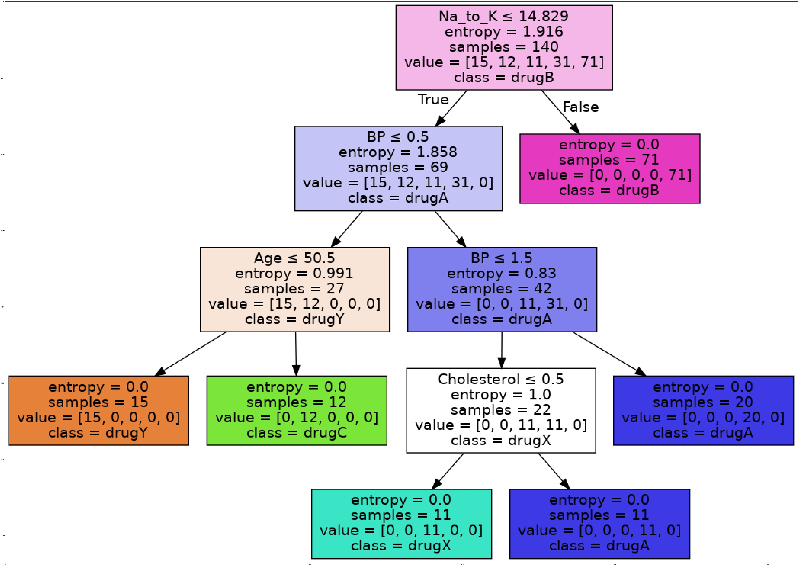


### Logistic Regression

Logistic regression is a categorical classification algorithm based on a linear division between categorical values


Logistic regression can be used for binary and multi class classification and predicts the probability of a class which is then mapped to a discrete value

Logistic regression is best suited to

- Binary Classification
- If you need probabilistic results
- Linear decision boundry 

$$
\theta_0+\theta_1x_1+\theta_2x_2>0
$$

- If you need to understand the impact of a feature

A logistic regression can calculate

$$
\hat y=P(y=1|x)
$$

### Logistic vs Linear Regression

We can use linear regression with a dividing line to give whether or not a specific circumstance will lead to a specific output, where we define a threshold value which would define a boundry for the target class

The problem with this method is that we only have a specific binary outcome, and not any information as to what the probability of that outcome is. Logistic regression helps us to define this by making use of a sigmoid to smoothen out the classification boundry, the sigmoid function can be seen below

$$
\sigma(\theta^TX)=\frac{1}{1+e^{-\theta^Tx}}
$$


```python
import numpy as np
from math import exp
import matplotlib.pyplot as plt

x = np.array(range(-100,102,2))/10
sigmoid = 1/(1+np.exp(-1*x))
step = []
for i in range(len(x)):
    step.append(1 if x[i] >= 0 else 0)

plt.plot(x,step, label='Step' )
plt.plot(x,sigmoid, label='Sigmoid')
# plt.xlim(-10,10)
plt.ylim(-0.1,1.1)
plt.xlabel('$x$')
plt.ylabel('$\sigma(x)$')
plt.legend()
plt.show()
```


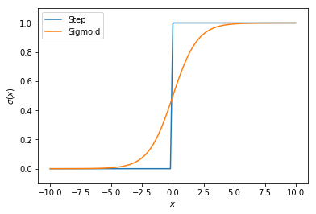


Based on the above we can see that depending on the value of $x$ we will have a greater tendency of a value towards 0 or 1 but not explicitly either

#### Algorithm

1. Initialize $\theta\$
2. Calculate$\hat y=\sigma(\theta^TX)$ for an $X$
3. Compare $Y$ and $\hat Y$ and record the error, defined by a cost function $J(\theta)$
4. Change $\theta$ to reduce the cost
5. Go to **2**

We can use different ways to change $\theta$ such as gradient descent

#### Lab

##### Import Libraries


```python
import pandas as pd
import pylab as pl
import numpy as np
import scipy.optimize as opt
from sklearn import preprocessing
import matplotlib.pyplot as plt
```

##### Import Data


```python
df = pd.read_csv('https://s3-api.us-geo.objectstorage.softlayer.net/cf-courses-data/CognitiveClass/ML0101ENv3/labs/ChurnData.csv')
```


```python
df.head()
```


<div>
<style scoped>
    .dataframe tbody tr th:only-of-type {
        vertical-align: middle;
    }

    .dataframe tbody tr th {
        vertical-align: top;
    }

    .dataframe thead th {
        text-align: right;
    }
</style>
<table border="1" class="dataframe">
  <thead>
    <tr style="text-align: right;">
      <th></th>
      <th>tenure</th>
      <th>age</th>
      <th>address</th>
      <th>income</th>
      <th>ed</th>
      <th>employ</th>
      <th>equip</th>
      <th>callcard</th>
      <th>wireless</th>
      <th>longmon</th>
      <th>...</th>
      <th>pager</th>
      <th>internet</th>
      <th>callwait</th>
      <th>confer</th>
      <th>ebill</th>
      <th>loglong</th>
      <th>logtoll</th>
      <th>lninc</th>
      <th>custcat</th>
      <th>churn</th>
    </tr>
  </thead>
  <tbody>
    <tr>
      <th>0</th>
      <td>11.0</td>
      <td>33.0</td>
      <td>7.0</td>
      <td>136.0</td>
      <td>5.0</td>
      <td>5.0</td>
      <td>0.0</td>
      <td>1.0</td>
      <td>1.0</td>
      <td>4.40</td>
      <td>...</td>
      <td>1.0</td>
      <td>0.0</td>
      <td>1.0</td>
      <td>1.0</td>
      <td>0.0</td>
      <td>1.482</td>
      <td>3.033</td>
      <td>4.913</td>
      <td>4.0</td>
      <td>1.0</td>
    </tr>
    <tr>
      <th>1</th>
      <td>33.0</td>
      <td>33.0</td>
      <td>12.0</td>
      <td>33.0</td>
      <td>2.0</td>
      <td>0.0</td>
      <td>0.0</td>
      <td>0.0</td>
      <td>0.0</td>
      <td>9.45</td>
      <td>...</td>
      <td>0.0</td>
      <td>0.0</td>
      <td>0.0</td>
      <td>0.0</td>
      <td>0.0</td>
      <td>2.246</td>
      <td>3.240</td>
      <td>3.497</td>
      <td>1.0</td>
      <td>1.0</td>
    </tr>
    <tr>
      <th>2</th>
      <td>23.0</td>
      <td>30.0</td>
      <td>9.0</td>
      <td>30.0</td>
      <td>1.0</td>
      <td>2.0</td>
      <td>0.0</td>
      <td>0.0</td>
      <td>0.0</td>
      <td>6.30</td>
      <td>...</td>
      <td>0.0</td>
      <td>0.0</td>
      <td>0.0</td>
      <td>1.0</td>
      <td>0.0</td>
      <td>1.841</td>
      <td>3.240</td>
      <td>3.401</td>
      <td>3.0</td>
      <td>0.0</td>
    </tr>
    <tr>
      <th>3</th>
      <td>38.0</td>
      <td>35.0</td>
      <td>5.0</td>
      <td>76.0</td>
      <td>2.0</td>
      <td>10.0</td>
      <td>1.0</td>
      <td>1.0</td>
      <td>1.0</td>
      <td>6.05</td>
      <td>...</td>
      <td>1.0</td>
      <td>1.0</td>
      <td>1.0</td>
      <td>1.0</td>
      <td>1.0</td>
      <td>1.800</td>
      <td>3.807</td>
      <td>4.331</td>
      <td>4.0</td>
      <td>0.0</td>
    </tr>
    <tr>
      <th>4</th>
      <td>7.0</td>
      <td>35.0</td>
      <td>14.0</td>
      <td>80.0</td>
      <td>2.0</td>
      <td>15.0</td>
      <td>0.0</td>
      <td>1.0</td>
      <td>0.0</td>
      <td>7.10</td>
      <td>...</td>
      <td>0.0</td>
      <td>0.0</td>
      <td>1.0</td>
      <td>1.0</td>
      <td>0.0</td>
      <td>1.960</td>
      <td>3.091</td>
      <td>4.382</td>
      <td>3.0</td>
      <td>0.0</td>
    </tr>
  </tbody>
</table>
<p>5 rows × 28 columns</p>
</div>


##### Preprocessing


```python
df = df[['tenure', 'age', 'address', 'income', 'ed', 'employ', 'equip',   'callcard', 'wireless','churn']]
df[['churn']] = df[['churn']].astype('int')
df.head()
```


<div>
<style scoped>
    .dataframe tbody tr th:only-of-type {
        vertical-align: middle;
    }

    .dataframe tbody tr th {
        vertical-align: top;
    }

    .dataframe thead th {
        text-align: right;
    }
</style>
<table border="1" class="dataframe">
  <thead>
    <tr style="text-align: right;">
      <th></th>
      <th>tenure</th>
      <th>age</th>
      <th>address</th>
      <th>income</th>
      <th>ed</th>
      <th>employ</th>
      <th>equip</th>
      <th>callcard</th>
      <th>wireless</th>
      <th>churn</th>
    </tr>
  </thead>
  <tbody>
    <tr>
      <th>0</th>
      <td>11.0</td>
      <td>33.0</td>
      <td>7.0</td>
      <td>136.0</td>
      <td>5.0</td>
      <td>5.0</td>
      <td>0.0</td>
      <td>1.0</td>
      <td>1.0</td>
      <td>1</td>
    </tr>
    <tr>
      <th>1</th>
      <td>33.0</td>
      <td>33.0</td>
      <td>12.0</td>
      <td>33.0</td>
      <td>2.0</td>
      <td>0.0</td>
      <td>0.0</td>
      <td>0.0</td>
      <td>0.0</td>
      <td>1</td>
    </tr>
    <tr>
      <th>2</th>
      <td>23.0</td>
      <td>30.0</td>
      <td>9.0</td>
      <td>30.0</td>
      <td>1.0</td>
      <td>2.0</td>
      <td>0.0</td>
      <td>0.0</td>
      <td>0.0</td>
      <td>0</td>
    </tr>
    <tr>
      <th>3</th>
      <td>38.0</td>
      <td>35.0</td>
      <td>5.0</td>
      <td>76.0</td>
      <td>2.0</td>
      <td>10.0</td>
      <td>1.0</td>
      <td>1.0</td>
      <td>1.0</td>
      <td>0</td>
    </tr>
    <tr>
      <th>4</th>
      <td>7.0</td>
      <td>35.0</td>
      <td>14.0</td>
      <td>80.0</td>
      <td>2.0</td>
      <td>15.0</td>
      <td>0.0</td>
      <td>1.0</td>
      <td>0.0</td>
      <td>0</td>
    </tr>
  </tbody>
</table>
</div>


##### Define X and Y


```python
X = np.asarray(df[['tenure', 'age', 'address', 'income', 'ed', 'employ', 'equip']])
X[0:5]
```


    array([[  11.,   33.,    7.,  136.,    5.,    5.,    0.],
           [  33.,   33.,   12.,   33.,    2.,    0.,    0.],
           [  23.,   30.,    9.,   30.,    1.,    2.,    0.],
           [  38.,   35.,    5.,   76.,    2.,   10.,    1.],
           [   7.,   35.,   14.,   80.,    2.,   15.,    0.]])


```python
Y = np.asarray(df['churn'])
Y[0:5]
```


    array([1, 1, 0, 0, 0])


##### Normalize Data


```python
from sklearn import preprocessing
```


```python
X = preprocessing.StandardScaler().fit(X).transform(X)
X[0:5]
```


    array([[-1.13518441, -0.62595491, -0.4588971 ,  0.4751423 ,  1.6961288 ,
            -0.58477841, -0.85972695],
           [-0.11604313, -0.62595491,  0.03454064, -0.32886061, -0.6433592 ,
            -1.14437497, -0.85972695],
           [-0.57928917, -0.85594447, -0.261522  , -0.35227817, -1.42318853,
            -0.92053635, -0.85972695],
           [ 0.11557989, -0.47262854, -0.65627219,  0.00679109, -0.6433592 ,
            -0.02518185,  1.16316   ],
           [-1.32048283, -0.47262854,  0.23191574,  0.03801451, -0.6433592 ,
             0.53441472, -0.85972695]])


##### Train/Test Split


```python
from sklearn.model_selection import train_test_split
```


```python
X_train, X_test, Y_train, Y_test = train_test_split(X, Y, test_size=0.2, random_state=4)
```


```python
print('Train: ', X_train.shape, Y_train.shape)
print('Test: ', X_test.shape, Y_test.shape)
```

    Train:  (160, 7) (160,)
    Test:  (40, 7) (40,)


##### Modelling


```python
from sklearn.linear_model import LogisticRegression
from sklearn.metrics import confusion_matrix
```


```python
lr = LogisticRegression(C=0.01, solver='liblinear').fit(X_train, Y_train)
lr
```


    LogisticRegression(C=0.01, class_weight=None, dual=False, fit_intercept=True,
              intercept_scaling=1, max_iter=100, multi_class='ovr', n_jobs=1,
              penalty='l2', random_state=None, solver='liblinear', tol=0.0001,
              verbose=0, warm_start=False)


##### Predict


```python
Y_hat = lr.predict(X_test)
```


```python
Y_hat_prob = lr.predict_proba(X_test)
Y_hat_prob[0:5]
```


    array([[ 0.54132919,  0.45867081],
           [ 0.60593357,  0.39406643],
           [ 0.56277713,  0.43722287],
           [ 0.63432489,  0.36567511],
           [ 0.56431839,  0.43568161]])


##### Evaluation

###### Jaccard Index


```python
from sklearn.metrics import jaccard_similarity_score
```


```python
jaccard_similarity_score(Y_test, Y_hat)
```


    0.75


```python
from sklearn.metrics import classification_report, confusion_matrix
import itertools
```


```python
def plot_confusion_matrix(cm, classes,
                          normalize=False,
                          title='Confusion matrix',
                          cmap=plt.cm.Blues):
    """
    This function prints and plots the confusion matrix.
    Normalization can be applied by setting `normalize=True`.
    """
    if normalize:
        cm = cm.astype('float') / cm.sum(axis=1)[:, np.newaxis]
        print("Normalized confusion matrix")
    else:
        print('Confusion matrix, without normalization')

    print(cm)

    plt.imshow(cm, interpolation='nearest', cmap=cmap)
    plt.title(title)
    plt.colorbar()
    tick_marks = np.arange(len(classes))
    plt.xticks(tick_marks, classes, rotation=45)
    plt.yticks(tick_marks, classes)

    fmt = '.2f' if normalize else 'd'
    thresh = cm.max() / 2.
    for i, j in itertools.product(range(cm.shape[0]), range(cm.shape[1])):
        plt.text(j, i, format(cm[i, j], fmt),
                 horizontalalignment="center",
                 color="white" if cm[i, j] > thresh else "black")

    plt.tight_layout()
    plt.ylabel('True label')
    plt.xlabel('Predicted label')
```


```python
print(confusion_matrix(Y_test, Y_hat, labels=[1,0]))
```

    [[ 6  9]
     [ 1 24]]


```python
# Compute confusion matrix
cnf_matrix = confusion_matrix(Y_test, Y_hat, labels=[1,0])
np.set_printoptions(precision=2)


# Plot non-normalized confusion matrix
plt.figure()
plot_confusion_matrix(cnf_matrix, classes=['churn=1','churn=0'],normalize= False,  title='Confusion matrix')
```

    Confusion matrix, without normalization
    [[ 6  9]
     [ 1 24]]


```python
print(classification_report(Y_test, Y_hat))
```

                 precision    recall  f1-score   support
    
              0       0.73      0.96      0.83        25
              1       0.86      0.40      0.55        15
    
    avg / total       0.78      0.75      0.72        40
    


```python
from sklearn.metrics import log_loss
```


```python
log_loss(Y_hat, Y_hat_prob)
```


    0.54903192026736869


##### Using Different Model Parameters


```python
lr2 = LogisticRegression(C=10, solver='sag').fit(X_train,Y_train)
Y_hat_prob2 = lr2.predict_proba(X_test)
print ("LogLoss: : %.2f" % log_loss(Y_test, Y_hat_prob2))
```

    LogLoss: : 0.63


### Support Vector Machine

SVM is a supervised algorithm that classifies data by finding a separator

1. Map data to higher-dimensional Feature Space
2. Find a separating hyperplane in higher dimensional space

#### Data Transformation

Mapping data into a higher space is known as kernelling and can be of different functions such as

- Linear
- Polynomial
- RBF
- Sigmoid

The best hyperplane is the one that results in the largest margin possible between the hyperplane and our closest sample, the samples closest to our hyperlane are known as support vectors

#### Advantages and Disadvantages

- Advantages
    - Accurate in high dimensional spaces
    - Memory efficient
- Disadvantages
    - Prone to overfitting
    - No probability estimation
    - Not suited to very large datasets
    
#### Applications

- Image Recognition
- Text mining/categorization
    - Spam detection
    - Sentiment analysis
- Regression
- Outlier detection
- Clustering

#### Lab

##### Import Packages


```python
import pandas as pd
import pylab as pl
import numpy as np
import scipy.optimize as opt
from sklearn import preprocessing
from sklearn.model_selection import train_test_split
import matplotlib.pyplot as plt
```

##### Import Data

The data is from the UCI Machine Learning Archive, the fields are as follows

| Field name  | Description                 |
| ----------- | --------------------------- |
| ID          | Clump thickness             |
| Clump       | Clump thickness             |
| UnifSize    | Uniformity of cell size     |
| UnifShape   | Uniformity of cell shape    |
| MargAdh     | Marginal adhesion           |
| SingEpiSize | Single epithelial cell size |
| BareNuc     | Bare nuclei                 |
| BlandChrom  | Bland chromatin             |
| NormNucl    | Normal nucleoli             |
| Mit         | Mitoses                     |
| Class       | Benign or malignant         |


```python
df = pd.read_csv('https://s3-api.us-geo.objectstorage.softlayer.net/cf-courses-data/CognitiveClass/ML0101ENv3/labs/cell_samples.csv')
```


```python
df.head()
```


<div>
<style scoped>
    .dataframe tbody tr th:only-of-type {
        vertical-align: middle;
    }

    .dataframe tbody tr th {
        vertical-align: top;
    }

    .dataframe thead th {
        text-align: right;
    }
</style>
<table border="1" class="dataframe">
  <thead>
    <tr style="text-align: right;">
      <th></th>
      <th>ID</th>
      <th>Clump</th>
      <th>UnifSize</th>
      <th>UnifShape</th>
      <th>MargAdh</th>
      <th>SingEpiSize</th>
      <th>BareNuc</th>
      <th>BlandChrom</th>
      <th>NormNucl</th>
      <th>Mit</th>
      <th>Class</th>
    </tr>
  </thead>
  <tbody>
    <tr>
      <th>0</th>
      <td>1000025</td>
      <td>5</td>
      <td>1</td>
      <td>1</td>
      <td>1</td>
      <td>2</td>
      <td>1</td>
      <td>3</td>
      <td>1</td>
      <td>1</td>
      <td>2</td>
    </tr>
    <tr>
      <th>1</th>
      <td>1002945</td>
      <td>5</td>
      <td>4</td>
      <td>4</td>
      <td>5</td>
      <td>7</td>
      <td>10</td>
      <td>3</td>
      <td>2</td>
      <td>1</td>
      <td>2</td>
    </tr>
    <tr>
      <th>2</th>
      <td>1015425</td>
      <td>3</td>
      <td>1</td>
      <td>1</td>
      <td>1</td>
      <td>2</td>
      <td>2</td>
      <td>3</td>
      <td>1</td>
      <td>1</td>
      <td>2</td>
    </tr>
    <tr>
      <th>3</th>
      <td>1016277</td>
      <td>6</td>
      <td>8</td>
      <td>8</td>
      <td>1</td>
      <td>3</td>
      <td>4</td>
      <td>3</td>
      <td>7</td>
      <td>1</td>
      <td>2</td>
    </tr>
    <tr>
      <th>4</th>
      <td>1017023</td>
      <td>4</td>
      <td>1</td>
      <td>1</td>
      <td>3</td>
      <td>2</td>
      <td>1</td>
      <td>3</td>
      <td>1</td>
      <td>1</td>
      <td>2</td>
    </tr>
  </tbody>
</table>
</div>


##### Visualization

The `Class` field contains the diagnosis where 2 means benign, and 4 means malignant


```python
ax = df[df['Class'] == 4][0:50].plot(kind='scatter', 
                                     x='Clump', 
                                     y='UnifSize', 
                                     color='DarkBlue', 
                                     label='malignant');
df[df['Class'] == 2][0:50].plot(kind='scatter', 
                                x='Clump', 
                                y='UnifSize', 
                                color='Yellow', 
                                label='benign', 
                                ax=ax);
plt.show()
```


##### Preprocessing Data


```python
print(df.dtypes)
```

    ID              int64
    Clump           int64
    UnifSize        int64
    UnifShape       int64
    MargAdh         int64
    SingEpiSize     int64
    BareNuc        object
    BlandChrom      int64
    NormNucl        int64
    Mit             int64
    Class           int64
    dtype: object


```python
df = df[pd.to_numeric(df['BareNuc'].apply(lambda x: x.isnumeric()))]
df['BareNuc'] = df['BareNuc'].astype('int')
df.dtypes
```


    ID             int64
    Clump          int64
    UnifSize       int64
    UnifShape      int64
    MargAdh        int64
    SingEpiSize    int64
    BareNuc        int64
    BlandChrom     int64
    NormNucl       int64
    Mit            int64
    Class          int64
    dtype: object


##### Break into X and Y


```python
X = np.asarray(df[['Clump', 'UnifSize', 'UnifShape', 'MargAdh', 'SingEpiSize', 'BareNuc', 'BlandChrom', 'NormNucl', 'Mit']])
X[0:5]
```


    array([[ 5,  1,  1,  1,  2,  1,  3,  1,  1],
           [ 5,  4,  4,  5,  7, 10,  3,  2,  1],
           [ 3,  1,  1,  1,  2,  2,  3,  1,  1],
           [ 6,  8,  8,  1,  3,  4,  3,  7,  1],
           [ 4,  1,  1,  3,  2,  1,  3,  1,  1]])


```python
Y = np.asarray(df['Class'])
Y[0:5]
```


    array([2, 2, 2, 2, 2])


##### Train/Test Split


```python
X_train, X_test, Y_train, Y_test = train_test_split(X, Y, 
                                                    test_size=0.2, 
                                                    random_state=4)
print ('Train set:', X_train.shape,  Y_train.shape)
print ('Test set:', X_test.shape,  Y_test.shape)
```

    Train set: (546, 9) (546,)
    Test set: (137, 9) (137,)


##### Modeling


```python
from sklearn import svm
```


```python
clf = svm.SVC(gamma='auto', kernel='rbf')
clf.fit(X_train, Y_train)
```


    SVC(C=1.0, cache_size=200, class_weight=None, coef0=0.0,
      decision_function_shape='ovr', degree=3, gamma='auto', kernel='rbf',
      max_iter=-1, probability=False, random_state=None, shrinking=True,
      tol=0.001, verbose=False)


```python
Y_hat = clf.predict(X_test)
Y_hat[0:5]
```


    array([2, 4, 2, 4, 2])


##### Evaluation


```python
from sklearn.metrics import classification_report, confusion_matrix
import itertools
```


```python
def plot_confusion_matrix(cm, classes,
                          normalize=False,
                          title='Confusion matrix',
                          cmap=plt.cm.Blues):
    """
    This function prints and plots the confusion matrix.
    Normalization can be applied by setting `normalize=True`.
    """
    if normalize:
        cm = cm.astype('float') / cm.sum(axis=1)[:, np.newaxis]
        print("Normalized confusion matrix")
    else:
        print('Confusion matrix, without normalization')

    print(cm)

    plt.imshow(cm, interpolation='nearest', cmap=cmap)
    plt.title(title)
    plt.colorbar()
    tick_marks = np.arange(len(classes))
    plt.xticks(tick_marks, classes, rotation=45)
    plt.yticks(tick_marks, classes)

    fmt = '.2f' if normalize else 'd'
    thresh = cm.max() / 2.
    for i, j in itertools.product(range(cm.shape[0]), range(cm.shape[1])):
        plt.text(j, i, format(cm[i, j], fmt),
                 horizontalalignment="center",
                 color="white" if cm[i, j] > thresh else "black")

    plt.tight_layout()
    plt.ylabel('True label')
    plt.xlabel('Predicted label')
```


```python
# Compute confusion matrix
cnf_matrix = confusion_matrix(Y_test, Y_hat, labels=[2,4])
np.set_printoptions(precision=2)

print (classification_report(Y_test, Y_hat))

# Plot non-normalized confusion matrix
plt.figure()
plot_confusion_matrix(cnf_matrix, classes=['Benign(2)','Malignant(4)'],
                      normalize= False,  title='Confusion matrix')
```

                 precision    recall  f1-score   support
    
              2       1.00      0.94      0.97        90
              4       0.90      1.00      0.95        47
    
    avg / total       0.97      0.96      0.96       137
    
    Confusion matrix, without normalization
    [[85  5]
     [ 0 47]]


```python
from sklearn.metrics import f1_score
print('F1 Score: ', f1_score(Y_test, Y_hat, average='weighted'))
```

    F1 Score:  0.96390389821


```python
from sklearn.metrics import jaccard_similarity_score
print('Jaccard Index: ', jaccard_similarity_score(Y_test, Y_hat))
```

    Jaccard Index:  0.963503649635


##### Using an Alternative Kernal


```python
clf2 = svm.SVC(kernel='linear')
clf2.fit(X_train, Y_train) 
Y_hat2 = clf2.predict(X_test)
print("Avg F1-score: %.4f" % f1_score(Y_test, Y_hat2, average='weighted'))
print("Jaccard score: %.4f" % jaccard_similarity_score(Y_test, Y_hat2))
```

    Avg F1-score: 0.9639
    Jaccard score: 0.9635


## Clustering

Clustering is an unsupervised grouping of data in which similar datapoints are grouped together

The diference between clustering and classification is that clustering does not speficy what th groupings should be

### Uses of Clustering

- Exploration of data
- Summary Generation
- Outlier Detection
- Finding Duplicates
- Data Pre-Processing

### Clustering Algorithms

- Partitioned Based
    - Efficient
- Hierachical 
    - Produces trees of clusters
- Density based
    - Produces arbitrary shaped clusters
    

### K-Means

- Partitioning Clustering
- Divides data into K non-overlapping subsets

K tries to minimize intra-cluster distances, and maximize inter-cluster distances

#### Distance

We can define the distance simply as the euclidean distance, typically normalizing the values so that our distances are not affected more by one value than another

Other distance formulas can be used depending on our understanding of the data as appropriate

#### Algorithm

1. Determine K and initialize centroids randomly
2. Measure distance from centroids to each datapoint
3. Assign each point to closest centroid
4. New centroids are at the mean of the points in its cluster 
5. Go to **2** if not converged

K-Means may not converge to a global optimum, but simply a local one and is somewhat dependant on the intial choice in **1**

#### Accuracy

Average distance between datapoints within a cluster is a measure of error

#### Choice of K

We can use the elbow method in which we look at the distance of the datapoints to their centroid  versus the K value, and select the one at which we notice a sharp change in the distance gradient

#### Lab

##### Import Packages


```python
import numpy as np 
import pandas as pd
import matplotlib.pyplot as plt 
from sklearn.cluster import KMeans 
# from sklearn.datasets.samples_generator import make_blobs 
```

##### Import Data


```python
df = pd.read_csv('https://s3-api.us-geo.objectstorage.softlayer.net/cf-courses-data/CognitiveClass/ML0101ENv3/labs/Cust_Segmentation.csv')
```


```python
df.head()
```


<div>
<style scoped>
    .dataframe tbody tr th:only-of-type {
        vertical-align: middle;
    }

    .dataframe tbody tr th {
        vertical-align: top;
    }

    .dataframe thead th {
        text-align: right;
    }
</style>
<table border="1" class="dataframe">
  <thead>
    <tr style="text-align: right;">
      <th></th>
      <th>Customer Id</th>
      <th>Age</th>
      <th>Edu</th>
      <th>Years Employed</th>
      <th>Income</th>
      <th>Card Debt</th>
      <th>Other Debt</th>
      <th>Defaulted</th>
      <th>Address</th>
      <th>DebtIncomeRatio</th>
    </tr>
  </thead>
  <tbody>
    <tr>
      <th>0</th>
      <td>1</td>
      <td>41</td>
      <td>2</td>
      <td>6</td>
      <td>19</td>
      <td>0.124</td>
      <td>1.073</td>
      <td>0.0</td>
      <td>NBA001</td>
      <td>6.3</td>
    </tr>
    <tr>
      <th>1</th>
      <td>2</td>
      <td>47</td>
      <td>1</td>
      <td>26</td>
      <td>100</td>
      <td>4.582</td>
      <td>8.218</td>
      <td>0.0</td>
      <td>NBA021</td>
      <td>12.8</td>
    </tr>
    <tr>
      <th>2</th>
      <td>3</td>
      <td>33</td>
      <td>2</td>
      <td>10</td>
      <td>57</td>
      <td>6.111</td>
      <td>5.802</td>
      <td>1.0</td>
      <td>NBA013</td>
      <td>20.9</td>
    </tr>
    <tr>
      <th>3</th>
      <td>4</td>
      <td>29</td>
      <td>2</td>
      <td>4</td>
      <td>19</td>
      <td>0.681</td>
      <td>0.516</td>
      <td>0.0</td>
      <td>NBA009</td>
      <td>6.3</td>
    </tr>
    <tr>
      <th>4</th>
      <td>5</td>
      <td>47</td>
      <td>1</td>
      <td>31</td>
      <td>253</td>
      <td>9.308</td>
      <td>8.908</td>
      <td>0.0</td>
      <td>NBA008</td>
      <td>7.2</td>
    </tr>
  </tbody>
</table>
</div>


```python
df = df.drop('Address', axis=1)
df.head()
```


<div>
<style scoped>
    .dataframe tbody tr th:only-of-type {
        vertical-align: middle;
    }

    .dataframe tbody tr th {
        vertical-align: top;
    }

    .dataframe thead th {
        text-align: right;
    }
</style>
<table border="1" class="dataframe">
  <thead>
    <tr style="text-align: right;">
      <th></th>
      <th>Customer Id</th>
      <th>Age</th>
      <th>Edu</th>
      <th>Years Employed</th>
      <th>Income</th>
      <th>Card Debt</th>
      <th>Other Debt</th>
      <th>Defaulted</th>
      <th>DebtIncomeRatio</th>
    </tr>
  </thead>
  <tbody>
    <tr>
      <th>0</th>
      <td>1</td>
      <td>41</td>
      <td>2</td>
      <td>6</td>
      <td>19</td>
      <td>0.124</td>
      <td>1.073</td>
      <td>0.0</td>
      <td>6.3</td>
    </tr>
    <tr>
      <th>1</th>
      <td>2</td>
      <td>47</td>
      <td>1</td>
      <td>26</td>
      <td>100</td>
      <td>4.582</td>
      <td>8.218</td>
      <td>0.0</td>
      <td>12.8</td>
    </tr>
    <tr>
      <th>2</th>
      <td>3</td>
      <td>33</td>
      <td>2</td>
      <td>10</td>
      <td>57</td>
      <td>6.111</td>
      <td>5.802</td>
      <td>1.0</td>
      <td>20.9</td>
    </tr>
    <tr>
      <th>3</th>
      <td>4</td>
      <td>29</td>
      <td>2</td>
      <td>4</td>
      <td>19</td>
      <td>0.681</td>
      <td>0.516</td>
      <td>0.0</td>
      <td>6.3</td>
    </tr>
    <tr>
      <th>4</th>
      <td>5</td>
      <td>47</td>
      <td>1</td>
      <td>31</td>
      <td>253</td>
      <td>9.308</td>
      <td>8.908</td>
      <td>0.0</td>
      <td>7.2</td>
    </tr>
  </tbody>
</table>
</div>


##### Normalize the Data


```python
from sklearn.preprocessing import StandardScaler
```


```python
X = np.asarray(df.values[:,1:])
X = np.nan_to_num(X)
X
```


    array([[ 41.  ,   2.  ,   6.  , ...,   1.07,   0.  ,   6.3 ],
           [ 47.  ,   1.  ,  26.  , ...,   8.22,   0.  ,  12.8 ],
           [ 33.  ,   2.  ,  10.  , ...,   5.8 ,   1.  ,  20.9 ],
           ..., 
           [ 25.  ,   4.  ,   0.  , ...,   3.21,   1.  ,  33.4 ],
           [ 32.  ,   1.  ,  12.  , ...,   0.7 ,   0.  ,   2.9 ],
           [ 52.  ,   1.  ,  16.  , ...,   3.64,   0.  ,   8.6 ]])


```python
X_norm = StandardScaler().fit_transform(X)
X_norm
```


    array([[ 0.74,  0.31, -0.38, ..., -0.59, -0.52, -0.58],
           [ 1.49, -0.77,  2.57, ...,  1.51, -0.52,  0.39],
           [-0.25,  0.31,  0.21, ...,  0.8 ,  1.91,  1.6 ],
           ..., 
           [-1.25,  2.47, -1.26, ...,  0.04,  1.91,  3.46],
           [-0.38, -0.77,  0.51, ..., -0.7 , -0.52, -1.08],
           [ 2.11, -0.77,  1.1 , ...,  0.16, -0.52, -0.23]])


### Modeling


```python
k = 3
k_means = KMeans(init='k-means++',
                n_clusters=k,
                n_init=12)
```


```python
k_means.fit(X)
```


    KMeans(algorithm='auto', copy_x=True, init='k-means++', max_iter=300,
        n_clusters=3, n_init=12, n_jobs=1, precompute_distances='auto',
        random_state=None, tol=0.0001, verbose=0)


```python
labels = k_means.labels_
print(labels[:20], labels.shape)
```

    [1 0 1 1 2 0 1 0 1 0 0 1 1 1 1 1 1 1 0 1] (850,)


```python
df['Cluster'] = labels
df.head()
```


<div>
<style scoped>
    .dataframe tbody tr th:only-of-type {
        vertical-align: middle;
    }

    .dataframe tbody tr th {
        vertical-align: top;
    }

    .dataframe thead th {
        text-align: right;
    }
</style>
<table border="1" class="dataframe">
  <thead>
    <tr style="text-align: right;">
      <th></th>
      <th>Customer Id</th>
      <th>Age</th>
      <th>Edu</th>
      <th>Years Employed</th>
      <th>Income</th>
      <th>Card Debt</th>
      <th>Other Debt</th>
      <th>Defaulted</th>
      <th>DebtIncomeRatio</th>
      <th>Cluster</th>
    </tr>
  </thead>
  <tbody>
    <tr>
      <th>0</th>
      <td>1</td>
      <td>41</td>
      <td>2</td>
      <td>6</td>
      <td>19</td>
      <td>0.124</td>
      <td>1.073</td>
      <td>0.0</td>
      <td>6.3</td>
      <td>1</td>
    </tr>
    <tr>
      <th>1</th>
      <td>2</td>
      <td>47</td>
      <td>1</td>
      <td>26</td>
      <td>100</td>
      <td>4.582</td>
      <td>8.218</td>
      <td>0.0</td>
      <td>12.8</td>
      <td>0</td>
    </tr>
    <tr>
      <th>2</th>
      <td>3</td>
      <td>33</td>
      <td>2</td>
      <td>10</td>
      <td>57</td>
      <td>6.111</td>
      <td>5.802</td>
      <td>1.0</td>
      <td>20.9</td>
      <td>1</td>
    </tr>
    <tr>
      <th>3</th>
      <td>4</td>
      <td>29</td>
      <td>2</td>
      <td>4</td>
      <td>19</td>
      <td>0.681</td>
      <td>0.516</td>
      <td>0.0</td>
      <td>6.3</td>
      <td>1</td>
    </tr>
    <tr>
      <th>4</th>
      <td>5</td>
      <td>47</td>
      <td>1</td>
      <td>31</td>
      <td>253</td>
      <td>9.308</td>
      <td>8.908</td>
      <td>0.0</td>
      <td>7.2</td>
      <td>2</td>
    </tr>
  </tbody>
</table>
</div>


```python
df.groupby('Cluster').mean()
```


<div>
<style scoped>
    .dataframe tbody tr th:only-of-type {
        vertical-align: middle;
    }

    .dataframe tbody tr th {
        vertical-align: top;
    }

    .dataframe thead th {
        text-align: right;
    }
</style>
<table border="1" class="dataframe">
  <thead>
    <tr style="text-align: right;">
      <th></th>
      <th>Customer Id</th>
      <th>Age</th>
      <th>Edu</th>
      <th>Years Employed</th>
      <th>Income</th>
      <th>Card Debt</th>
      <th>Other Debt</th>
      <th>Defaulted</th>
      <th>DebtIncomeRatio</th>
    </tr>
    <tr>
      <th>Cluster</th>
      <th></th>
      <th></th>
      <th></th>
      <th></th>
      <th></th>
      <th></th>
      <th></th>
      <th></th>
      <th></th>
    </tr>
  </thead>
  <tbody>
    <tr>
      <th>0</th>
      <td>402.295082</td>
      <td>41.333333</td>
      <td>1.956284</td>
      <td>15.256831</td>
      <td>83.928962</td>
      <td>3.103639</td>
      <td>5.765279</td>
      <td>0.171233</td>
      <td>10.724590</td>
    </tr>
    <tr>
      <th>1</th>
      <td>432.468413</td>
      <td>32.964561</td>
      <td>1.614792</td>
      <td>6.374422</td>
      <td>31.164869</td>
      <td>1.032541</td>
      <td>2.104133</td>
      <td>0.285185</td>
      <td>10.094761</td>
    </tr>
    <tr>
      <th>2</th>
      <td>410.166667</td>
      <td>45.388889</td>
      <td>2.666667</td>
      <td>19.555556</td>
      <td>227.166667</td>
      <td>5.678444</td>
      <td>10.907167</td>
      <td>0.285714</td>
      <td>7.322222</td>
    </tr>
  </tbody>
</table>
</div>


##### Visualization


```python
%matplotlib inline
area = np.pi*(X[:,1])**2
plt.figure()
plt.title('Income vs Age')
plt.scatter(X[:,0], X[:,3], s=area, c=labels, alpha=0.5)
plt.xlabel('Age')
plt.ylabel('Income')
plt.show()
```


```python
from mpl_toolkits.mplot3d import Axes3D
```


```python
plt.clf()
ax = Axes3D(plt.figure(figsize=(8,6)), rect=[0,0,0.95,1], elev=48, azim=134)
plt.cla()
ax.set_xlabel('Education')
ax.set_ylabel('Age')
ax.set_zlabel('Income')

ax.scatter(X[:,1], X[:,0], X[:,3], c=labels)

plt.figure()
plt.show()
```


    <matplotlib.figure.Figure at 0x7f2a4432b828>


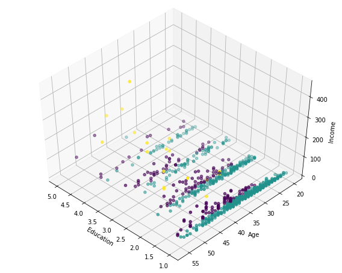


    <matplotlib.figure.Figure at 0x7f2a9c021e48>


### Hierachical Clustering

Two types

- Divisive - Top Down
- Agglomerative - Bottom Up

Agglomerative works by combining clusters based on the distance between them, this is the most popular method for HC

#### Agglomerative Algorithm

1. Create n clusters, one for each datapoint
2. Compute the proximity matrix
3. Repeat Until a single cluster remains
    1. Merge the two closest clusters
    2. Update the proximity matrix

We can use any distance function we want to, there are multiple algorithms for this

- Single linkage clustering
- Complete linkage clustering
- Average linkag clustering
- Centroid linkage clustering

#### Advantages and Disadvantages

- Advantages
    - Number of clusters does not need to be specified
    - Easy to implement
    - Dendogram can be easily understood
- Disadvantages
    - Long runtimes
    - Cannot undo previous steps
    - Difficult to identify the number of clusters on dendogram

#### Lab

##### Import Packages


```python
import numpy as np 
import pandas as pd
from scipy import ndimage 
from scipy.cluster import hierarchy 
from scipy.spatial import distance_matrix 
from matplotlib import pyplot as plt 
from sklearn import manifold, datasets 
from sklearn.cluster import AgglomerativeClustering 
from sklearn.datasets.samples_generator import make_blobs
```

##### Import Data


```python
df = pd.read_csv('https://s3-api.us-geo.objectstorage.softlayer.net/cf-courses-data/CognitiveClass/ML0101ENv3/labs/cars_clus.csv')
```


```python
df.head()
```


<div>
<style scoped>
    .dataframe tbody tr th:only-of-type {
        vertical-align: middle;
    }

    .dataframe tbody tr th {
        vertical-align: top;
    }

    .dataframe thead th {
        text-align: right;
    }
</style>
<table border="1" class="dataframe">
  <thead>
    <tr style="text-align: right;">
      <th></th>
      <th>manufact</th>
      <th>model</th>
      <th>sales</th>
      <th>resale</th>
      <th>type</th>
      <th>price</th>
      <th>engine_s</th>
      <th>horsepow</th>
      <th>wheelbas</th>
      <th>width</th>
      <th>length</th>
      <th>curb_wgt</th>
      <th>fuel_cap</th>
      <th>mpg</th>
      <th>lnsales</th>
      <th>partition</th>
    </tr>
  </thead>
  <tbody>
    <tr>
      <th>0</th>
      <td>Acura</td>
      <td>Integra</td>
      <td>16.919</td>
      <td>16.360</td>
      <td>0.000</td>
      <td>21.500</td>
      <td>1.800</td>
      <td>140.000</td>
      <td>101.200</td>
      <td>67.300</td>
      <td>172.400</td>
      <td>2.639</td>
      <td>13.200</td>
      <td>28.000</td>
      <td>2.828</td>
      <td>0.0</td>
    </tr>
    <tr>
      <th>1</th>
      <td>Acura</td>
      <td>TL</td>
      <td>39.384</td>
      <td>19.875</td>
      <td>0.000</td>
      <td>28.400</td>
      <td>3.200</td>
      <td>225.000</td>
      <td>108.100</td>
      <td>70.300</td>
      <td>192.900</td>
      <td>3.517</td>
      <td>17.200</td>
      <td>25.000</td>
      <td>3.673</td>
      <td>0.0</td>
    </tr>
    <tr>
      <th>2</th>
      <td>Acura</td>
      <td>CL</td>
      <td>14.114</td>
      <td>18.225</td>
      <td>0.000</td>
      <td>$null$</td>
      <td>3.200</td>
      <td>225.000</td>
      <td>106.900</td>
      <td>70.600</td>
      <td>192.000</td>
      <td>3.470</td>
      <td>17.200</td>
      <td>26.000</td>
      <td>2.647</td>
      <td>0.0</td>
    </tr>
    <tr>
      <th>3</th>
      <td>Acura</td>
      <td>RL</td>
      <td>8.588</td>
      <td>29.725</td>
      <td>0.000</td>
      <td>42.000</td>
      <td>3.500</td>
      <td>210.000</td>
      <td>114.600</td>
      <td>71.400</td>
      <td>196.600</td>
      <td>3.850</td>
      <td>18.000</td>
      <td>22.000</td>
      <td>2.150</td>
      <td>0.0</td>
    </tr>
    <tr>
      <th>4</th>
      <td>Audi</td>
      <td>A4</td>
      <td>20.397</td>
      <td>22.255</td>
      <td>0.000</td>
      <td>23.990</td>
      <td>1.800</td>
      <td>150.000</td>
      <td>102.600</td>
      <td>68.200</td>
      <td>178.000</td>
      <td>2.998</td>
      <td>16.400</td>
      <td>27.000</td>
      <td>3.015</td>
      <td>0.0</td>
    </tr>
  </tbody>
</table>
</div>


##### Clean Data


```python
print ("Shape of dataset before cleaning: ", df.size)

df[[ 'sales', 'resale', 'type', 'price', 'engine_s',
       'horsepow', 'wheelbas', 'width', 'length', 'curb_wgt', 'fuel_cap',
       'mpg', 'lnsales']] = df[['sales', 'resale', 'type', 'price', 'engine_s',
       'horsepow', 'wheelbas', 'width', 'length', 'curb_wgt', 'fuel_cap',
       'mpg', 'lnsales']].apply(pd.to_numeric, errors='coerce')
df = df.dropna()
df = df.reset_index(drop=True)

print ("Shape of dataset after cleaning: ", df.size)
df.head()
```

    Shape of dataset before cleaning:  2544
    Shape of dataset after cleaning:  1872


<div>
<style scoped>
    .dataframe tbody tr th:only-of-type {
        vertical-align: middle;
    }

    .dataframe tbody tr th {
        vertical-align: top;
    }

    .dataframe thead th {
        text-align: right;
    }
</style>
<table border="1" class="dataframe">
  <thead>
    <tr style="text-align: right;">
      <th></th>
      <th>manufact</th>
      <th>model</th>
      <th>sales</th>
      <th>resale</th>
      <th>type</th>
      <th>price</th>
      <th>engine_s</th>
      <th>horsepow</th>
      <th>wheelbas</th>
      <th>width</th>
      <th>length</th>
      <th>curb_wgt</th>
      <th>fuel_cap</th>
      <th>mpg</th>
      <th>lnsales</th>
      <th>partition</th>
    </tr>
  </thead>
  <tbody>
    <tr>
      <th>0</th>
      <td>Acura</td>
      <td>Integra</td>
      <td>16.919</td>
      <td>16.360</td>
      <td>0.0</td>
      <td>21.50</td>
      <td>1.8</td>
      <td>140.0</td>
      <td>101.2</td>
      <td>67.3</td>
      <td>172.4</td>
      <td>2.639</td>
      <td>13.2</td>
      <td>28.0</td>
      <td>2.828</td>
      <td>0.0</td>
    </tr>
    <tr>
      <th>1</th>
      <td>Acura</td>
      <td>TL</td>
      <td>39.384</td>
      <td>19.875</td>
      <td>0.0</td>
      <td>28.40</td>
      <td>3.2</td>
      <td>225.0</td>
      <td>108.1</td>
      <td>70.3</td>
      <td>192.9</td>
      <td>3.517</td>
      <td>17.2</td>
      <td>25.0</td>
      <td>3.673</td>
      <td>0.0</td>
    </tr>
    <tr>
      <th>2</th>
      <td>Acura</td>
      <td>RL</td>
      <td>8.588</td>
      <td>29.725</td>
      <td>0.0</td>
      <td>42.00</td>
      <td>3.5</td>
      <td>210.0</td>
      <td>114.6</td>
      <td>71.4</td>
      <td>196.6</td>
      <td>3.850</td>
      <td>18.0</td>
      <td>22.0</td>
      <td>2.150</td>
      <td>0.0</td>
    </tr>
    <tr>
      <th>3</th>
      <td>Audi</td>
      <td>A4</td>
      <td>20.397</td>
      <td>22.255</td>
      <td>0.0</td>
      <td>23.99</td>
      <td>1.8</td>
      <td>150.0</td>
      <td>102.6</td>
      <td>68.2</td>
      <td>178.0</td>
      <td>2.998</td>
      <td>16.4</td>
      <td>27.0</td>
      <td>3.015</td>
      <td>0.0</td>
    </tr>
    <tr>
      <th>4</th>
      <td>Audi</td>
      <td>A6</td>
      <td>18.780</td>
      <td>23.555</td>
      <td>0.0</td>
      <td>33.95</td>
      <td>2.8</td>
      <td>200.0</td>
      <td>108.7</td>
      <td>76.1</td>
      <td>192.0</td>
      <td>3.561</td>
      <td>18.5</td>
      <td>22.0</td>
      <td>2.933</td>
      <td>0.0</td>
    </tr>
  </tbody>
</table>
</div>


##### Selecting Features


```python
X = df[['engine_s','horsepow', 'wheelbas', 
        'width', 'length', 'curb_wgt', 
        'fuel_cap', 'mpg']].values
print(X[:5])
```

    [[   1.8   140.    101.2    67.3   172.4     2.64   13.2    28.  ]
     [   3.2   225.    108.1    70.3   192.9     3.52   17.2    25.  ]
     [   3.5   210.    114.6    71.4   196.6     3.85   18.     22.  ]
     [   1.8   150.    102.6    68.2   178.      3.     16.4    27.  ]
     [   2.8   200.    108.7    76.1   192.      3.56   18.5    22.  ]]


##### Normalization


```python
from sklearn.preprocessing import MinMaxScaler
X_norm = MinMaxScaler().fit_transform(X)
print(X_norm[:5])
```

    [[ 0.11  0.22  0.19  0.28  0.31  0.23  0.13  0.43]
     [ 0.31  0.43  0.34  0.46  0.58  0.5   0.32  0.33]
     [ 0.36  0.39  0.48  0.53  0.63  0.61  0.35  0.23]
     [ 0.11  0.24  0.22  0.34  0.38  0.34  0.28  0.4 ]
     [ 0.26  0.37  0.35  0.81  0.57  0.52  0.38  0.23]]


##### Clustering with Scipy


```python
import scipy as sp

entries = X_norm.shape[0]
D = sp.zeros([entries, entries])
for i in range(entries):
    for j in range(entries):
        D[i,j] = sp.spatial.distance.euclidean(X[i],X[j])
print(D)
```

    [[   0.     87.92   75.8  ...,   16.64   28.08   26.83]
     [  87.92    0.     17.09 ...,   75.6   115.32  114.34]
     [  75.8    17.09    0.   ...,   62.15  103.4   102.08]
     ..., 
     [  16.64   75.6    62.15 ...,    0.     43.35   41.45]
     [  28.08  115.32  103.4  ...,   43.35    0.      3.76]
     [  26.83  114.34  102.08 ...,   41.45    3.76    0.  ]]


We have different distace formulas such as

- single
- complete
- average
- weighted
- centroid


```python
import pylab
import scipy.cluster.hierarchy
```


```python
Z = hierarchy.linkage(D, 'complete')
print(Z[:5])
```

    [[  3.60e+01   9.20e+01   7.15e-03   2.00e+00]
     [  2.80e+01   9.00e+01   1.14e-02   2.00e+00]
     [  4.10e+01   7.40e+01   7.12e-02   2.00e+00]
     [  1.12e+02   1.16e+02   1.65e-01   2.00e+00]
     [  7.60e+01   8.40e+01   4.36e-01   2.00e+00]]


    /opt/conda/envs/DSX-Python35/lib/python3.5/site-packages/ipykernel/__main__.py:1: ClusterWarning: scipy.cluster: The symmetric non-negative hollow observation matrix looks suspiciously like an uncondensed distance matrix
      if __name__ == '__main__':


```python
from scipy.cluster.hierarchy import fcluster
```


```python
max_d =  3
clusters = fcluster(Z, max_d, criterion='distance')
print(clusters)
```

    [ 51 102  95  59  83   3  46  47  38  80  99  97   4   7  84  20  30  39
      40  82   9  19  29  70  31  89  56  78  55  71  32 108  76  41  50  13
      66  22  44  33  73  88  90  75  81  14  77  23  58  60  87  96  12  52
      64 104  28  42  48  94 103   8   5 106  26  68  65  92  72  85  35  15
      16  74  88  91  37  43 100   6   2  17  69 101  37  34  67  79  45  49
      55  56  66  63  36  82  86  98 107   1   1  10  11  18  19  57  93  53
      54  21  61 105  24  27  62  25  24]


```python
max_d = 5
clusters = fcluster(Z, max_d, criterion='maxclust')
print(clusters)
```

    [3 4 4 3 4 1 3 3 3 4 4 4 1 1 4 2 3 3 3 4 1 2 2 3 3 4 3 4 3 3 3 5 4 3 3 2 3
     2 3 3 3 4 4 3 4 2 4 2 3 3 4 4 2 3 3 4 2 3 3 4 4 1 1 4 2 3 3 4 3 4 3 2 2 3
     4 4 3 3 4 1 1 2 3 4 3 3 3 4 3 3 3 3 3 3 3 4 4 4 4 1 1 2 2 2 2 3 4 3 3 2 3
     4 2 2 3 2 2]


```python
fig = pylab.figure(figsize=(18,50))
def llf(id):
    return '[%s %s %s]' % (df['manufact'][id], 
                           df['model'][id], 
                           int(float(df['type'][id])))

dendro = hierarchy.dendrogram(Z, leaf_label_func=llf, 
                             leaf_rotation=0, 
                             leaf_font_size=12, 
                             orientation='right')
```


##### Clustering with SciKit Learn


```python
D = distance_matrix(X, X)
print(D)
```

    [[   0.     87.92   75.8  ...,   16.64   28.08   26.83]
     [  87.92    0.     17.09 ...,   75.6   115.32  114.34]
     [  75.8    17.09    0.   ...,   62.15  103.4   102.08]
     ..., 
     [  16.64   75.6    62.15 ...,    0.     43.35   41.45]
     [  28.08  115.32  103.4  ...,   43.35    0.      3.76]
     [  26.83  114.34  102.08 ...,   41.45    3.76    0.  ]]


```python
agglom = AgglomerativeClustering(n_clusters=6, linkage='complete')
```


```python
agglom.fit(X)
```


    AgglomerativeClustering(affinity='euclidean', compute_full_tree='auto',
                connectivity=None, linkage='complete', memory=None,
                n_clusters=6, pooling_func=<function mean at 0x7f2ad42c3730>)


```python
df['cluster_'] = agglom.labels_
df.head()
```


<div>
<style scoped>
    .dataframe tbody tr th:only-of-type {
        vertical-align: middle;
    }

    .dataframe tbody tr th {
        vertical-align: top;
    }

    .dataframe thead th {
        text-align: right;
    }
</style>
<table border="1" class="dataframe">
  <thead>
    <tr style="text-align: right;">
      <th></th>
      <th>manufact</th>
      <th>model</th>
      <th>sales</th>
      <th>resale</th>
      <th>type</th>
      <th>price</th>
      <th>engine_s</th>
      <th>horsepow</th>
      <th>wheelbas</th>
      <th>width</th>
      <th>length</th>
      <th>curb_wgt</th>
      <th>fuel_cap</th>
      <th>mpg</th>
      <th>lnsales</th>
      <th>partition</th>
      <th>cluster_</th>
    </tr>
  </thead>
  <tbody>
    <tr>
      <th>0</th>
      <td>Acura</td>
      <td>Integra</td>
      <td>16.919</td>
      <td>16.360</td>
      <td>0.0</td>
      <td>21.50</td>
      <td>1.8</td>
      <td>140.0</td>
      <td>101.2</td>
      <td>67.3</td>
      <td>172.4</td>
      <td>2.639</td>
      <td>13.2</td>
      <td>28.0</td>
      <td>2.828</td>
      <td>0.0</td>
      <td>2</td>
    </tr>
    <tr>
      <th>1</th>
      <td>Acura</td>
      <td>TL</td>
      <td>39.384</td>
      <td>19.875</td>
      <td>0.0</td>
      <td>28.40</td>
      <td>3.2</td>
      <td>225.0</td>
      <td>108.1</td>
      <td>70.3</td>
      <td>192.9</td>
      <td>3.517</td>
      <td>17.2</td>
      <td>25.0</td>
      <td>3.673</td>
      <td>0.0</td>
      <td>0</td>
    </tr>
    <tr>
      <th>2</th>
      <td>Acura</td>
      <td>RL</td>
      <td>8.588</td>
      <td>29.725</td>
      <td>0.0</td>
      <td>42.00</td>
      <td>3.5</td>
      <td>210.0</td>
      <td>114.6</td>
      <td>71.4</td>
      <td>196.6</td>
      <td>3.850</td>
      <td>18.0</td>
      <td>22.0</td>
      <td>2.150</td>
      <td>0.0</td>
      <td>0</td>
    </tr>
    <tr>
      <th>3</th>
      <td>Audi</td>
      <td>A4</td>
      <td>20.397</td>
      <td>22.255</td>
      <td>0.0</td>
      <td>23.99</td>
      <td>1.8</td>
      <td>150.0</td>
      <td>102.6</td>
      <td>68.2</td>
      <td>178.0</td>
      <td>2.998</td>
      <td>16.4</td>
      <td>27.0</td>
      <td>3.015</td>
      <td>0.0</td>
      <td>3</td>
    </tr>
    <tr>
      <th>4</th>
      <td>Audi</td>
      <td>A6</td>
      <td>18.780</td>
      <td>23.555</td>
      <td>0.0</td>
      <td>33.95</td>
      <td>2.8</td>
      <td>200.0</td>
      <td>108.7</td>
      <td>76.1</td>
      <td>192.0</td>
      <td>3.561</td>
      <td>18.5</td>
      <td>22.0</td>
      <td>2.933</td>
      <td>0.0</td>
      <td>0</td>
    </tr>
  </tbody>
</table>
</div>


```python
import matplotlib.cm as cm
n_clusters = max(agglom.labels_)+1
colors = cm.rainbow(np.linspace(0,1,n_clusters))
cluster_labels = list(range(0,n_clusters))

plt.figure(figsize=(16,14))

for color, label in zip(colors, cluster_labels):
    subset = df[df.cluster_ == label]
    for i in subset.index:
            plt.text(subset.horsepow[i], 
                     subset.mpg[i],
                     str(subset['model'][i]), 
                     rotation=25) 
            
    plt.scatter(subset.horsepow, subset.mpg, 
                s= subset.price*10, c=color, 
                label='cluster'+str(label),alpha=0.5)

plt.legend()
plt.title('Clusters')
plt.xlabel('horsepow')
plt.ylabel('mpg')
plt.show()
```


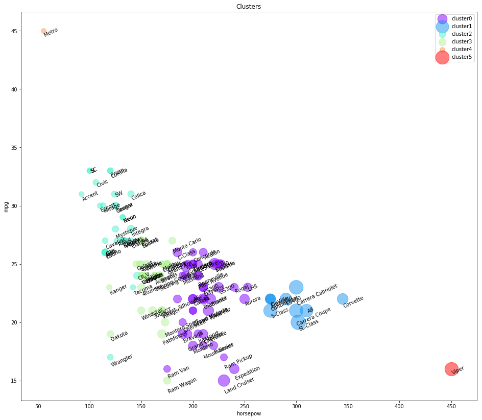


```python
df.groupby(['cluster_','type'])['cluster_'].count()
```


    cluster_  type
    0         0.0     29
              1.0     14
    1         0.0     10
    2         0.0     26
              1.0      4
    3         0.0     21
              1.0     11
    4         0.0      1
    5         0.0      1
    Name: cluster_, dtype: int64


```python
df_mean = df.groupby(['cluster_','type'])['horsepow','engine_s','mpg','price'].mean()
df_mean
```


<div>
<style scoped>
    .dataframe tbody tr th:only-of-type {
        vertical-align: middle;
    }

    .dataframe tbody tr th {
        vertical-align: top;
    }

    .dataframe thead th {
        text-align: right;
    }
</style>
<table border="1" class="dataframe">
  <thead>
    <tr style="text-align: right;">
      <th></th>
      <th></th>
      <th>horsepow</th>
      <th>engine_s</th>
      <th>mpg</th>
      <th>price</th>
    </tr>
    <tr>
      <th>cluster_</th>
      <th>type</th>
      <th></th>
      <th></th>
      <th></th>
      <th></th>
    </tr>
  </thead>
  <tbody>
    <tr>
      <th rowspan="2" valign="top">0</th>
      <th>0.0</th>
      <td>210.551724</td>
      <td>3.420690</td>
      <td>23.648276</td>
      <td>30.449310</td>
    </tr>
    <tr>
      <th>1.0</th>
      <td>206.428571</td>
      <td>4.064286</td>
      <td>18.500000</td>
      <td>28.727714</td>
    </tr>
    <tr>
      <th>1</th>
      <th>0.0</th>
      <td>294.700000</td>
      <td>4.380000</td>
      <td>21.600000</td>
      <td>57.864000</td>
    </tr>
    <tr>
      <th rowspan="2" valign="top">2</th>
      <th>0.0</th>
      <td>121.230769</td>
      <td>1.934615</td>
      <td>29.115385</td>
      <td>14.720385</td>
    </tr>
    <tr>
      <th>1.0</th>
      <td>133.750000</td>
      <td>2.225000</td>
      <td>22.750000</td>
      <td>15.856500</td>
    </tr>
    <tr>
      <th rowspan="2" valign="top">3</th>
      <th>0.0</th>
      <td>160.857143</td>
      <td>2.680952</td>
      <td>24.857143</td>
      <td>19.822048</td>
    </tr>
    <tr>
      <th>1.0</th>
      <td>154.272727</td>
      <td>2.936364</td>
      <td>20.909091</td>
      <td>21.199364</td>
    </tr>
    <tr>
      <th>4</th>
      <th>0.0</th>
      <td>55.000000</td>
      <td>1.000000</td>
      <td>45.000000</td>
      <td>9.235000</td>
    </tr>
    <tr>
      <th>5</th>
      <th>0.0</th>
      <td>450.000000</td>
      <td>8.000000</td>
      <td>16.000000</td>
      <td>69.725000</td>
    </tr>
  </tbody>
</table>
</div>


```python
plt.figure(figsize=(16,10))
for color, label in zip(colors, cluster_labels):
    subset = df_mean.loc[(label,),]
    for i in subset.index:
        plt.text(subset.loc[i][0]+5, subset.loc[i][2], 'type='+str(int(i)) + ', price='+str(int(subset.loc[i][3]))+'k')
    plt.scatter(subset.horsepow, subset.mpg, s=subset.price*20, c=color, label='cluster'+str(label))
plt.legend()
plt.title('Clusters')
plt.xlabel('horsepow')
plt.ylabel('mpg')
```


    Text(0,0.5,'mpg')


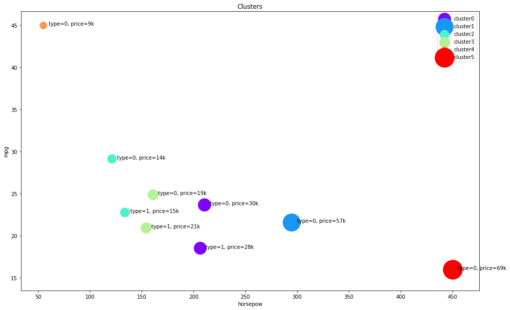


### DBSCAN

Density Based clstering locates regions of high density and separates outliers while being able to find arbitrarily shaped clusters while ignoring noise

- Density Based Spacial Clustering of Applications with Noise
    - Common clustering algorithm
    - Based on object density
- Radius of neighborhood
- Min number of neighbors

Different types of points

- Core
    - Has M neighbors withn R
- Border
    - Has Core point within R, less than M in R
- Outlier
    - Not Core, or within R of Core

DBSCAN visits each point and identifies its type, and then groups points based on this

#### Lab

##### Import Packages


```python
import numpy as np 
from sklearn.cluster import DBSCAN 
from sklearn.datasets.samples_generator import make_blobs 
from sklearn.preprocessing import StandardScaler 
import matplotlib.pyplot as plt
import pandas as pd
```

##### About the Data

		

######  Environment Canada    
*Monthly Values for July - 2015*

<html>
<head>
<style>
table {
    font-family: arial, sans-serif;
    border-collapse: collapse;
    width: 100%;
}

td, th {
    border: 1px solid #dddddd;
    text-align: left;
    padding: 8px;
}

tr:nth-child(even) {
    background-color: #dddddd;
}
</style>
</head>
<body>

<table>
  <tr>
    <th>Name in the table</th>
    <th>Meaning</th>
  </tr>
  <tr>
    <td><font color = "green"><strong>Stn_Name</font></td>
    <td><font color = "green"><strong>Station Name</font</td>
  </tr>
  <tr>
    <td><font color = "green"><strong>Lat</font></td>
    <td><font color = "green"><strong>Latitude (North+, degrees)</font></td>
  </tr>
  <tr>
    <td><font color = "green"><strong>Long</font></td>
    <td><font color = "green"><strong>Longitude (West - , degrees)</font></td>
  </tr>
  <tr>
    <td>Prov</td>
    <td>Province</td>
  </tr>
  <tr>
    <td>Tm</td>
    <td>Mean Temperature (°C)</td>
  </tr>
  <tr>
    <td>DwTm</td>
    <td>Days without Valid Mean Temperature</td>
  </tr>
  <tr>
    <td>D</td>
    <td>Mean Temperature difference from Normal (1981-2010) (°C)</td>
  </tr>
  <tr>
    <td><font color = "black">Tx</font></td>
    <td><font color = "black">Highest Monthly Maximum Temperature (°C)</font></td>
  </tr>
  <tr>
    <td>DwTx</td>
    <td>Days without Valid Maximum Temperature</td>
  </tr>
  <tr>
    <td><font color = "black">Tn</font></td>
    <td><font color = "black">Lowest Monthly Minimum Temperature (°C)</font></td>
  </tr>
  <tr>
    <td>DwTn</td>
    <td>Days without Valid Minimum Temperature</td>
  </tr>
  <tr>
    <td>S</td>
    <td>Snowfall (cm)</td>
  </tr>
  <tr>
    <td>DwS</td>
    <td>Days without Valid Snowfall</td>
  </tr>
  <tr>
    <td>S%N</td>
    <td>Percent of Normal (1981-2010) Snowfall</td>
  </tr>
  <tr>
    <td><font color = "green"><strong>P</font></td>
    <td><font color = "green"><strong>Total Precipitation (mm)</font></td>
  </tr>
  <tr>
    <td>DwP</td>
    <td>Days without Valid Precipitation</td>
  </tr>
  <tr>
    <td>P%N</td>
    <td>Percent of Normal (1981-2010) Precipitation</td>
  </tr>
  <tr>
    <td>S_G</td>
    <td>Snow on the ground at the end of the month (cm)</td>
  </tr>
  <tr>
    <td>Pd</td>
    <td>Number of days with Precipitation 1.0 mm or more</td>
  </tr>
  <tr>
    <td>BS</td>
    <td>Bright Sunshine (hours)</td>
  </tr>
  <tr>
    <td>DwBS</td>
    <td>Days without Valid Bright Sunshine</td>
  </tr>
  <tr>
    <td>BS%</td>
    <td>Percent of Normal (1981-2010) Bright Sunshine</td>
  </tr>
  <tr>
    <td>HDD</td>
    <td>Degree Days below 18 °C</td>
  </tr>
  <tr>
    <td>CDD</td>
    <td>Degree Days above 18 °C</td>
  </tr>
  <tr>
    <td>Stn_No</td>
    <td>Climate station identifier (first 3 digits indicate   drainage basin, last 4 characters are for sorting alphabetically).</td>
  </tr>
  <tr>
    <td>NA</td>
    <td>Not Available</td>
  </tr>


</table>

</body>
</html>

 

##### Import the Data


```python
df = pd.read_csv('https://s3-api.us-geo.objectstorage.softlayer.net/cf-courses-data/CognitiveClass/ML0101ENv3/labs/weather-stations20140101-20141231.csv')
```


```python
df.head()
```


<div>
<style scoped>
    .dataframe tbody tr th:only-of-type {
        vertical-align: middle;
    }

    .dataframe tbody tr th {
        vertical-align: top;
    }

    .dataframe thead th {
        text-align: right;
    }
</style>
<table border="1" class="dataframe">
  <thead>
    <tr style="text-align: right;">
      <th></th>
      <th>Stn_Name</th>
      <th>Lat</th>
      <th>Long</th>
      <th>Prov</th>
      <th>Tm</th>
      <th>DwTm</th>
      <th>D</th>
      <th>Tx</th>
      <th>DwTx</th>
      <th>Tn</th>
      <th>...</th>
      <th>DwP</th>
      <th>P%N</th>
      <th>S_G</th>
      <th>Pd</th>
      <th>BS</th>
      <th>DwBS</th>
      <th>BS%</th>
      <th>HDD</th>
      <th>CDD</th>
      <th>Stn_No</th>
    </tr>
  </thead>
  <tbody>
    <tr>
      <th>0</th>
      <td>CHEMAINUS</td>
      <td>48.935</td>
      <td>-123.742</td>
      <td>BC</td>
      <td>8.2</td>
      <td>0.0</td>
      <td>NaN</td>
      <td>13.5</td>
      <td>0.0</td>
      <td>1.0</td>
      <td>...</td>
      <td>0.0</td>
      <td>NaN</td>
      <td>0.0</td>
      <td>12.0</td>
      <td>NaN</td>
      <td>NaN</td>
      <td>NaN</td>
      <td>273.3</td>
      <td>0.0</td>
      <td>1011500</td>
    </tr>
    <tr>
      <th>1</th>
      <td>COWICHAN LAKE FORESTRY</td>
      <td>48.824</td>
      <td>-124.133</td>
      <td>BC</td>
      <td>7.0</td>
      <td>0.0</td>
      <td>3.0</td>
      <td>15.0</td>
      <td>0.0</td>
      <td>-3.0</td>
      <td>...</td>
      <td>0.0</td>
      <td>104.0</td>
      <td>0.0</td>
      <td>12.0</td>
      <td>NaN</td>
      <td>NaN</td>
      <td>NaN</td>
      <td>307.0</td>
      <td>0.0</td>
      <td>1012040</td>
    </tr>
    <tr>
      <th>2</th>
      <td>LAKE COWICHAN</td>
      <td>48.829</td>
      <td>-124.052</td>
      <td>BC</td>
      <td>6.8</td>
      <td>13.0</td>
      <td>2.8</td>
      <td>16.0</td>
      <td>9.0</td>
      <td>-2.5</td>
      <td>...</td>
      <td>9.0</td>
      <td>NaN</td>
      <td>NaN</td>
      <td>11.0</td>
      <td>NaN</td>
      <td>NaN</td>
      <td>NaN</td>
      <td>168.1</td>
      <td>0.0</td>
      <td>1012055</td>
    </tr>
    <tr>
      <th>3</th>
      <td>DISCOVERY ISLAND</td>
      <td>48.425</td>
      <td>-123.226</td>
      <td>BC</td>
      <td>NaN</td>
      <td>NaN</td>
      <td>NaN</td>
      <td>12.5</td>
      <td>0.0</td>
      <td>NaN</td>
      <td>...</td>
      <td>NaN</td>
      <td>NaN</td>
      <td>NaN</td>
      <td>NaN</td>
      <td>NaN</td>
      <td>NaN</td>
      <td>NaN</td>
      <td>NaN</td>
      <td>NaN</td>
      <td>1012475</td>
    </tr>
    <tr>
      <th>4</th>
      <td>DUNCAN KELVIN CREEK</td>
      <td>48.735</td>
      <td>-123.728</td>
      <td>BC</td>
      <td>7.7</td>
      <td>2.0</td>
      <td>3.4</td>
      <td>14.5</td>
      <td>2.0</td>
      <td>-1.0</td>
      <td>...</td>
      <td>2.0</td>
      <td>NaN</td>
      <td>NaN</td>
      <td>11.0</td>
      <td>NaN</td>
      <td>NaN</td>
      <td>NaN</td>
      <td>267.7</td>
      <td>0.0</td>
      <td>1012573</td>
    </tr>
  </tbody>
</table>
<p>5 rows × 25 columns</p>
</div>


##### Clean Data


```python
df = df[pd.notnull(df['Tm'])]
df.reset_index(drop=True)
df.head()
```


<div>
<style scoped>
    .dataframe tbody tr th:only-of-type {
        vertical-align: middle;
    }

    .dataframe tbody tr th {
        vertical-align: top;
    }

    .dataframe thead th {
        text-align: right;
    }
</style>
<table border="1" class="dataframe">
  <thead>
    <tr style="text-align: right;">
      <th></th>
      <th>Stn_Name</th>
      <th>Lat</th>
      <th>Long</th>
      <th>Prov</th>
      <th>Tm</th>
      <th>DwTm</th>
      <th>D</th>
      <th>Tx</th>
      <th>DwTx</th>
      <th>Tn</th>
      <th>...</th>
      <th>DwP</th>
      <th>P%N</th>
      <th>S_G</th>
      <th>Pd</th>
      <th>BS</th>
      <th>DwBS</th>
      <th>BS%</th>
      <th>HDD</th>
      <th>CDD</th>
      <th>Stn_No</th>
    </tr>
  </thead>
  <tbody>
    <tr>
      <th>0</th>
      <td>CHEMAINUS</td>
      <td>48.935</td>
      <td>-123.742</td>
      <td>BC</td>
      <td>8.2</td>
      <td>0.0</td>
      <td>NaN</td>
      <td>13.5</td>
      <td>0.0</td>
      <td>1.0</td>
      <td>...</td>
      <td>0.0</td>
      <td>NaN</td>
      <td>0.0</td>
      <td>12.0</td>
      <td>NaN</td>
      <td>NaN</td>
      <td>NaN</td>
      <td>273.3</td>
      <td>0.0</td>
      <td>1011500</td>
    </tr>
    <tr>
      <th>1</th>
      <td>COWICHAN LAKE FORESTRY</td>
      <td>48.824</td>
      <td>-124.133</td>
      <td>BC</td>
      <td>7.0</td>
      <td>0.0</td>
      <td>3.0</td>
      <td>15.0</td>
      <td>0.0</td>
      <td>-3.0</td>
      <td>...</td>
      <td>0.0</td>
      <td>104.0</td>
      <td>0.0</td>
      <td>12.0</td>
      <td>NaN</td>
      <td>NaN</td>
      <td>NaN</td>
      <td>307.0</td>
      <td>0.0</td>
      <td>1012040</td>
    </tr>
    <tr>
      <th>2</th>
      <td>LAKE COWICHAN</td>
      <td>48.829</td>
      <td>-124.052</td>
      <td>BC</td>
      <td>6.8</td>
      <td>13.0</td>
      <td>2.8</td>
      <td>16.0</td>
      <td>9.0</td>
      <td>-2.5</td>
      <td>...</td>
      <td>9.0</td>
      <td>NaN</td>
      <td>NaN</td>
      <td>11.0</td>
      <td>NaN</td>
      <td>NaN</td>
      <td>NaN</td>
      <td>168.1</td>
      <td>0.0</td>
      <td>1012055</td>
    </tr>
    <tr>
      <th>4</th>
      <td>DUNCAN KELVIN CREEK</td>
      <td>48.735</td>
      <td>-123.728</td>
      <td>BC</td>
      <td>7.7</td>
      <td>2.0</td>
      <td>3.4</td>
      <td>14.5</td>
      <td>2.0</td>
      <td>-1.0</td>
      <td>...</td>
      <td>2.0</td>
      <td>NaN</td>
      <td>NaN</td>
      <td>11.0</td>
      <td>NaN</td>
      <td>NaN</td>
      <td>NaN</td>
      <td>267.7</td>
      <td>0.0</td>
      <td>1012573</td>
    </tr>
    <tr>
      <th>5</th>
      <td>ESQUIMALT HARBOUR</td>
      <td>48.432</td>
      <td>-123.439</td>
      <td>BC</td>
      <td>8.8</td>
      <td>0.0</td>
      <td>NaN</td>
      <td>13.1</td>
      <td>0.0</td>
      <td>1.9</td>
      <td>...</td>
      <td>8.0</td>
      <td>NaN</td>
      <td>NaN</td>
      <td>12.0</td>
      <td>NaN</td>
      <td>NaN</td>
      <td>NaN</td>
      <td>258.6</td>
      <td>0.0</td>
      <td>1012710</td>
    </tr>
  </tbody>
</table>
<p>5 rows × 25 columns</p>
</div>


```python
# ! pip install --user git+https://github.com/matplotlib/basemap.git
```


```python
# from mpl_toolkits.basemap import Basemap
import matplotlib.pyplot as plt
from pylab import rcParams
```


```python
rcParams['figure.figsize'] = (14,10)

llon=-140
ulon=-50
llat=40
ulat=65

df = df[(df['Long'] > llon) & (df['Long'] < ulon) & (df['Lat'] > llat) &(df['Lat'] < ulat)]

plt.title('Location of Sensors')
plt.scatter(list(df['Long']),list(df['Lat']))
plt.xlabel('Longitude')
plt.ylabel('Latitude')
plt.show()
```


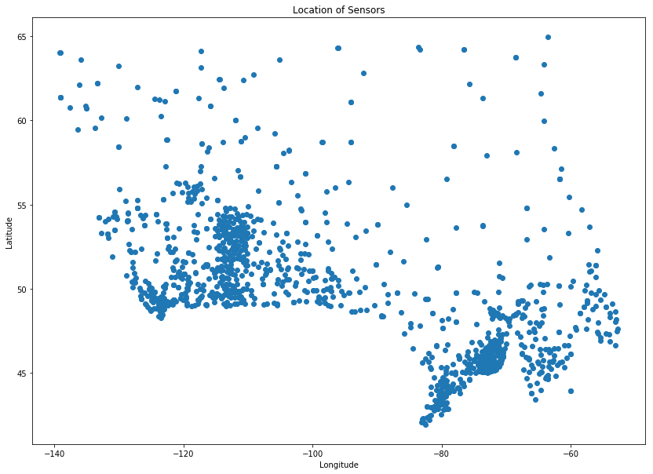


##### Compute DBSCAN


```python
from sklearn.cluster import DBSCAN
import sklearn.utils
from sklearn.preprocessing import StandardScaler
sklearn.utils.check_random_state(1000)
```


    <mtrand.RandomState at 0x7f29c41733a8>


```python
X = np.nan_to_num(df[['Lat','Long']])
X = StandardScaler().fit_transform(X)

X
```


    array([[-0.3 , -1.17],
           [-0.33, -1.19],
           [-0.33, -1.18],
           ..., 
           [ 1.84,  1.47],
           [ 1.01,  1.65],
           [ 0.6 ,  1.28]])


```python
db = DBSCAN(eps=0.15, min_samples=10).fit(X)
db
```


    DBSCAN(algorithm='auto', eps=0.15, leaf_size=30, metric='euclidean',
        metric_params=None, min_samples=10, n_jobs=1, p=None)


```python
core_samples_mask = np.zeros_like(db.labels_, dtype=bool)
core_samples_mask[db.core_sample_indices_] = True

core_samples_mask
```


    array([ True,  True,  True, ..., False, False, False], dtype=bool)


```python
df['Clus_db'] = db.labels_
df.head()
```


<div>
<style scoped>
    .dataframe tbody tr th:only-of-type {
        vertical-align: middle;
    }

    .dataframe tbody tr th {
        vertical-align: top;
    }

    .dataframe thead th {
        text-align: right;
    }
</style>
<table border="1" class="dataframe">
  <thead>
    <tr style="text-align: right;">
      <th></th>
      <th>Stn_Name</th>
      <th>Lat</th>
      <th>Long</th>
      <th>Prov</th>
      <th>Tm</th>
      <th>DwTm</th>
      <th>D</th>
      <th>Tx</th>
      <th>DwTx</th>
      <th>Tn</th>
      <th>...</th>
      <th>P%N</th>
      <th>S_G</th>
      <th>Pd</th>
      <th>BS</th>
      <th>DwBS</th>
      <th>BS%</th>
      <th>HDD</th>
      <th>CDD</th>
      <th>Stn_No</th>
      <th>Clus_db</th>
    </tr>
  </thead>
  <tbody>
    <tr>
      <th>0</th>
      <td>CHEMAINUS</td>
      <td>48.935</td>
      <td>-123.742</td>
      <td>BC</td>
      <td>8.2</td>
      <td>0.0</td>
      <td>NaN</td>
      <td>13.5</td>
      <td>0.0</td>
      <td>1.0</td>
      <td>...</td>
      <td>NaN</td>
      <td>0.0</td>
      <td>12.0</td>
      <td>NaN</td>
      <td>NaN</td>
      <td>NaN</td>
      <td>273.3</td>
      <td>0.0</td>
      <td>1011500</td>
      <td>0</td>
    </tr>
    <tr>
      <th>1</th>
      <td>COWICHAN LAKE FORESTRY</td>
      <td>48.824</td>
      <td>-124.133</td>
      <td>BC</td>
      <td>7.0</td>
      <td>0.0</td>
      <td>3.0</td>
      <td>15.0</td>
      <td>0.0</td>
      <td>-3.0</td>
      <td>...</td>
      <td>104.0</td>
      <td>0.0</td>
      <td>12.0</td>
      <td>NaN</td>
      <td>NaN</td>
      <td>NaN</td>
      <td>307.0</td>
      <td>0.0</td>
      <td>1012040</td>
      <td>0</td>
    </tr>
    <tr>
      <th>2</th>
      <td>LAKE COWICHAN</td>
      <td>48.829</td>
      <td>-124.052</td>
      <td>BC</td>
      <td>6.8</td>
      <td>13.0</td>
      <td>2.8</td>
      <td>16.0</td>
      <td>9.0</td>
      <td>-2.5</td>
      <td>...</td>
      <td>NaN</td>
      <td>NaN</td>
      <td>11.0</td>
      <td>NaN</td>
      <td>NaN</td>
      <td>NaN</td>
      <td>168.1</td>
      <td>0.0</td>
      <td>1012055</td>
      <td>0</td>
    </tr>
    <tr>
      <th>4</th>
      <td>DUNCAN KELVIN CREEK</td>
      <td>48.735</td>
      <td>-123.728</td>
      <td>BC</td>
      <td>7.7</td>
      <td>2.0</td>
      <td>3.4</td>
      <td>14.5</td>
      <td>2.0</td>
      <td>-1.0</td>
      <td>...</td>
      <td>NaN</td>
      <td>NaN</td>
      <td>11.0</td>
      <td>NaN</td>
      <td>NaN</td>
      <td>NaN</td>
      <td>267.7</td>
      <td>0.0</td>
      <td>1012573</td>
      <td>0</td>
    </tr>
    <tr>
      <th>5</th>
      <td>ESQUIMALT HARBOUR</td>
      <td>48.432</td>
      <td>-123.439</td>
      <td>BC</td>
      <td>8.8</td>
      <td>0.0</td>
      <td>NaN</td>
      <td>13.1</td>
      <td>0.0</td>
      <td>1.9</td>
      <td>...</td>
      <td>NaN</td>
      <td>NaN</td>
      <td>12.0</td>
      <td>NaN</td>
      <td>NaN</td>
      <td>NaN</td>
      <td>258.6</td>
      <td>0.0</td>
      <td>1012710</td>
      <td>0</td>
    </tr>
  </tbody>
</table>
<p>5 rows × 26 columns</p>
</div>


```python
df[['Stn_Name','Tx','Tm','Clus_db']][1000:1500:45]
```


<div>
<style scoped>
    .dataframe tbody tr th:only-of-type {
        vertical-align: middle;
    }

    .dataframe tbody tr th {
        vertical-align: top;
    }

    .dataframe thead th {
        text-align: right;
    }
</style>
<table border="1" class="dataframe">
  <thead>
    <tr style="text-align: right;">
      <th></th>
      <th>Stn_Name</th>
      <th>Tx</th>
      <th>Tm</th>
      <th>Clus_db</th>
    </tr>
  </thead>
  <tbody>
    <tr>
      <th>1138</th>
      <td>HEATH POINT</td>
      <td>-1.0</td>
      <td>-13.3</td>
      <td>-1</td>
    </tr>
    <tr>
      <th>1185</th>
      <td>LA GRANDE RIVIERE A</td>
      <td>-11.6</td>
      <td>-28.4</td>
      <td>-1</td>
    </tr>
    <tr>
      <th>1234</th>
      <td>BRIER ISLAND</td>
      <td>4.4</td>
      <td>-6.3</td>
      <td>3</td>
    </tr>
    <tr>
      <th>1286</th>
      <td>BRANCH</td>
      <td>8.0</td>
      <td>-3.4</td>
      <td>4</td>
    </tr>
    <tr>
      <th>1332</th>
      <td>GOOSE A</td>
      <td>-4.2</td>
      <td>-22.0</td>
      <td>-1</td>
    </tr>
  </tbody>
</table>
</div>


##### Cluster Visualization


```python
print(df['Clus_db'].max(), df['Clus_db'].min())
```

    5 -1


```python
from sklearn.preprocessing import LabelEncoder
```


```python
le = LabelEncoder()
colours = ['#D3D3D3','blue','red','green','purple','yellow','deepskyblue']
le.fit(colours)
le.classes_
```


    array(['#D3D3D3', 'blue', 'deepskyblue', 'green', 'purple', 'red', 'yellow'],
          dtype='<U11')


```python
# le.inverse_transform([0,1,2,3,4,5,6])
df['Colours'] = le.inverse_transform(db.labels_ + 1)
df[['Stn_Name','Tx','Tm','Clus_db', 'Colours']][1000:1500:45]
```


<div>
<style scoped>
    .dataframe tbody tr th:only-of-type {
        vertical-align: middle;
    }

    .dataframe tbody tr th {
        vertical-align: top;
    }

    .dataframe thead th {
        text-align: right;
    }
</style>
<table border="1" class="dataframe">
  <thead>
    <tr style="text-align: right;">
      <th></th>
      <th>Stn_Name</th>
      <th>Tx</th>
      <th>Tm</th>
      <th>Clus_db</th>
      <th>Colours</th>
    </tr>
  </thead>
  <tbody>
    <tr>
      <th>1138</th>
      <td>HEATH POINT</td>
      <td>-1.0</td>
      <td>-13.3</td>
      <td>-1</td>
      <td>#D3D3D3</td>
    </tr>
    <tr>
      <th>1185</th>
      <td>LA GRANDE RIVIERE A</td>
      <td>-11.6</td>
      <td>-28.4</td>
      <td>-1</td>
      <td>#D3D3D3</td>
    </tr>
    <tr>
      <th>1234</th>
      <td>BRIER ISLAND</td>
      <td>4.4</td>
      <td>-6.3</td>
      <td>3</td>
      <td>purple</td>
    </tr>
    <tr>
      <th>1286</th>
      <td>BRANCH</td>
      <td>8.0</td>
      <td>-3.4</td>
      <td>4</td>
      <td>red</td>
    </tr>
    <tr>
      <th>1332</th>
      <td>GOOSE A</td>
      <td>-4.2</td>
      <td>-22.0</td>
      <td>-1</td>
      <td>#D3D3D3</td>
    </tr>
  </tbody>
</table>
</div>


```python
plt.title('Clusters')
plt.scatter(list(df['Long']),
            list(df['Lat']),
            c=list(df['Colours']))
plt.xlabel('Longitude')
plt.ylabel('Latitude')
plt.show()
```


## Recommender Systems

Recommender systems try to capture people's behaviour in order to predict what people may like

There are two main types

- Content based
    - Provide more content similar to what that user likes
- Collaborative filtering
    - A user may be interested in what other similar users like
    
There are two types of implementations

- Memory based
    - Uses entire user-item dataset to generate a recommendation
- Model based
    - Develops model of users in an attempt to learn their preferences
    
### Content Based

Content based systems try to recommend content based on a model of the user and similarity of the content that they interact with

#### Lab

##### Download the Data

The dataset being used is a movie dataset from GroupLens


```python
#only run once

# !wget -O moviedataset.zip https://s3-api.us-geo.objectstorage.softlayer.net/cf-courses-data/CognitiveClass/ML0101ENv3/labs/moviedataset.zip
# print('unziping ...')
# !unzip -o -j moviedataset.zip 
```

##### Import Packages


```python
import pandas as pd
from math import sqrt
import numpy as np
import matplotlib.pyplot as plt
```

##### Import Data


```python
movies_df = pd.read_csv('movies.csv')
ratings_df = pd.read_csv('ratings.csv')
```


```python
movies_df.head()
```


<div>
<style scoped>
    .dataframe tbody tr th:only-of-type {
        vertical-align: middle;
    }

    .dataframe tbody tr th {
        vertical-align: top;
    }

    .dataframe thead th {
        text-align: right;
    }
</style>
<table border="1" class="dataframe">
  <thead>
    <tr style="text-align: right;">
      <th></th>
      <th>movieId</th>
      <th>title</th>
      <th>genres</th>
    </tr>
  </thead>
  <tbody>
    <tr>
      <th>0</th>
      <td>1</td>
      <td>Toy Story (1995)</td>
      <td>Adventure|Animation|Children|Comedy|Fantasy</td>
    </tr>
    <tr>
      <th>1</th>
      <td>2</td>
      <td>Jumanji (1995)</td>
      <td>Adventure|Children|Fantasy</td>
    </tr>
    <tr>
      <th>2</th>
      <td>3</td>
      <td>Grumpier Old Men (1995)</td>
      <td>Comedy|Romance</td>
    </tr>
    <tr>
      <th>3</th>
      <td>4</td>
      <td>Waiting to Exhale (1995)</td>
      <td>Comedy|Drama|Romance</td>
    </tr>
    <tr>
      <th>4</th>
      <td>5</td>
      <td>Father of the Bride Part II (1995)</td>
      <td>Comedy</td>
    </tr>
  </tbody>
</table>
</div>


```python
ratings_df.head()
```


<div>
<style scoped>
    .dataframe tbody tr th:only-of-type {
        vertical-align: middle;
    }

    .dataframe tbody tr th {
        vertical-align: top;
    }

    .dataframe thead th {
        text-align: right;
    }
</style>
<table border="1" class="dataframe">
  <thead>
    <tr style="text-align: right;">
      <th></th>
      <th>userId</th>
      <th>movieId</th>
      <th>rating</th>
      <th>timestamp</th>
    </tr>
  </thead>
  <tbody>
    <tr>
      <th>0</th>
      <td>1</td>
      <td>169</td>
      <td>2.5</td>
      <td>1204927694</td>
    </tr>
    <tr>
      <th>1</th>
      <td>1</td>
      <td>2471</td>
      <td>3.0</td>
      <td>1204927438</td>
    </tr>
    <tr>
      <th>2</th>
      <td>1</td>
      <td>48516</td>
      <td>5.0</td>
      <td>1204927435</td>
    </tr>
    <tr>
      <th>3</th>
      <td>2</td>
      <td>2571</td>
      <td>3.5</td>
      <td>1436165433</td>
    </tr>
    <tr>
      <th>4</th>
      <td>2</td>
      <td>109487</td>
      <td>4.0</td>
      <td>1436165496</td>
    </tr>
  </tbody>
</table>
</div>


##### Preprocessing


```python
movies_df['year'] = movies_df.title.str.extract('(\(\d\d\d\d\))', 
                                                expand=False)
movies_df['year'] = movies_df.year.str.extract('(\d\d\d\d)', 
                                               expand=False)

movies_df['title'] = movies_df.title.str.replace('(\(\d\d\d\d\))', '')
movies_df['title'] = movies_df['title'].apply(lambda x: x.strip())

movies_df.head()
```


<div>
<style scoped>
    .dataframe tbody tr th:only-of-type {
        vertical-align: middle;
    }

    .dataframe tbody tr th {
        vertical-align: top;
    }

    .dataframe thead th {
        text-align: right;
    }
</style>
<table border="1" class="dataframe">
  <thead>
    <tr style="text-align: right;">
      <th></th>
      <th>movieId</th>
      <th>title</th>
      <th>genres</th>
      <th>year</th>
    </tr>
  </thead>
  <tbody>
    <tr>
      <th>0</th>
      <td>1</td>
      <td>Toy Story</td>
      <td>Adventure|Animation|Children|Comedy|Fantasy</td>
      <td>1995</td>
    </tr>
    <tr>
      <th>1</th>
      <td>2</td>
      <td>Jumanji</td>
      <td>Adventure|Children|Fantasy</td>
      <td>1995</td>
    </tr>
    <tr>
      <th>2</th>
      <td>3</td>
      <td>Grumpier Old Men</td>
      <td>Comedy|Romance</td>
      <td>1995</td>
    </tr>
    <tr>
      <th>3</th>
      <td>4</td>
      <td>Waiting to Exhale</td>
      <td>Comedy|Drama|Romance</td>
      <td>1995</td>
    </tr>
    <tr>
      <th>4</th>
      <td>5</td>
      <td>Father of the Bride Part II</td>
      <td>Comedy</td>
      <td>1995</td>
    </tr>
  </tbody>
</table>
</div>


```python
movies_df['genres'] = movies_df.genres.str.split('|')
movies_df.head()
```


<div>
<style scoped>
    .dataframe tbody tr th:only-of-type {
        vertical-align: middle;
    }

    .dataframe tbody tr th {
        vertical-align: top;
    }

    .dataframe thead th {
        text-align: right;
    }
</style>
<table border="1" class="dataframe">
  <thead>
    <tr style="text-align: right;">
      <th></th>
      <th>movieId</th>
      <th>title</th>
      <th>genres</th>
      <th>year</th>
    </tr>
  </thead>
  <tbody>
    <tr>
      <th>0</th>
      <td>1</td>
      <td>Toy Story</td>
      <td>[Adventure, Animation, Children, Comedy, Fantasy]</td>
      <td>1995</td>
    </tr>
    <tr>
      <th>1</th>
      <td>2</td>
      <td>Jumanji</td>
      <td>[Adventure, Children, Fantasy]</td>
      <td>1995</td>
    </tr>
    <tr>
      <th>2</th>
      <td>3</td>
      <td>Grumpier Old Men</td>
      <td>[Comedy, Romance]</td>
      <td>1995</td>
    </tr>
    <tr>
      <th>3</th>
      <td>4</td>
      <td>Waiting to Exhale</td>
      <td>[Comedy, Drama, Romance]</td>
      <td>1995</td>
    </tr>
    <tr>
      <th>4</th>
      <td>5</td>
      <td>Father of the Bride Part II</td>
      <td>[Comedy]</td>
      <td>1995</td>
    </tr>
  </tbody>
</table>
</div>


```python
genres_df = movies_df.copy()

for index, row in movies_df.iterrows():
    for genre in row['genres']:
        genres_df.at[index, genre] = 1

genres_df = genres_df.fillna(0)
genres_df.head()
```


<div>
<style scoped>
    .dataframe tbody tr th:only-of-type {
        vertical-align: middle;
    }

    .dataframe tbody tr th {
        vertical-align: top;
    }

    .dataframe thead th {
        text-align: right;
    }
</style>
<table border="1" class="dataframe">
  <thead>
    <tr style="text-align: right;">
      <th></th>
      <th>movieId</th>
      <th>title</th>
      <th>genres</th>
      <th>year</th>
      <th>Adventure</th>
      <th>Animation</th>
      <th>Children</th>
      <th>Comedy</th>
      <th>Fantasy</th>
      <th>Romance</th>
      <th>...</th>
      <th>Horror</th>
      <th>Mystery</th>
      <th>Sci-Fi</th>
      <th>IMAX</th>
      <th>Documentary</th>
      <th>War</th>
      <th>Musical</th>
      <th>Western</th>
      <th>Film-Noir</th>
      <th>(no genres listed)</th>
    </tr>
  </thead>
  <tbody>
    <tr>
      <th>0</th>
      <td>1</td>
      <td>Toy Story</td>
      <td>[Adventure, Animation, Children, Comedy, Fantasy]</td>
      <td>1995</td>
      <td>1.0</td>
      <td>1.0</td>
      <td>1.0</td>
      <td>1.0</td>
      <td>1.0</td>
      <td>0.0</td>
      <td>...</td>
      <td>0.0</td>
      <td>0.0</td>
      <td>0.0</td>
      <td>0.0</td>
      <td>0.0</td>
      <td>0.0</td>
      <td>0.0</td>
      <td>0.0</td>
      <td>0.0</td>
      <td>0.0</td>
    </tr>
    <tr>
      <th>1</th>
      <td>2</td>
      <td>Jumanji</td>
      <td>[Adventure, Children, Fantasy]</td>
      <td>1995</td>
      <td>1.0</td>
      <td>0.0</td>
      <td>1.0</td>
      <td>0.0</td>
      <td>1.0</td>
      <td>0.0</td>
      <td>...</td>
      <td>0.0</td>
      <td>0.0</td>
      <td>0.0</td>
      <td>0.0</td>
      <td>0.0</td>
      <td>0.0</td>
      <td>0.0</td>
      <td>0.0</td>
      <td>0.0</td>
      <td>0.0</td>
    </tr>
    <tr>
      <th>2</th>
      <td>3</td>
      <td>Grumpier Old Men</td>
      <td>[Comedy, Romance]</td>
      <td>1995</td>
      <td>0.0</td>
      <td>0.0</td>
      <td>0.0</td>
      <td>1.0</td>
      <td>0.0</td>
      <td>1.0</td>
      <td>...</td>
      <td>0.0</td>
      <td>0.0</td>
      <td>0.0</td>
      <td>0.0</td>
      <td>0.0</td>
      <td>0.0</td>
      <td>0.0</td>
      <td>0.0</td>
      <td>0.0</td>
      <td>0.0</td>
    </tr>
    <tr>
      <th>3</th>
      <td>4</td>
      <td>Waiting to Exhale</td>
      <td>[Comedy, Drama, Romance]</td>
      <td>1995</td>
      <td>0.0</td>
      <td>0.0</td>
      <td>0.0</td>
      <td>1.0</td>
      <td>0.0</td>
      <td>1.0</td>
      <td>...</td>
      <td>0.0</td>
      <td>0.0</td>
      <td>0.0</td>
      <td>0.0</td>
      <td>0.0</td>
      <td>0.0</td>
      <td>0.0</td>
      <td>0.0</td>
      <td>0.0</td>
      <td>0.0</td>
    </tr>
    <tr>
      <th>4</th>
      <td>5</td>
      <td>Father of the Bride Part II</td>
      <td>[Comedy]</td>
      <td>1995</td>
      <td>0.0</td>
      <td>0.0</td>
      <td>0.0</td>
      <td>1.0</td>
      <td>0.0</td>
      <td>0.0</td>
      <td>...</td>
      <td>0.0</td>
      <td>0.0</td>
      <td>0.0</td>
      <td>0.0</td>
      <td>0.0</td>
      <td>0.0</td>
      <td>0.0</td>
      <td>0.0</td>
      <td>0.0</td>
      <td>0.0</td>
    </tr>
  </tbody>
</table>
<p>5 rows × 24 columns</p>
</div>


```python
ratings_df.head()
```


<div>
<style scoped>
    .dataframe tbody tr th:only-of-type {
        vertical-align: middle;
    }

    .dataframe tbody tr th {
        vertical-align: top;
    }

    .dataframe thead th {
        text-align: right;
    }
</style>
<table border="1" class="dataframe">
  <thead>
    <tr style="text-align: right;">
      <th></th>
      <th>userId</th>
      <th>movieId</th>
      <th>rating</th>
      <th>timestamp</th>
    </tr>
  </thead>
  <tbody>
    <tr>
      <th>0</th>
      <td>1</td>
      <td>169</td>
      <td>2.5</td>
      <td>1204927694</td>
    </tr>
    <tr>
      <th>1</th>
      <td>1</td>
      <td>2471</td>
      <td>3.0</td>
      <td>1204927438</td>
    </tr>
    <tr>
      <th>2</th>
      <td>1</td>
      <td>48516</td>
      <td>5.0</td>
      <td>1204927435</td>
    </tr>
    <tr>
      <th>3</th>
      <td>2</td>
      <td>2571</td>
      <td>3.5</td>
      <td>1436165433</td>
    </tr>
    <tr>
      <th>4</th>
      <td>2</td>
      <td>109487</td>
      <td>4.0</td>
      <td>1436165496</td>
    </tr>
  </tbody>
</table>
</div>


```python
ratings_df = ratings_df.drop('timestamp', 1)
ratings_df.head()
```


<div>
<style scoped>
    .dataframe tbody tr th:only-of-type {
        vertical-align: middle;
    }

    .dataframe tbody tr th {
        vertical-align: top;
    }

    .dataframe thead th {
        text-align: right;
    }
</style>
<table border="1" class="dataframe">
  <thead>
    <tr style="text-align: right;">
      <th></th>
      <th>userId</th>
      <th>movieId</th>
      <th>rating</th>
    </tr>
  </thead>
  <tbody>
    <tr>
      <th>0</th>
      <td>1</td>
      <td>169</td>
      <td>2.5</td>
    </tr>
    <tr>
      <th>1</th>
      <td>1</td>
      <td>2471</td>
      <td>3.0</td>
    </tr>
    <tr>
      <th>2</th>
      <td>1</td>
      <td>48516</td>
      <td>5.0</td>
    </tr>
    <tr>
      <th>3</th>
      <td>2</td>
      <td>2571</td>
      <td>3.5</td>
    </tr>
    <tr>
      <th>4</th>
      <td>2</td>
      <td>109487</td>
      <td>4.0</td>
    </tr>
  </tbody>
</table>
</div>


##### User Interests


```python
user_movies = pd.DataFrame([
                            {'title':'Breakfast Club, The', 'rating':5},
                            {'title':'Toy Story', 'rating':3.5},
                            {'title':'Jumanji', 'rating':2},
                            {'title':"Pulp Fiction", 'rating':5},
                            {'title':'Akira', 'rating':4.5}
                           ])
user_movies
```


<div>
<style scoped>
    .dataframe tbody tr th:only-of-type {
        vertical-align: middle;
    }

    .dataframe tbody tr th {
        vertical-align: top;
    }

    .dataframe thead th {
        text-align: right;
    }
</style>
<table border="1" class="dataframe">
  <thead>
    <tr style="text-align: right;">
      <th></th>
      <th>rating</th>
      <th>title</th>
    </tr>
  </thead>
  <tbody>
    <tr>
      <th>0</th>
      <td>5.0</td>
      <td>Breakfast Club, The</td>
    </tr>
    <tr>
      <th>1</th>
      <td>3.5</td>
      <td>Toy Story</td>
    </tr>
    <tr>
      <th>2</th>
      <td>2.0</td>
      <td>Jumanji</td>
    </tr>
    <tr>
      <th>3</th>
      <td>5.0</td>
      <td>Pulp Fiction</td>
    </tr>
    <tr>
      <th>4</th>
      <td>4.5</td>
      <td>Akira</td>
    </tr>
  </tbody>
</table>
</div>


```python
movie_ids = genres_df[genres_df['title'].isin(user_movies['title'].tolist())]
user_movies = pd.merge(movie_ids, user_movies)
user_genres = user_movies.drop('genres', 1).drop('year',1)
user_genres
```


<div>
<style scoped>
    .dataframe tbody tr th:only-of-type {
        vertical-align: middle;
    }

    .dataframe tbody tr th {
        vertical-align: top;
    }

    .dataframe thead th {
        text-align: right;
    }
</style>
<table border="1" class="dataframe">
  <thead>
    <tr style="text-align: right;">
      <th></th>
      <th>movieId</th>
      <th>title</th>
      <th>Adventure</th>
      <th>Animation</th>
      <th>Children</th>
      <th>Comedy</th>
      <th>Fantasy</th>
      <th>Romance</th>
      <th>Drama</th>
      <th>Action</th>
      <th>...</th>
      <th>Mystery</th>
      <th>Sci-Fi</th>
      <th>IMAX</th>
      <th>Documentary</th>
      <th>War</th>
      <th>Musical</th>
      <th>Western</th>
      <th>Film-Noir</th>
      <th>(no genres listed)</th>
      <th>rating</th>
    </tr>
  </thead>
  <tbody>
    <tr>
      <th>0</th>
      <td>1</td>
      <td>Toy Story</td>
      <td>1.0</td>
      <td>1.0</td>
      <td>1.0</td>
      <td>1.0</td>
      <td>1.0</td>
      <td>0.0</td>
      <td>0.0</td>
      <td>0.0</td>
      <td>...</td>
      <td>0.0</td>
      <td>0.0</td>
      <td>0.0</td>
      <td>0.0</td>
      <td>0.0</td>
      <td>0.0</td>
      <td>0.0</td>
      <td>0.0</td>
      <td>0.0</td>
      <td>3.5</td>
    </tr>
    <tr>
      <th>1</th>
      <td>2</td>
      <td>Jumanji</td>
      <td>1.0</td>
      <td>0.0</td>
      <td>1.0</td>
      <td>0.0</td>
      <td>1.0</td>
      <td>0.0</td>
      <td>0.0</td>
      <td>0.0</td>
      <td>...</td>
      <td>0.0</td>
      <td>0.0</td>
      <td>0.0</td>
      <td>0.0</td>
      <td>0.0</td>
      <td>0.0</td>
      <td>0.0</td>
      <td>0.0</td>
      <td>0.0</td>
      <td>2.0</td>
    </tr>
    <tr>
      <th>2</th>
      <td>296</td>
      <td>Pulp Fiction</td>
      <td>0.0</td>
      <td>0.0</td>
      <td>0.0</td>
      <td>1.0</td>
      <td>0.0</td>
      <td>0.0</td>
      <td>1.0</td>
      <td>0.0</td>
      <td>...</td>
      <td>0.0</td>
      <td>0.0</td>
      <td>0.0</td>
      <td>0.0</td>
      <td>0.0</td>
      <td>0.0</td>
      <td>0.0</td>
      <td>0.0</td>
      <td>0.0</td>
      <td>5.0</td>
    </tr>
    <tr>
      <th>3</th>
      <td>1274</td>
      <td>Akira</td>
      <td>1.0</td>
      <td>1.0</td>
      <td>0.0</td>
      <td>0.0</td>
      <td>0.0</td>
      <td>0.0</td>
      <td>0.0</td>
      <td>1.0</td>
      <td>...</td>
      <td>0.0</td>
      <td>1.0</td>
      <td>0.0</td>
      <td>0.0</td>
      <td>0.0</td>
      <td>0.0</td>
      <td>0.0</td>
      <td>0.0</td>
      <td>0.0</td>
      <td>4.5</td>
    </tr>
    <tr>
      <th>4</th>
      <td>1968</td>
      <td>Breakfast Club, The</td>
      <td>0.0</td>
      <td>0.0</td>
      <td>0.0</td>
      <td>1.0</td>
      <td>0.0</td>
      <td>0.0</td>
      <td>1.0</td>
      <td>0.0</td>
      <td>...</td>
      <td>0.0</td>
      <td>0.0</td>
      <td>0.0</td>
      <td>0.0</td>
      <td>0.0</td>
      <td>0.0</td>
      <td>0.0</td>
      <td>0.0</td>
      <td>0.0</td>
      <td>5.0</td>
    </tr>
  </tbody>
</table>
<p>5 rows × 23 columns</p>
</div>


Since we only need the genres


```python
user_genres.drop('title', 1, inplace=True)
user_genres.drop('movieId', 1, inplace=True)
user_genres.drop('rating', 1, inplace=True)
user_genres
```


<div>
<style scoped>
    .dataframe tbody tr th:only-of-type {
        vertical-align: middle;
    }

    .dataframe tbody tr th {
        vertical-align: top;
    }

    .dataframe thead th {
        text-align: right;
    }
</style>
<table border="1" class="dataframe">
  <thead>
    <tr style="text-align: right;">
      <th></th>
      <th>Adventure</th>
      <th>Animation</th>
      <th>Children</th>
      <th>Comedy</th>
      <th>Fantasy</th>
      <th>Romance</th>
      <th>Drama</th>
      <th>Action</th>
      <th>Crime</th>
      <th>Thriller</th>
      <th>Horror</th>
      <th>Mystery</th>
      <th>Sci-Fi</th>
      <th>IMAX</th>
      <th>Documentary</th>
      <th>War</th>
      <th>Musical</th>
      <th>Western</th>
      <th>Film-Noir</th>
      <th>(no genres listed)</th>
    </tr>
  </thead>
  <tbody>
    <tr>
      <th>0</th>
      <td>1.0</td>
      <td>1.0</td>
      <td>1.0</td>
      <td>1.0</td>
      <td>1.0</td>
      <td>0.0</td>
      <td>0.0</td>
      <td>0.0</td>
      <td>0.0</td>
      <td>0.0</td>
      <td>0.0</td>
      <td>0.0</td>
      <td>0.0</td>
      <td>0.0</td>
      <td>0.0</td>
      <td>0.0</td>
      <td>0.0</td>
      <td>0.0</td>
      <td>0.0</td>
      <td>0.0</td>
    </tr>
    <tr>
      <th>1</th>
      <td>1.0</td>
      <td>0.0</td>
      <td>1.0</td>
      <td>0.0</td>
      <td>1.0</td>
      <td>0.0</td>
      <td>0.0</td>
      <td>0.0</td>
      <td>0.0</td>
      <td>0.0</td>
      <td>0.0</td>
      <td>0.0</td>
      <td>0.0</td>
      <td>0.0</td>
      <td>0.0</td>
      <td>0.0</td>
      <td>0.0</td>
      <td>0.0</td>
      <td>0.0</td>
      <td>0.0</td>
    </tr>
    <tr>
      <th>2</th>
      <td>0.0</td>
      <td>0.0</td>
      <td>0.0</td>
      <td>1.0</td>
      <td>0.0</td>
      <td>0.0</td>
      <td>1.0</td>
      <td>0.0</td>
      <td>1.0</td>
      <td>1.0</td>
      <td>0.0</td>
      <td>0.0</td>
      <td>0.0</td>
      <td>0.0</td>
      <td>0.0</td>
      <td>0.0</td>
      <td>0.0</td>
      <td>0.0</td>
      <td>0.0</td>
      <td>0.0</td>
    </tr>
    <tr>
      <th>3</th>
      <td>1.0</td>
      <td>1.0</td>
      <td>0.0</td>
      <td>0.0</td>
      <td>0.0</td>
      <td>0.0</td>
      <td>0.0</td>
      <td>1.0</td>
      <td>0.0</td>
      <td>0.0</td>
      <td>0.0</td>
      <td>0.0</td>
      <td>1.0</td>
      <td>0.0</td>
      <td>0.0</td>
      <td>0.0</td>
      <td>0.0</td>
      <td>0.0</td>
      <td>0.0</td>
      <td>0.0</td>
    </tr>
    <tr>
      <th>4</th>
      <td>0.0</td>
      <td>0.0</td>
      <td>0.0</td>
      <td>1.0</td>
      <td>0.0</td>
      <td>0.0</td>
      <td>1.0</td>
      <td>0.0</td>
      <td>0.0</td>
      <td>0.0</td>
      <td>0.0</td>
      <td>0.0</td>
      <td>0.0</td>
      <td>0.0</td>
      <td>0.0</td>
      <td>0.0</td>
      <td>0.0</td>
      <td>0.0</td>
      <td>0.0</td>
      <td>0.0</td>
    </tr>
  </tbody>
</table>
</div>


And next we need to multiply this with the ratings column


```python
user_profile = user_genres.transpose().dot(user_movies['rating'])
user_profile
```


    Adventure             10.0
    Animation              8.0
    Children               5.5
    Comedy                13.5
    Fantasy                5.5
    Romance                0.0
    Drama                 10.0
    Action                 4.5
    Crime                  5.0
    Thriller               5.0
    Horror                 0.0
    Mystery                0.0
    Sci-Fi                 4.5
    IMAX                   0.0
    Documentary            0.0
    War                    0.0
    Musical                0.0
    Western                0.0
    Film-Noir              0.0
    (no genres listed)     0.0
    dtype: float64


We can then compare this to the table of all our movies, and build a recommendation based on that


```python
all_genres = genres_df.set_index(genres_df['movieId'])
all_genres.head()
```


<div>
<style scoped>
    .dataframe tbody tr th:only-of-type {
        vertical-align: middle;
    }

    .dataframe tbody tr th {
        vertical-align: top;
    }

    .dataframe thead th {
        text-align: right;
    }
</style>
<table border="1" class="dataframe">
  <thead>
    <tr style="text-align: right;">
      <th></th>
      <th>movieId</th>
      <th>title</th>
      <th>genres</th>
      <th>year</th>
      <th>Adventure</th>
      <th>Animation</th>
      <th>Children</th>
      <th>Comedy</th>
      <th>Fantasy</th>
      <th>Romance</th>
      <th>...</th>
      <th>Horror</th>
      <th>Mystery</th>
      <th>Sci-Fi</th>
      <th>IMAX</th>
      <th>Documentary</th>
      <th>War</th>
      <th>Musical</th>
      <th>Western</th>
      <th>Film-Noir</th>
      <th>(no genres listed)</th>
    </tr>
    <tr>
      <th>movieId</th>
      <th></th>
      <th></th>
      <th></th>
      <th></th>
      <th></th>
      <th></th>
      <th></th>
      <th></th>
      <th></th>
      <th></th>
      <th></th>
      <th></th>
      <th></th>
      <th></th>
      <th></th>
      <th></th>
      <th></th>
      <th></th>
      <th></th>
      <th></th>
      <th></th>
    </tr>
  </thead>
  <tbody>
    <tr>
      <th>1</th>
      <td>1</td>
      <td>Toy Story</td>
      <td>[Adventure, Animation, Children, Comedy, Fantasy]</td>
      <td>1995</td>
      <td>1.0</td>
      <td>1.0</td>
      <td>1.0</td>
      <td>1.0</td>
      <td>1.0</td>
      <td>0.0</td>
      <td>...</td>
      <td>0.0</td>
      <td>0.0</td>
      <td>0.0</td>
      <td>0.0</td>
      <td>0.0</td>
      <td>0.0</td>
      <td>0.0</td>
      <td>0.0</td>
      <td>0.0</td>
      <td>0.0</td>
    </tr>
    <tr>
      <th>2</th>
      <td>2</td>
      <td>Jumanji</td>
      <td>[Adventure, Children, Fantasy]</td>
      <td>1995</td>
      <td>1.0</td>
      <td>0.0</td>
      <td>1.0</td>
      <td>0.0</td>
      <td>1.0</td>
      <td>0.0</td>
      <td>...</td>
      <td>0.0</td>
      <td>0.0</td>
      <td>0.0</td>
      <td>0.0</td>
      <td>0.0</td>
      <td>0.0</td>
      <td>0.0</td>
      <td>0.0</td>
      <td>0.0</td>
      <td>0.0</td>
    </tr>
    <tr>
      <th>3</th>
      <td>3</td>
      <td>Grumpier Old Men</td>
      <td>[Comedy, Romance]</td>
      <td>1995</td>
      <td>0.0</td>
      <td>0.0</td>
      <td>0.0</td>
      <td>1.0</td>
      <td>0.0</td>
      <td>1.0</td>
      <td>...</td>
      <td>0.0</td>
      <td>0.0</td>
      <td>0.0</td>
      <td>0.0</td>
      <td>0.0</td>
      <td>0.0</td>
      <td>0.0</td>
      <td>0.0</td>
      <td>0.0</td>
      <td>0.0</td>
    </tr>
    <tr>
      <th>4</th>
      <td>4</td>
      <td>Waiting to Exhale</td>
      <td>[Comedy, Drama, Romance]</td>
      <td>1995</td>
      <td>0.0</td>
      <td>0.0</td>
      <td>0.0</td>
      <td>1.0</td>
      <td>0.0</td>
      <td>1.0</td>
      <td>...</td>
      <td>0.0</td>
      <td>0.0</td>
      <td>0.0</td>
      <td>0.0</td>
      <td>0.0</td>
      <td>0.0</td>
      <td>0.0</td>
      <td>0.0</td>
      <td>0.0</td>
      <td>0.0</td>
    </tr>
    <tr>
      <th>5</th>
      <td>5</td>
      <td>Father of the Bride Part II</td>
      <td>[Comedy]</td>
      <td>1995</td>
      <td>0.0</td>
      <td>0.0</td>
      <td>0.0</td>
      <td>1.0</td>
      <td>0.0</td>
      <td>0.0</td>
      <td>...</td>
      <td>0.0</td>
      <td>0.0</td>
      <td>0.0</td>
      <td>0.0</td>
      <td>0.0</td>
      <td>0.0</td>
      <td>0.0</td>
      <td>0.0</td>
      <td>0.0</td>
      <td>0.0</td>
    </tr>
  </tbody>
</table>
<p>5 rows × 24 columns</p>
</div>


```python
all_genres.drop(['movieId','title','genres','year'], 1, inplace=True)
all_genres.head()
```


<div>
<style scoped>
    .dataframe tbody tr th:only-of-type {
        vertical-align: middle;
    }

    .dataframe tbody tr th {
        vertical-align: top;
    }

    .dataframe thead th {
        text-align: right;
    }
</style>
<table border="1" class="dataframe">
  <thead>
    <tr style="text-align: right;">
      <th></th>
      <th>Adventure</th>
      <th>Animation</th>
      <th>Children</th>
      <th>Comedy</th>
      <th>Fantasy</th>
      <th>Romance</th>
      <th>Drama</th>
      <th>Action</th>
      <th>Crime</th>
      <th>Thriller</th>
      <th>Horror</th>
      <th>Mystery</th>
      <th>Sci-Fi</th>
      <th>IMAX</th>
      <th>Documentary</th>
      <th>War</th>
      <th>Musical</th>
      <th>Western</th>
      <th>Film-Noir</th>
      <th>(no genres listed)</th>
    </tr>
    <tr>
      <th>movieId</th>
      <th></th>
      <th></th>
      <th></th>
      <th></th>
      <th></th>
      <th></th>
      <th></th>
      <th></th>
      <th></th>
      <th></th>
      <th></th>
      <th></th>
      <th></th>
      <th></th>
      <th></th>
      <th></th>
      <th></th>
      <th></th>
      <th></th>
      <th></th>
    </tr>
  </thead>
  <tbody>
    <tr>
      <th>1</th>
      <td>1.0</td>
      <td>1.0</td>
      <td>1.0</td>
      <td>1.0</td>
      <td>1.0</td>
      <td>0.0</td>
      <td>0.0</td>
      <td>0.0</td>
      <td>0.0</td>
      <td>0.0</td>
      <td>0.0</td>
      <td>0.0</td>
      <td>0.0</td>
      <td>0.0</td>
      <td>0.0</td>
      <td>0.0</td>
      <td>0.0</td>
      <td>0.0</td>
      <td>0.0</td>
      <td>0.0</td>
    </tr>
    <tr>
      <th>2</th>
      <td>1.0</td>
      <td>0.0</td>
      <td>1.0</td>
      <td>0.0</td>
      <td>1.0</td>
      <td>0.0</td>
      <td>0.0</td>
      <td>0.0</td>
      <td>0.0</td>
      <td>0.0</td>
      <td>0.0</td>
      <td>0.0</td>
      <td>0.0</td>
      <td>0.0</td>
      <td>0.0</td>
      <td>0.0</td>
      <td>0.0</td>
      <td>0.0</td>
      <td>0.0</td>
      <td>0.0</td>
    </tr>
    <tr>
      <th>3</th>
      <td>0.0</td>
      <td>0.0</td>
      <td>0.0</td>
      <td>1.0</td>
      <td>0.0</td>
      <td>1.0</td>
      <td>0.0</td>
      <td>0.0</td>
      <td>0.0</td>
      <td>0.0</td>
      <td>0.0</td>
      <td>0.0</td>
      <td>0.0</td>
      <td>0.0</td>
      <td>0.0</td>
      <td>0.0</td>
      <td>0.0</td>
      <td>0.0</td>
      <td>0.0</td>
      <td>0.0</td>
    </tr>
    <tr>
      <th>4</th>
      <td>0.0</td>
      <td>0.0</td>
      <td>0.0</td>
      <td>1.0</td>
      <td>0.0</td>
      <td>1.0</td>
      <td>1.0</td>
      <td>0.0</td>
      <td>0.0</td>
      <td>0.0</td>
      <td>0.0</td>
      <td>0.0</td>
      <td>0.0</td>
      <td>0.0</td>
      <td>0.0</td>
      <td>0.0</td>
      <td>0.0</td>
      <td>0.0</td>
      <td>0.0</td>
      <td>0.0</td>
    </tr>
    <tr>
      <th>5</th>
      <td>0.0</td>
      <td>0.0</td>
      <td>0.0</td>
      <td>1.0</td>
      <td>0.0</td>
      <td>0.0</td>
      <td>0.0</td>
      <td>0.0</td>
      <td>0.0</td>
      <td>0.0</td>
      <td>0.0</td>
      <td>0.0</td>
      <td>0.0</td>
      <td>0.0</td>
      <td>0.0</td>
      <td>0.0</td>
      <td>0.0</td>
      <td>0.0</td>
      <td>0.0</td>
      <td>0.0</td>
    </tr>
  </tbody>
</table>
</div>


```python
user_recommendation = all_genres.dot(user_profile)/user_profile.sum()
user_recommendation.head()
```


    movieId
    1    0.594406
    2    0.293706
    3    0.188811
    4    0.328671
    5    0.188811
    dtype: float64


```python
user_recommendation.sort_values(ascending=False, inplace=True)
user_recommendation.head(10)
```


    movieId
    5018      0.748252
    26093     0.734266
    27344     0.720280
    148775    0.685315
    6902      0.678322
    117646    0.678322
    64645     0.671329
    81132     0.671329
    122787    0.671329
    2987      0.664336
    dtype: float64


##### Top Recommendations for User


```python
movies_df.loc[movies_df['movieId'].isin(user_recommendation.head().keys())]
```


<div>
<style scoped>
    .dataframe tbody tr th:only-of-type {
        vertical-align: middle;
    }

    .dataframe tbody tr th {
        vertical-align: top;
    }

    .dataframe thead th {
        text-align: right;
    }
</style>
<table border="1" class="dataframe">
  <thead>
    <tr style="text-align: right;">
      <th></th>
      <th>movieId</th>
      <th>title</th>
      <th>genres</th>
      <th>year</th>
    </tr>
  </thead>
  <tbody>
    <tr>
      <th>4923</th>
      <td>5018</td>
      <td>Motorama</td>
      <td>[Adventure, Comedy, Crime, Drama, Fantasy, Mys...</td>
      <td>1991</td>
    </tr>
    <tr>
      <th>6793</th>
      <td>6902</td>
      <td>Interstate 60</td>
      <td>[Adventure, Comedy, Drama, Fantasy, Mystery, S...</td>
      <td>2002</td>
    </tr>
    <tr>
      <th>8605</th>
      <td>26093</td>
      <td>Wonderful World of the Brothers Grimm, The</td>
      <td>[Adventure, Animation, Children, Comedy, Drama...</td>
      <td>1962</td>
    </tr>
    <tr>
      <th>9296</th>
      <td>27344</td>
      <td>Revolutionary Girl Utena: Adolescence of Utena...</td>
      <td>[Action, Adventure, Animation, Comedy, Drama, ...</td>
      <td>1999</td>
    </tr>
    <tr>
      <th>33509</th>
      <td>148775</td>
      <td>Wizards of Waverly Place: The Movie</td>
      <td>[Adventure, Children, Comedy, Drama, Fantasy, ...</td>
      <td>2009</td>
    </tr>
  </tbody>
</table>
</div>


### Collaborative Filtering

Collaborative filtering works by recommending content based on other similar users/items

There are two types

- User
    - Based on user's similar neighborhood
- Item 
    - Based on similarity of item recommendations   

#### Lab

Note that this uses the same movie data as before and uses the Pearson Correlation Coefficient to identify users who rate movies similarly based on the ratings table and can be found in `5-2-Collaborative-Filtering`
