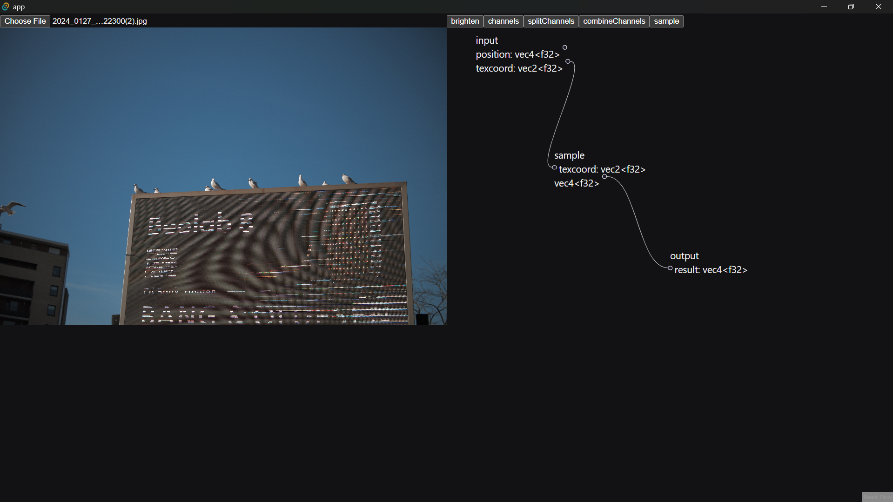

I've spent the past few weeks building a concept photo editing application that allows users to visually define and compose shaders to transform an image in ways that are really challenging or impossible in other image manipulation software

For readers of my website it's probably not too much of a surprise that I've been spending a lot of time learning about [Parser Combinators](/blog/20-07/parser-combinators-and-gleam) as well as [Shaders](/docs/shaders/intro-to-shaders). Armed with this information, it looks like I accidentally created a Visual Programming Language - this post will talk about how that all works

## Why

Every time I've shown anyone the app the first question was "Why do you need this?". I think it's fair to say that no one _really_ **needs** this. This exists to satisfy the artistic urge to do create something new. I've spent so much time feeling limited by the tools I have for working with images are lacking in creative expression. I think there's an intersection between computational/generative art and photography that's underserved and it's a space I would like to play in. I wanted to create a tool that allows creative **exploration** of images and helps break away from the "filter" based approach that dominates how we edit images

It also seemed like a challenge, it begged to be done.

## The App

The high level architecture that makes this all work looks something like this:

1. I define different types of functions that can be applied to an image using a shader function written in **WebGPU**
2. The shader is then parsed into a **Node** that a user can use in the editing workflow
3. A user can structure **Nodes** and **Edges** into a tree for applying edits
4. The tree is compiled into shader code and inputs to the shader (**Bindings/Uniforms**) are identified
5. The final shader is applied to image and is updated when a user modifies any **Bindings**

## Shaders

Shaders are programs that run on the GPU. Due to this fact there are some interesting limitations on how shaders work and what they can do. For working in our application a shader consists of two parts, a **Vertex Shader** and a **Fragment Shader**. The Vertex Shader is related to objects that are being rendered in a scene, since we're rendering an image this isn't of too much consequence, and for our purposes this always looks the same:

```wgpu
struct VertexOutput {
  @builtin(position) position: vec4f,
  @location(0) texcoord: vec2f,
};


@node fn vs(
  @builtin(node_index) nodeIndex : u32
) -> VertexOutput {
  const pos = array(
    vec2( 1.0,  1.0),
    vec2( 1.0, -1.0),
    vec2(-1.0, -1.0),
    vec2( 1.0,  1.0),
    vec2(-1.0, -1.0),
    vec2(-1.0,  1.0),
  );

  var vsOutput: VertexOutput;

  let xy = pos[nodeIndex];
  vsOutput.texcoord = pos[nodeIndex] * vec2f(0.5, 0.5) + vec2f(0.5);
  vsOutput.position = vec4f(pos[nodeIndex], 0, 1);

  return vsOutput;
}
```

The data output from the Vertex shader is sent to the Fragment shader. We've defined a struct for the data I want to pass called `VertexOutput`

The Fragment shader is where things get interesting though. This is where I apply transformations to pixel data and it allows us to do stuff to our image. For now I've defined the main part of our Fragment shader as follows:

```wgpu
@group(0) @binding(0) var ourSampler: sampler;
@group(0) @binding(1) var ourTexture: texture_2d<f32>;

// BINDINGS_SECTION_START
// BINDINGS_SECTION_END

@node fn sample(texcoord: vec2f) -> vec4f {
  return textureSample(ourTexture, ourSampler, texcoord);
}

@fragment fn fs(fsInput: VertexOutput) -> @location(0) vec4f {
  var input__result = fsInput;
  // MAIN_SECTION_START
  return textureSample(ourTexture, ourSampler, fsInput__result.texcoord);
  // MAIN_SECTION_END
}
```

In the above I have also defined a function called `sample` which has the `@node` decorator - this is important - our app will use this decorator to identify methods that will be available in the UI that can be applied to images. The `sample` decorator simply gets the color of a pixel in the input for a given coordinate. In fragment shader I need to output a color as denoted by the return type of the `fs` function

From the perspective of a shader our goal is to provide a library of functions that apply transformations that users can compose to apply an edit to an image, a simple example of this are the `splitChannels` and `combineChannels` functions that we can see below:

```wgpu
struct SplitChannelsOutput {
  r: f32,
  g: f32,
  b: f32,
  a: f32,
};

@node fn splitChannels(color: vec4f) -> SplitChannelsOutput {
  var output: SplitChannelsOutput;

  output.r = color.r;
  output.g = color.g;
  output.b = color.b;
  output.a = color.a;

  return output;
}

@node fn combineChannels(r: f32, g: f32, b: f32, a: f32) -> vec4f {
  return vec4f(r, g, b, a);
}
```

The above methods can be composed in interesting ways to do things like swap around the green and blue channels of an image:

```wgpu
@fragment fn fs(fsInput: VertexOutput) -> @location(0) vec4f {
    var split = splitChannels(color);
    var result = combineChannels(color.r, color.b, color.g, color.a);
    return result;
}
```

So this is the basic concept, a bit of complexity comes in when we consider that it's possible that a function may want inputs from multiple other functions but this still doesn't create too much of a hurdle for us as we'll discuss later

## Parsing

I wanted to ensure that the application has a single source of truth for the available functions. In order to do this I wanted to use the shader to inform us as to what functions should be available for a user. In order to do this I had to create a parser for the WebGPU langauge. The parser I built is a little simplified since there are only certain things I care about when parsing the shader. It's also optimized for maintenance and probably isn't very fast. My main goal here was to get something working. I wrote the parser using a library called [`ts-parsec`](https://github.com/microsoft/ts-parsec) which lets me define parsers using parser combinators.

Defining a parser using this library requires a list of tokens to be defined using regexes. Below are the tokens I currently have defined:

```ts
enum Tok {
  Var = 'Var',
  Let = 'Let',
  Const = 'Const',
  Struct = 'Struct',
  Return = 'Return',
  Fn = 'Fn',
  At = 'At',
  Arrow = 'Arrow',
  Integer = 'Integer',
  Comma = 'Comma',
  Dot = 'Dot',
  Plus = 'Plus',
  Semicolon = 'Semicolon',
  Colon = 'Colon',
  Dash = 'Dash',
  Asterisk = 'Asterisk',
  Slash = 'Slash',
  Equal = 'Equal',
  OpenParen = 'OpenParen',
  CloseParen = 'CloseParen',
  OpenBrace = 'OpenBrace',
  CloseBrace = 'CloseBrace',
  OpenBracket = 'OpenBracket',
  CloseBracket = 'CloseBracket',
  OpenAngle = 'OpenAngle',
  CloseAngle = 'CloseAngle',
  Identifier = 'Identifier',
  Space = 'Space',
  Comment = 'Comment',
}
```

Along with the tokenizer. Each token is configured as `[shouldKeepToken, regex, token]`

```ts
export const tokenizer = ts.buildLexer([
  [true, /^var/g, Tok.Var],
  [true, /^let/g, Tok.Let],
  [true, /^const/g, Tok.Const],
  [true, /^struct /g, Tok.Struct],
  [true, /^fn/g, Tok.Fn],
  [true, /^return/g, Tok.Return],
  [true, /^->/g, Tok.Arrow],
  [true, /^@/g, Tok.At],
  [true, /^,/g, Tok.Comma],
  [true, /^\./g, Tok.Dot],
  [true, /^\+/g, Tok.Plus],
  [true, /^\;/g, Tok.Semicolon],
  [true, /^\:/g, Tok.Colon],
  [true, /^\-/g, Tok.Dash],
  [true, /^\*/g, Tok.Asterisk],
  [true, /^\//g, Tok.Slash],
  [true, /^\=/g, Tok.Equal],
  [true, /^\(/g, Tok.OpenParen],
  [true, /^\)/g, Tok.CloseParen],
  [true, /^\{/g, Tok.OpenBrace],
  [true, /^\}/g, Tok.CloseBrace],
  [true, /^\[/g, Tok.OpenBracket],
  [true, /^\]/g, Tok.CloseBracket],
  [true, /^\</g, Tok.OpenAngle],
  [true, /^\>/g, Tok.CloseAngle],

  [true, /^\d+?/g, Tok.Integer],
  [true, /^[A-Za-z]+([A-Za-z0-9_]*)/g, Tok.Identifier],
  [false, /^\s+/g, Tok.Space],
  [false, /^\/\/ .*/g, Tok.Comment],
])
```

You can see that I throw away comments and spaces since I don't care about these for now

A relatively simple parser that I have is

All parsers in my application are defined using classes to just help keep things a little tidy. One of the simpler parsers I have is the one that parses integers and is defined as follows:

```ts
export class Integer {
  constructor(public value: number) {}

  static parser = ts.apply(ts.tok(Tok.Integer), (t) => new Integer(+t.text))
}
```

This consists of a constructor for defining the members and a `static parser` function which defines a parser for the current class. We can compose these parsers to build more complex ones, for example the way I parse `Generic` uses `Integer` for an optional `length` that a generic may have, for example `array<f32, 3>`:

```ts
export class Generic {
  constructor(
    public type: TypeDeclaration,
    public length?: Integer,
  ) {}

  static parser = ts.apply(
    ts.kmid(
      ts.tok(Tok.OpenAngle),
      ts.seq(
        TypeDeclaration.parser,
        ts.opt(ts.kright(ts.tok(Tok.Comma), Integer.parser)),
      ),
      ts.tok(Tok.CloseAngle),
    ),
    (matches) => new Generic(...matches),
  )
}
```

The composition of these parses results in a tree looking something like this:

```ts
TypeDeclaration {
  "generic": Generic {
    "length": Integer {
      "value": 5,
    },
    "type": TypeDeclaration {
      "generic": undefined,
      "identifier": Identifier {
        "name": "i32",
      },
    },
  },
  "identifier": Identifier {
    "name": "array",
  },
}
```

At a high level, we can apply this to the entire file to get a syntax tree for the whole file, but as you can imagine that starts to get much bigger

## The UI

Now, since I'm able to parse the file, I can extract the functions from it and use that to define the different things a user can do in the UI. A simple example of some UI that uses the `sample` function defined previously can be seen below:



In this we are able to define Nodes that have certain inputs and outputs which can be connected to each other. Each node is a function call and each edge refers to using the result of one function as an input to another function. When defining connections it's important to verify that connections are of the same type and don't create a cycle in any way - while fiddly, the code to do this isn't particularly interesting

This step is actually relatively simple, the complexity comes into converting this back to the WebGPU code.

## Compiling

This tree structure effectively represents a **Dependency Graph** where all functions depend on their inputs, and the final `output` node depends on any previous edges. The goal in this step is to build a tree out of the nodes and edges and then sort this in a way that defines the order that different operations need to be applied to obtain the `output` value

The first step to this is compiling a list of `nodes` and `edges` into a `tree`. I've done this using the following:

```ts
interface ReadonlyOrderedMap<T> extends ReadonlyMap<Id, T> {
  orderedValues(): ReadonlyArray<T>
  orderedKeys(): ReadonlyArray<Id>
}

/**
 * Wraps the builtin `Map` with an easy way to get keys and values as an array
 * sorted by the original insertion order
 *
 * @see MDN: [Map is insertion-order aware](https://developer.mozilla.org/en-US/docs/Web/JavaScript/Reference/Global_Objects/Map)
 */
class OrderedMap<T> extends Map<Id, T> implements ReadonlyOrderedMap<T> {
  orderedValues() {
    return Array.from(this.values())
  }

  orderedKeys() {
    return Array.from(this.keys())
  }
}

export function buildTree<T extends Node, E extends Edge>(
  nodes: T[],
  edges: E[],
): OrderedMap<Connected<T, E>> {
  const map = new OrderedMap<Connected<T, E>>()

  for (const node of nodes) {
    map.set(node.id, { ...node, connections: [] })
  }

  for (const edge of edges) {
    const from = map.get(edge.from)
    const to = map.get(edge.to)

    if (from && to) {
      from.connections.push([edge, to])
    }
  }

  return map
}
```

This helps us go from the list of connections to a tree that represents the relationships between the nodes - this looks pretty much the same as the UI from earlier

Next, we need to sort the nodes in an order that ensures that each node comes after any nodes that it depends on, this is called a **Topographic Sort** and I've loosely implemented it as follows:

```ts
/**
 * Does a depth-first search on the input vertices relative to the given ID.
 *
 * @returns a map of the nodes reachable from
 */
export function topologicalSort<T extends Vertex, E extends Edge>(
  vertices: ReadonlyMap<Id, Connected<T, E>>,
  relative: Id,
) {
  const visited = new OrderedMap<Connected<T, E>>()

  const rec = (at: Connected<T, E>) => {
    if (visited.has(at.id)) return

    for (const [_, child] of at.connections) rec(child)

    // Insert self after all children have been inserted to maintain ordering
    visited.set(at.id, at)
  }

  const initial = vertices.get(relative)
  if (!initial) {
    console.error('Relative node not in tree', relative, vertices)
    throw new Error('Relative node not provided')
  }

  rec(initial)
  return visited
}
```

Using this function, I can transform the earlier example for sampling an image into a list that looks something like `[input, sample, output]`

What's nice is that this will also work with a more complicated set of connections like so:


Can be compiled into `[input, sample, splitChannels, combineChannels, brighten, output]`. It's worth taking a moment to let this idea sink in because this is the core idea that allows us to compile the UI based language into a shader

Once we are able to order our nodes, it's a simple matter of iterating through them in order and determining which inputs are needed and which functions these nodes refer to, the output of this looks something like:

```wgpu
@fragment fn fs(fsInput: VertexOutput) -> @location(0) vec4f {
    var value1 = sample(input.texcoord);
    var value2 = splitChannels(value1);
    var value3 = combineChannels(value2.g, value2.r, value2.b, value2.a);
    var value4 = brighten(value3, value2.b);
    return value4;
}
```

## User Input

So, it's all well and good that I can compile a shader, but as I have it right now a user can't really customize what any of these values do. It would be nice if I could allow users to provide some input to the shader. For this we will use a **uniform** which is basically an input to the GPU. Uniforms are nice because we can change them without having to recompile the shader

For my purpose, I can infer that any input to a node that is not specified is meant to be set by the user, we can depict this using some kind of input field for that value, in the example below we use a range input for a `f32` value, this can be set by the user:


Then, when compiling our nodes, we can extract this to a `binding`, which would look something like this:

```wgpu
@group(1) @binding(0) var<uniform> combineChannelsInputB: f32;
```

And that can be used in the fragment shader as follows:

```wgpu
@fragment fn fs(fsInput: VertexOutput) -> @location(0) vec4f {
    var value1 = sample(input.texcoord);
    var value2 = splitChannels(value1);
    var value3 = combineChannels(value2.g, value2.r, combineChannelsInputB, value2.a);
    var value4 = brighten(value3, value2.b);
    return value4;
}
```

Now, actually passing this value to the shader is a bit messy but really comes down to using the [WebGPU API](https://developer.mozilla.org/en-US/docs/Web/API/WebGPU_API). This effectively involves creating a `bindGroup` adding `buffers` which hold the value of the data

```ts
const dynamicBuffers: Record<BindingId, GPUBuffer> = {}

const entries: GPUBindGroupEntry[] = []
for (const { id, bindings } of shader.compiled.compiledNodes) {
  for (const binding of bindings) {
    const buffer = device.createBuffer({
      size: binding.size,
      usage: GPUBufferUsage.UNIFORM | GPUBufferUsage.COPY_DST,
      label: 'dynamic binding for: ' + binding.declaration,
    })

    buffer.unmap()

    entries.push({
      binding: binding.binding,
      resource: {
        buffer,
      },
    })

    dynamicBuffers[`${id}.${binding.name}`] = buffer
  }
}

const dynamicBindGroup =
  entries.length &&
  device.createBindGroup({
    label: 'dynamic bind group',
    layout: pipeline.getBindGroupLayout(1),
    entries,
  })
```

Whenever the user changes some input the buffer values can be updates like so:

```ts
for (const [groupId, group] of Object.entries(data || {})) {
  for (const [bindingId, value] of Object.entries(group || {})) {
    const buffer = dynamicBuffers[`${groupId}.${bindingId}`]
    if (buffer) {
      device.queue.writeBuffer(buffer, 0, value)
    }
  }
}
```

Now, there are some finicky bits involved in assembling all the data here but these are the important bits around using the API

## Closing

As you can see there are quite a few moving pieces but I feel like the approach I've taken here fits the problem relatively well. As things are defined now, all app functionality is driven by what is available in the shader and the different nodes can be inferred and combined however the user wants

This isn't the end though. There's a lot more to do, and a lot of art to be made

## References

The most important resource in making this work is defintely the [WebGPU Fundamentals Site](https://webgpufundamentals.org/). The UI is inspired by [Blender's](https://www.blender.org/) Node Editor and is implemented using [React Flow](https://reactflow.dev/)

For the purpose of implementation, I've also looked at loads of different things, of notable value were the following:

- [WGSL Spec](https://www.w3.org/TR/WGSL)
- [WebGPU Fundamentals](https://webgpufundamentals.org/)
- [Alan Galvan's Blog](https://alain.xyz/)
- [Maxim McNair's Blog](https://maximmcnair.com/)
- [WebGPU Course by GetIntoGameDev](https://www.youtube.com/watch?v=vPEiCNjjjFU)
- [Topographical Sorting](https://www.geeksforgeeks.org/topological-sorting/)
- [`ts-parsec`](https://github.com/microsoft/ts-parsec)
- [React Flow](https://reactflow.dev/)
