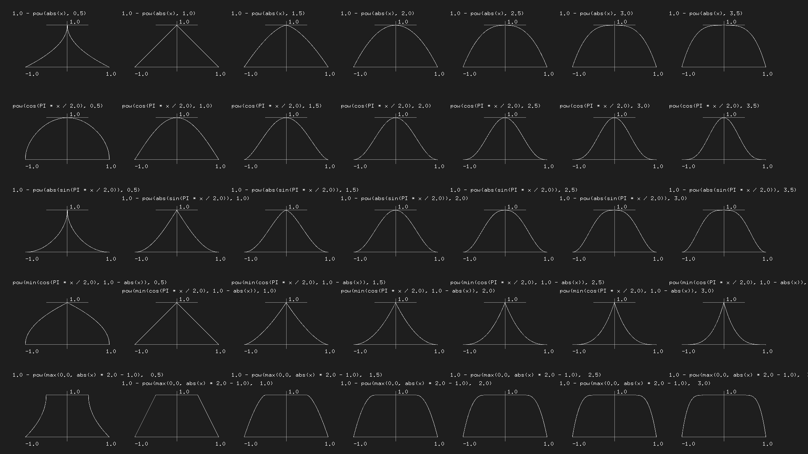

import ShaderSnippet from '@/components/ShaderSnippet.astro'

> These notes and snippets are based/derived from [The Book of Shaders by Patricio Gonzalez Vivo & Jen Lowe](https://thebookofshaders.com/02/)

# Setup

For using these samples you will need some way to view shaders. I am using the [**glslCanvas** VSCode extension](https://marketplace.visualstudio.com/items?itemName=circledev.glsl-canvas) for previewing shaders but you can also use another [**glslCanvas** directly](https://github.com/patriciogonzalezvivo/glslCanvas)

# Introduction

## Fragment Shaders

Shaders are a set of instructions that are executed simultaneously for each pixel. Effectively, a fragment shader receives a position and returns a colour

## Why are Shaders Fast

Shaders run on the GPU and are executed in parallel for each pixel on the screen. Since they run on the GPU they can take advantage of special hardware for speeding up matrix and trigonometric functions. In order to make this possible, there are some limitations imposed on them:

- Threads are "blind" to other threads - they cannot be dependent on each other
- Threads are "memoryless" - they do not have access to information about previous computations

## GLSL

GLSL stands for "openGL Shading Language" and is one of the languages available for writing shaders

# Hello World

THe hello world example for a shader looks like so:

<ShaderSnippet path="001_helloWorld.glsl" />

This example renders a simple colour to the screen. In the above we can see the following:

- A `main` function that is the entry point for the program
- Builtin variables like `gl_FragColor` which is the output color for the shader
- Functions like `vec4` which take in floats
- The `vec4` function takes in R,G,B,A channels as floats between 0 and 1
- Using floats between 0 and 1 is called normalizing and makes it easy for us to map vectors to different output spaces, e.g. color
- A preprocessor macro (`#ifdef ... #endif`) which checks if `GL_ES` is defined (which mostly happens when on mobile browsers)
- The level of floating point precision to be used `precision mediump float` which sets the float prevision, this can also be `highp` or `lowp`
- Types are not cast and must be defined explicitly, so `1` will not be automatically cast to the float `1.0`

## Uniforms

Uniforms are data that is passed to our program from the CPU. Some of the uniforms taht are sent can be seen below:

```glsl
uniform vec2 u_resolution;  // Canvas size (width,height)
uniform vec2 u_mouse;       // mouse position in screen pixels
uniform float u_time;       // Time in seconds since load
```

The uniform names and types may differ based on implementation, for example in [ShaderToy](https://shadertoy.com) they are as follows:

```glsl
uniform vec3 iResolution;   // viewport resolution (in pixels)
uniform vec4 iMouse;        // mouse pixel coords. xy: current, zw: click
uniform float iTime;        // shader playback time (in seconds)
```

## Using Uniforms

We can use uniforms just as any other variable, for example we can use the `u_time` uniform to set the color based on time:

<ShaderSnippet path="002_uniformTime.glsl" mark="5-7" />

We can also make use of the GPU accelerated functions like `abs` and `sin`. Some other GPU accelerated functions are `sin()`, `cos()`, `tan()`, `asin()`, `acos()`, `atan()`, `pow()`, `exp()`, `log()`, `sqrt()`, `sign()`, `floor()`, `ceil()`, `fract()`, `mod()`, `min()`, `max()`, and `clamp()`

## `gl_FragCoord`

Another thing that is provided similar to `gl_FragColor` is `gl_FragCoord` which is the coordinates of the pixel or "screen fragment" that the current thread is working on.

The`gl_` variables are called "varying" and are different to uniforms which are the same across all threads

We can make use of this coordinate in the following code:

<ShaderSnippet path="003_fragCoord.glsl" />

# Algorithmic Drawing

## Shaping Functions

There are a few builtin shaping functions that we can use for creating a value that is varied based on some input parameter.

The simplest of these is the `step` function that returns a `float` that is either `0` if the value is less that the parameter, or `1` otherwise

<ShaderSnippet path="004_step.glsl" />

There is also a `smoothstep` function that varies a value across the start and end ranges which can be used as follows:

<ShaderSnippet path="005_smoothstep.glsl" />

We can also use a combination of two smoothsteps that are slightly offset to create a line as follows:

```glsl
float plot(vec2 st,float x){
    return
    smoothstep(x-.01,x,st.y)
    -smoothstep(x,x+.01,st.y);
}
```

We can then call this with the variable of interest to get an output value at the given point:

```glsl
float y=abs(sin(st.x));
float plt=plot(st,y);
```

And we can then multiply the result by a color to actually view something:

```glsl
vec3 color=plt*vec3(1.,0.,0.);
gl_FragColor=vec4(color,1.);
```

The result full code that renders a moving `abs(sin(x))` for example can be seen below:

<ShaderSnippet path="006_plot.glsl" />

It's also possible to combine the lower level GLSL functions to get more complex mathematical functions, for example the below from [Kynd](http://www.kynd.info/log/)



Additionally, the [Lygia library](https://lygia.xyz/) also has a huge set of predefined shaping functions that you can use

## Colors

### Vectors

In general, we have been using colours using `vec3` or `vec4` vectors. We have mostly being accessing vector values using `.x` or `.y`, however there are a few different syntaxes that are equivalent

```glsl
vec4 vector;
vector[0] = vector.r = vector.x = vector.s;
vector[1] = vector.g = vector.y = vector.t;
vector[2] = vector.b = vector.z = vector.p;
vector[3] = vector.a = vector.w = vector.q;
```

Furthermore, it's also possible to create new vectors out of vectors we and organize their parts as we want. For example:

```glsl
vec4 color = vec4(1.,1.,0.,1.);

vec3 rgb = color.rgb;
vec3 rbg = color.rbg;
vec3 bgr = color.bgr;
vec3 bga = color.bga;
```

The above idea is called "swizzling" and can be applied to all vectors based on their components

### Mixing Colors

Colors can be mixed using the `mix` function which can take a percentage value of how to mix the two colors. This can be seen below where we are using a sin wave based on the `x` coordinate and `time` to mix two colors:

<ShaderSnippet path="007_mix.glsl" />

### HSB

There are multiple different ways that we can represent color. Using a function for converting from HSB to RGB we can render the colour space:

<ShaderSnippet path="008_hsb.glsl" />

Since HSB is meant to be displayed as a polar color space, we can also display this as follows:

<ShaderSnippet path="009_hsbPolar.glsl" />

### Function Arguments

When defining functions we can define inputs as read only, write only, or read-write:

```glsl
int newFunction(in vec4 aVec4,      // read-only
                out vec3 aVec3,     // write-only
                inout int aInt);    // read-write
```

## Shapes

### Rectangle

If we wanted to fill a rectangle in a shader, we need to think about how to determine the value for a single pixel, the general idea is as follows:

```
if (startX < x < endX) and (startY < y < endY)
    paint white
else
    paint black
```

When thinking about this from a shader standpoint, we can implement this kind of conditional using a `step` function

In our case, we need to do this in a few steps:

1. Create the boundry for the left side, this is painting all content that is greater the left and bottom values:

```glsl
float left=step(.1,st.x);// returns 1 when st.x > 0.1
float bottom=step(.1,st.y);// returns 1 when st.y > 0.1
```

2. Create the boundary for right right and top sides by setting these back to white

```glsl
float right=step(.1,1.-st.x);//returns 1 when (1-st.x) > 0.1
float top=step(.1,1.-st.y);//returns 1 when (1-st.x) > 0.1
```

3. Multiplying the color components functions as a logical AND:

```glsl
float pct = left * bottom * right * top;
vec3 color = vec3(pct);
```

Furthermore, we can simplify part 1. and 2. to use vectors directly instead of working with components, so the updated version for 1. and 2. combined looks like so:

```glsl
vec2 bl=step(vec2(.1),st);
vec2 tr=step(vec2(.1),vec2(1.)-st);
```

Using the above, the final result can be seen below:

<ShaderSnippet path="010_rectangle.glsl" />

### Circle

The approach for drawing a circle is a bit less confusing. Basically we define the distance of a point from a given location, in our case the center of the circle, and we use a step to include everything within that distance space:

<ShaderSnippet path="011_circle.glsl" />

### Distance Fields

The above implementation makes use of a distance field. A distance field tells us how far all the points in the field are from some reference point.

Note that the `distance` function uses the `sqrt` function underneath - this function can be computationally intensive so it can sometimes be more useful to define our operations without using the `sqrt` function in any way. For this example, it is also possible to implement a circle distance field using a `smoothstep` and the vector `dot` product which can be seen below:

<ShaderSnippet path="012_circleDistanceField.glsl" />

### Properties of Distance Fields

We can draw almost anything using distance fields. Once you have a formula to draw a specific shape using a distance field it becomes relatively easy to apply effects to it

We can visualize a distance field as the distance from the center to any given input point:

<ShaderSnippet path="013_distanceField.glsl" />

### Polar Shapes

Polar shapes depend on changing the distance of a circle. We can map catresian to polar coordinates using the following:

```glsl
vec2 pos = vec2(0.5)-st;
float r = length(pos)*2.0;
float a = atan(pos.y,pos.x);
```

We can use these shapes along with the idea of using a `smoothstep/step` as a cutoff value to draw more complex shapes in combination with the polar coordinates:

<ShaderSnippet path="014_polarCoordinates.glsl" />

## Matrices

Once we know how to define specific shapes, we can use vector transformations to move them to different locations

### Translation

The way we do this at the implementation level is by actually transforming the entire output coordinate space. We can see this by defining a new vector to move the space with below:

<ShaderSnippet path="015_translation.glsl" />

If you observe the example above, you can see that it's not just the shape that moves but the entire color space. This is due to the coordinate system translation

### 2D Matrices

Doing more complex operations requires a matrix, for example we can translate as above by doing the dot product:

$$
\begin{bmatrix}
   1 & 0 & t_x \\
   0 & 1 & t_y \\
   0 & 0 & 1
\end{bmatrix}

\cdot{}

\begin{bmatrix}
   x \\
   y \\
   1
\end{bmatrix}

=

\begin{bmatrix}
   x + t_x \\
   y + t_y \\
   1
\end{bmatrix}
$$

### Rotation

For rotation, this is a bit more interesting

$$
\begin{bmatrix}
   cos\theta & -sin\theta & 0 \\
   sin\theta & cos\theta & 0 \\
   0 & 0 & 1
\end{bmatrix}

\cdot{}

\begin{bmatrix}
   x \\
   y \\
   1
\end{bmatrix}

=

\begin{bmatrix}
   x.cos\theta - y.sin\theta \\
   x.sin\theta - y.cos\theta \\
   1
\end{bmatrix}
$$

Using the above, we can implement the rotation as follows:

<ShaderSnippet path="016_rotation.glsl" />

### Scale

Similarly, we can define a matrix operation for scaling:

$$
\begin{bmatrix}
   S_x & 0 & 0 \\
   0 & S_y & 0 \\
   0 & 0 & S_z
\end{bmatrix}

\cdot{}

\begin{bmatrix}
   x \\
   y \\
   z
\end{bmatrix}

=

\begin{bmatrix}
   S_x.x \\
   S_y.y \\
   S_z.z
\end{bmatrix}
$$

And the implementation of this can be seen below:

<ShaderSnippet path="017_scale.glsl" />

### YUV Color

YUV is a color space for analog encoding of photos and videos that uses the human perception range.

We can define the conversions from YUV and RGB using a matrix and we can apply this to our input space to view the color range

<ShaderSnippet path="018_yuv.glsl" />

## Patterns

Since shaders execute once per pixel, no matter how much we repeat a shape the complexity is constant - this is a useful property for defining patterns

When creating patterns, we commonly use the `fract` function which gives us the decimal part of a number. Since our numbers are always between 1 and 0 this isn't instantly useful but becomes interesting when multiplying by some value

We can use this for displaying color:

<ShaderSnippet path="019_fractColor.glsl" />

And we can do something similar using a circle:

<ShaderSnippet path="020_fractCircle.glsl" />

Since each subsection that we create above is a small sub-coordinate space, we can apply the other methods we've used to do stuff like rotate the space:

<ShaderSnippet path="021_fractRotate.glsl" />

Or we can make use of the `mod` and `step` functions to identify which row we are in and translate that value halfway to the right like so:

<ShaderSnippet path="022_fractModulo.glsl" />

## Randomness

If we consider the function `y = fract(sin(x)*n)` we will notice that as we increase `n` at a certain point we get what looks like randomness:

<ShaderSnippet path="023_randomness.glsl" />

THe problem with using this kind of randomness is that while it is somewhat chaotic, it is not truly random since the underlying function is not random

Regardless, since we have a method of defining randomness, we can implement this in two dimensions as follows:

<ShaderSnippet path="024_randomness2d.glsl" />

We do this by getting the dot product of the input vector and some other large vector and then using that to get the value that we pass to our pseudo random function

We can implement something interesting by combining this with the patterning/fraction method we learnt previously do get blocks of random colour instead of just noise:

<ShaderSnippet path="025_randomnessBlocks.glsl" />

This works since by getting the integer value (via the `floor` function) we effectively group our `st.x` and `st.y` values into buckets over a specified range

Next, we can use these values more directly by creting more complex patterns

<ShaderSnippet path="026_randomnessPatterns.glsl" />

## Noise

Since very few things in nature are actually random but are a sort random with some sense of order. An example of a function that does something like this is ther Perlin noise algorithm and is a method for generating noise

### Perlin Noise

This algorithm works by mixing the random values with other nearby noise values to create some kind of continuiy. There are of course different ways we can mix these values

For example, we can just use a plain `mix`:

<ShaderSnippet path="027_perlin.glsl" />

Or mixing using a `smoothstep` as well:

<ShaderSnippet path="028_perlinSmooth.glsl" />

It is also possible to calculate your own custom curve instead of using something like smoothstep

<ShaderSnippet path="029_perlinCustom.glsl" mark="24-25" />

### 2D Noise

When doing 1D noise we interpolated between random values of `x` and `x+1`. For 2D noise however, we need to consider a plane with a point at each edge offset randomly

<ShaderSnippet path="030_perlin2d.glsl" />

We can combine these ideas along with the methodology for working with polar coordinates and the user's mouse positon to do something kinda cool

> Go ahead and try moving your mouse around on the image below

<ShaderSnippet path="031_perlinCircle.glsl" />
