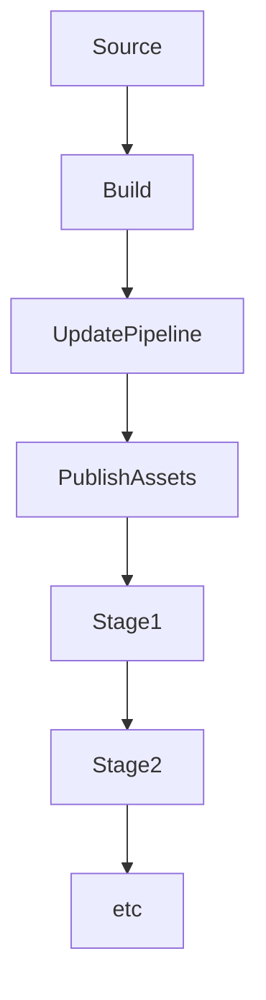

[[toc]]

> Prior to doing any of the below you will require your `~/.aws/credentials` file to be configured with the credentials for your AWS account

A good reference for this is also the [AWS Workshop Docs](https://cdkworkshop.com/20-typescript/70-advanced-topics/200-pipelines.html) and the [AWS Advanced Workshop Docs](https://cdk-advanced.workshop.aws/sample/target-construct.html)

# Create CDK App

First, create a directory for your app and then `cd` into it:

```sh
mkdir cdk-pipeline-docker
cd cdk-pipeline-docker
```

We're going to be using the CDK CLI to setup our application, to do this we can use npx:

```
npx cdk init --language=typescript
```

Then, remove the `package.lock.json` so we can then swap the app over to use `yarn` with:

```sh
rm package.lock.json
yarn
```

> Note that we'll be adding npm packages as we need them instead of all at once

Now, do `git init` and push the application up to GitHub as the pipeline will source the code from there


# Add our Application Files

Before we jump right into the CDK and pipeline setup, we need an application to containerize. We're going to create a simple Node.js app which uses `express` and `redis`

Create the `app` directory in the root of our CDK app, init, and add the required dependencies

```sh
mkdir app
cd app
yarn init -y
yarn add express redis
```

Since the TypeScript CDK app is setup to ignore `.js` files by default, we want to create a `.gitignore` file in our `app` directory with the following:

`app/.gitignore`

```sh
!*.js
node_modules
```

Then, add an `index.js` file with the following:

`app/index.js`

```js
const express = require("express");
const redis = require("redis");

const port = process.env.PORT || 8080;
const redisUrl = process.env.REDIS_URL || "redis://redis:6379";

const app = express();

app.use(express.text());

const client = redis.createClient({
  url: redisUrl,
});

client.on("error", function (error) {
  console.error(error);
});

app.get("/", (req, res) => {
  console.log("request at URL");
  res.send("hello from port " + port);
});

app.get("/:key", (req, res) => {
  const key = req.params.key;
  client.get(key, (error, reply) => {
    if (error) res.send("Error");
    else res.send(reply);
  });
});

app.post("/:key", (req, res) => {
  const key = req.params.key;
  const data = req.body;
  client.set(key, data, (error, reply) => {
    if (error) res.send("Error");
    else res.send(reply);
  });
});

app.listen(port, () => {
  console.log("app is listening on port " + port);
});
```

> The above consists a simple app which will use service discovery to connect to Redis and create/retreive values based on their `key`

Next, add a `Dockerfile` for this application:

`app/Dockerfile`

```Dockerfile
FROM node:14

COPY package.json .
COPY yarn.lock .
RUN yarn --frozen-lockfile

COPY . .

EXPOSE 8080
CMD ["yarn", "start"]
```

And that should be everything we need to do at this point in terms of the application itself - after all, using Redis with Node.js not the focus of this doc

# Setup

A CDK Pipeline consists of a few different stage, namely:



## Pipeline Stack

To define a pipeline we use the `@aws-cdk/core` package as the base, create a `lib/pipeline-stack.ts` file in which we'll define a `Stack` which represents our deployment pipeline:

`lib/pipeline-stack.ts`

```ts
import * as cdk from "@aws-cdk/core";

export class PipelineStack extends cdk.Stack {
    constructor(scope: cdk.Construct, id: string, props?: cdk.StackProps) {
        super(scope, id, props);

        // Pipeline code goes here
    }
}
```

Then, instantiate this stack update the `bin/pipeline.ts` to have the following:

`bin/pipeline.ts`

```ts
#!/usr/bin/env node
import * as cdk from '@aws-cdk/core';
import { PipelineStack } from '../lib/pipeline-stack';

const app = new cdk.App();
new PipelineStack(app, 'CdkPipelineDocker');
```

Then reference this from your `cdk.json` file in the root directory:

```json
"app": "npx ts-node --prefer-ts-exts bin/pipeline.ts"
```

And also add the following to the `context` section of your `cdk.json` file:

`cdk.json`

```json
"@aws-cdk/core:newStyleStackSynthesis": true
```

## Pipeline Account Permissions

First, install the `cdk` CLI at a project level with:

```sh
yarn add aws-cdk
```

The reason for this is to ensure we use a version of the cdk that was installed for our specific application and we aren't accidentally using something that maybe exists somewhere else on our computer

And then add the following to the `scripts` section of your `package.json` file:

`package.json`

```json
"scripts" {
  // ... other scripts
  "cdk": "cdk"
}
```

Before we can use the pipelines we need to grant CDK some permissions to our account, we can do this with:

```sh
yarn cdk bootstrap --cloudformation-execution-policies arn:aws:iam::aws:policy/AdministratorAccess
```

> The above will create a `CDKToolkit` stack which you will be able to see in AWS's CloudFormation Console

## GitHub Repo Permissions

We need to provide AWS with credentials to our GitHub repo. To do this go to `GitHub > Settings > Developer settings > Personal access tokens` and create a token with access to `repo` and `admin:repo_hook` permissions

Then add the token to AWS's Secrets Manager via the console with a `plaintext` value of the token you just generated above, then name the token `github-token` and complete the rest of the steps to store the new secret

## Develop the Pipeline

Now that we've got most of the scaffolding in place, we need to actually deploy our pipeline to AWS so that it's aware of the codebase and everything else it needs to hook into our git repo for the building and deployment of our project

We need to install some of the cdk libraries packages, we can do this with `yarn`:

```sh
yarn add @aws-cdk/aws-codepipeline @aws-cdk/pipelines @aws-cdk/aws-codepipeline-actions
```

Then  we can use these packages in the `pipeline-stack.ts` file we're going to add the following imports:

`lib/pipeline-stack.ts`

```ts
import * as cdk from "@aws-cdk/core";
import { Stack, Construct, StackProps, SecretValue } from "@aws-cdk/core";
import { Artifact } from "@aws-cdk/aws-codepipeline";
import { CdkPipeline, SimpleSynthAction } from "@aws-cdk/pipelines";
import { GitHubSourceAction } from "@aws-cdk/aws-codepipeline-actions";
```

Next up, we're going to be writing everything else within the `PipelineStack` we defined earlier:

`lib/pipeline-stack.ts`

```ts
export class PipelineStack extends cdk.Stack {
    constructor(scope: cdk.Construct, id: string, props?: cdk.StackProps) {
        super(scope, id, props);

        // Pipeline code goes here
    }
}
```

First, we need to create `sourceArtifact` and `cloudAssemblyArtifact` instances for the pipeline:

```ts
const sourceArtifact = new Artifact();
const cloudAssemblyArtifact = new Artifact();
```

Then, we define the `sourceAction` which is how the pipeline neeeds to get our code from our repository. In this case we use the `GitHubSourceAction`. We use the `SecretValue.secretsManager` function to retreive the GitHub token we created previously:

```ts
const sourceAction = new GitHubSourceAction({
  actionName: "GitHubSource",
  output: sourceArtifact,
  oauthToken: SecretValue.secretsManager("github-token"),
  owner: "username",
  repo: "repository",
  branch: "main",
});
```

Ensure you've replaced the `owner`, `repo` and `branch` with the one that contains your code on GitHub

Then, we define the `synthAction` which is used to install dependencies and optionally run a build of our app:

```ts
// will run yarn install --frozen-lockfile, and then the buildCommand
const synthAction = SimpleSynthAction.standardYarnSynth({
  sourceArtifact,
  cloudAssemblyArtifact,
  buildCommand: "yarn build",
});
```

And lastly, we combine these to create a `CdkPipeline` instance:

```ts
const pipeline = new CdkPipeline(this, "Pipeline", {
  cloudAssemblyArtifact,
  sourceAction,
  synthAction,
});
```

So our overall `lib/pipeline-stack` will now look like this:

```ts
import * as cdk from "@aws-cdk/core";
import { Artifact } from "@aws-cdk/aws-codepipeline";
import { CdkPipeline, SimpleSynthAction } from "@aws-cdk/pipelines";
import { GitHubSourceAction } from "@aws-cdk/aws-codepipeline-actions";

export class PipelineStack extends cdk.Stack {
  constructor(scope: cdk.Construct, id: string, props?: cdk.StackProps) {
    super(scope, id, props);
    const sourceArtifact = new Artifact();
    const cloudAssemblyArtifact = new Artifact();

    // clone repo from GtiHub using token from secrets manager
    const sourceAction = new GitHubSourceAction({
      actionName: "GitHubSource",
      output: sourceArtifact,
      oauthToken: cdk.SecretValue.secretsManager("github-token"),
      owner: "username",
      repo: "repository",
      branch: "main",
    });

    // will run yarn install --frozen-lockfile, and then the buildCommand
    const synthAction = SimpleSynthAction.standardYarnSynth({
      sourceArtifact,
      cloudAssemblyArtifact,
      buildCommand: "yarn build",
    });

    const pipeline = new CdkPipeline(this, "Pipeline", {
      cloudAssemblyArtifact,
      sourceAction,
      synthAction,
    });
  }
}
```

Next, initialize the Pipeline in AWS by using `yarn cdk deploy`. This should be the only manual deploy we need. From this point all other Pipeline runs will happen directly in CDK via GitHub Commits:

```sh
yarn cdk deploy
```

### Add App to Deployment

To create deployments we need to have a class that inherits from `cdk.Stage`, in this  `Stage` we specify all the requisites for an application deployment. We're deploying the `AppStack` application, we will reference it from a Stage called `AppStage` which will just create an instance of the application:

`lib/app-stage.ts`

```ts
import * as cdk from "@aws-cdk/core";
import { AppStack } from "./app-stack";

export class AppStage extends cdk.Stage {
  constructor(scope: cdk.Construct, id: string, props?: cdk.StageProps) {
    super(scope, id, props);

    new AppStack(this, "AppStack");
  }
}
```

We can then add the above `AppStage` to the `pipeline-stack` using the `pipeline.addApplicationStage` function:

`lib/pipeline-stack.ts`

```ts
// ... other pipeline code

// CdkPipeline as previously created
const pipeline = new CdkPipeline(this, "Pipeline", {
  cloudAssemblyArtifact,
  sourceAction,
  synthAction,
});

// adding app stage to the deployment
const appStage = new AppStage(this, "Dev");

pipeline.addApplicationStage(appStage);
```

Once all that's been added, the final `pipeline-stack.ts` file will have the following:

```ts
import * as cdk from "@aws-cdk/core";
import { Artifact } from "@aws-cdk/aws-codepipeline";
import { CdkPipeline, SimpleSynthAction } from "@aws-cdk/pipelines";
import { GitHubSourceAction } from "@aws-cdk/aws-codepipeline-actions";
import { AppStage } from "./app-stage";

export class PipelineStack extends cdk.Stack {
  constructor(scope: cdk.Construct, id: string, props?: cdk.StackProps) {
    super(scope, id, props);
    
    const sourceArtifact = new Artifact();
    const cloudAssemblyArtifact = new Artifact();

    // clone repo from GtiHub using token from secrets manager
    const sourceAction = new GitHubSourceAction({
      actionName: "GitHubSource",
      output: sourceArtifact,
      oauthToken: cdk.SecretValue.secretsManager("github-token"),
      owner: "username",
      repo: "repository",
      branch: "main",
    });

    // will run yarn install --frozen-lockfile, and then the buildCommand
    const synthAction = SimpleSynthAction.standardYarnSynth({
      sourceArtifact,
      cloudAssemblyArtifact,
      buildCommand: "yarn build",
    });

    const pipeline = new CdkPipeline(this, "Pipeline", {
      cloudAssemblyArtifact,
      sourceAction,
      synthAction,
    });

    const app = new AppStage(this, "Dev");
    
    pipeline.addApplicationStage(app);
  }
}

```

## App Stack

Since our app will use a Docker container we need to install the `@aws-cdk/aws-ecs`, `@aws-cdk/aws-ec2` and `@aws-cdk/aws-ecs-patterns` packages:

```sh
yarn add @aws-cdk/aws-ecs @aws-cdk/aws-ecs-patterns
```

Next, from our `lib/app-stack.ts` file, we want to create two services:

1. A Docker service which builds a locally defined Docker image
2. A Docker service which runs the public `redis` image

In order to define our servivce, we need a `vpc`, `cluster`, and some image information and configuration

Importing everything required we would have the following as our `AppStack`:

`lib/app-stack.ts`

```ts
import * as cdk from "@aws-cdk/core";
import * as ec2 from "@aws-cdk/aws-ec2";
import * as ecs from "@aws-cdk/aws-ecs";
import * as ecsPatterns from "@aws-cdk/aws-ecs-patterns";
import * as ecrAssets from "@aws-cdk/aws-ecr-assets";

export class AppStack extends cdk.Stack {
  constructor(scope: cdk.Construct, id: string, props?: cdk.StageProps) {
    super(scope, id, props);

    // constructs go here
  }
}
```

Our applications need a VPC and Cluster in which they will run, we can define a `vpc` with:

`lib/app-stack.ts`

```ts
const vpc = new ec2.Vpc(this, "AppVPC", {
  maxAzs: 2,
});
```

And a `cluster`:

`lib/app-stack.ts`

```ts
const cluster = new ecs.Cluster(this, "ServiceCluster", { vpc });
```

The `cluster` requires a `CloudMapNamespace` to enable service discovery. This will allow other containers and application within the Cluster to connect to one another using the service name with the service namespace

`lib/app-stack.ts`

```ts
cluster.addDefaultCloudMapNamespace({ name: this.cloudMapNamespace });
```

Using the `cluster` above, we can create a `Task` and `Service` using the `NetworkLoadBalancedFargateService` as defined in the `aws-ecs-patterns` library

Defining the `appService` involves the following steps:

1. Defining the App as a Docker Asset

`lib/app-stack.ts`

```ts
const appAsset = new ecrAssets.DockerImageAsset(this, "app", {
  directory: "./app",
  file: "Dockerfile",
});
```

1. Defining the App Task

`lib/app-stack.ts`

```ts
const appTask = new ecs.FargateTaskDefinition(this, "app-task", {
  cpu: 512,
  memoryLimitMiB: 2048,
});
```

2. Adding a Container Definition to the Task

`lib/app-stack.ts`

```ts
appTask
  .addContainer("app", {
    image: ecs.ContainerImage.fromDockerImageAsset(appAsset),
    essential: true,
    environment: { REDIS_URL: this.redisServiceUrl },
    logging: ecs.LogDrivers.awsLogs({
      streamPrefix: "AppContainer",
      logRetention: logs.RetentionDays.ONE_DAY,
    }),
  })
  .addPortMappings({ containerPort: this.appPort, hostPort: this.appPort });
```

3. Create a Service

`lib/app-stack.ts`

```ts
const appService = new ecsPatterns.NetworkLoadBalancedFargateService(
  this,
  "app-service",
  {
    cluster,
    cloudMapOptions: {
      name: "app",
    },
    cpu: 512,
    desiredCount: 1,
    taskDefinition: appTask,
    memoryLimitMiB: 2048,
    listenerPort: 80,
    publicLoadBalancer: true,
  }
);
```

4. Enable Public connections to the serive

`lib/app-stack.ts`

```ts
appService.service.connections.allowFromAnyIpv4(
  ec2.Port.tcp(this.appPort),
  "app-inbound"
);
```

Defining the Redis service is pretty much the same as above, with the exception that we don't need to define the Image Asset and we can just retreive it from the reigstry, and instead of allowing public connections we only allow connections from the `appService` we defined

`lib/app-stack.ts`

```ts
const redisTask = new ecs.FargateTaskDefinition(this, "redis-task", {
  cpu: 512,
  memoryLimitMiB: 2048,
});

redisTask
  .addContainer("redis", {
    image: ecs.ContainerImage.fromRegistry("redis:alpine"),
    essential: true,
    logging: ecs.LogDrivers.awsLogs({
      streamPrefix: "RedisContainer",
      logRetention: logs.RetentionDays.ONE_DAY,
    }),
  })
  .addPortMappings({
    containerPort: this.redisPort,
    hostPort: this.redisPort,
  });

const redisService = new ecsPatterns.NetworkLoadBalancedFargateService(
  this,
  "redis-service",
  {
    cluster,
    cloudMapOptions: {
      name: "redis",
    },
    cpu: 512,
    desiredCount: 1,
    taskDefinition: redisTask,
    memoryLimitMiB: 2048,
    listenerPort: this.redisPort,
    publicLoadBalancer: false,
  }
);

redisService.service.connections.allowFrom(
  appService.service,
  ec2.Port.tcp(this.redisPort)
);

return redisService;
```

Lastly, we want to add the Load Balancer DNS name to our stack's outputs. We can do this with the `cdk.CfnOutput` class:

`lib/app-stack.ts`

```ts
this.appLoadBalancerDNS = new cdk.CfnOutput(this, "AppLoadBalancerDNS", {
  value: appService.loadBalancer.loadBalancerDnsName,
});

this.redisLoadBalancerDNS = new cdk.CfnOutput(
  this,
  "RedisLoadBalancerDNS",
  {
    value: redisService.loadBalancer.loadBalancerDnsName,
  }
);
```

We can break the `AppService` definition into a `createAppService` function, and the `RedisService` into a `createRedisService` function for some organization, the final `lib/app-stack.ts` file looks like this:

`lib/app-stack.ts`

```ts
import * as cdk from "@aws-cdk/core";
import * as logs from "@aws-cdk/aws-logs";
import * as ec2 from "@aws-cdk/aws-ec2";
import * as ecs from "@aws-cdk/aws-ecs";
import * as ecsPatterns from "@aws-cdk/aws-ecs-patterns";
import * as ecrAssets from "@aws-cdk/aws-ecr-assets";

export class AppStack extends cdk.Stack {
  public readonly redisLoadBalancerDNS: cdk.CfnOutput;
  public readonly appLoadBalancerDNS: cdk.CfnOutput;

  public readonly redisPort: number = 6379;
  public readonly appPort: number = 8080;
  public readonly cloudMapNamespace: string = "service.internal";
  public readonly redisServiceUrl: string = "redis://redis.service.internal:6379";

  constructor(scope: cdk.Construct, id: string, props?: cdk.StageProps) {
    super(scope, id, props);

    const vpc = new ec2.Vpc(this, "AppVPC", {
      maxAzs: 2,
    });

    const cluster = new ecs.Cluster(this, "ServiceCluster", { vpc });

    cluster.addDefaultCloudMapNamespace({ name: this.cloudMapNamespace });

    const appService = this.createAppService(cluster);

    const redisService = this.createRedisService(cluster, appService);

    this.appLoadBalancerDNS = new cdk.CfnOutput(this, "AppLoadBalancerDNS", {
      value: appService.loadBalancer.loadBalancerDnsName,
    });

    this.redisLoadBalancerDNS = new cdk.CfnOutput(
      this,
      "RedisLoadBalancerDNS",
      {
        value: redisService.loadBalancer.loadBalancerDnsName,
      }
    );
  }

  private createAppService(cluster: ecs.Cluster) {
    const appAsset = new ecrAssets.DockerImageAsset(this, "app", {
      directory: "./app",
      file: "Dockerfile",
    });

    const appTask = new ecs.FargateTaskDefinition(this, "app-task", {
      cpu: 512,
      memoryLimitMiB: 2048,
    });

    appTask
      .addContainer("app", {
        image: ecs.ContainerImage.fromDockerImageAsset(appAsset),
        essential: true,
        environment: { REDIS_URL: this.redisServiceUrl },
        logging: ecs.LogDrivers.awsLogs({
          streamPrefix: "AppContainer",
          logRetention: logs.RetentionDays.ONE_DAY,
        }),
      })
      .addPortMappings({ containerPort: this.appPort, hostPort: this.appPort });

    const appService = new ecsPatterns.NetworkLoadBalancedFargateService(
      this,
      "app-service",
      {
        cluster,
        cloudMapOptions: {
          name: "app",
        },
        cpu: 512,
        desiredCount: 1,
        taskDefinition: appTask,
        memoryLimitMiB: 2048,
        listenerPort: 80,
        publicLoadBalancer: true,
      }
    );

    appService.service.connections.allowFromAnyIpv4(
      ec2.Port.tcp(this.appPort),
      "app-inbound"
    );

    return appService;
  }

  private createRedisService(
    cluster: ecs.Cluster,
    appService: ecsPatterns.NetworkLoadBalancedFargateService
  ) {
    const redisTask = new ecs.FargateTaskDefinition(this, "redis-task", {
      cpu: 512,
      memoryLimitMiB: 2048,
    });

    redisTask
      .addContainer("redis", {
        image: ecs.ContainerImage.fromRegistry("redis:alpine"),
        essential: true,
        logging: ecs.LogDrivers.awsLogs({
          streamPrefix: "RedisContainer",
          logRetention: logs.RetentionDays.ONE_DAY,
        }),
      })
      .addPortMappings({
        containerPort: this.redisPort,
        hostPort: this.redisPort,
      });

    const redisService = new ecsPatterns.NetworkLoadBalancedFargateService(
      this,
      "redis-service",
      {
        cluster,
        cloudMapOptions: {
          name: "redis",
        },
        cpu: 512,
        desiredCount: 1,
        taskDefinition: redisTask,
        memoryLimitMiB: 2048,
        listenerPort: this.redisPort,
        publicLoadBalancer: false,
      }
    );

    redisService.service.connections.allowFrom(
      appService.service,
      ec2.Port.tcp(this.redisPort)
    );

    return redisService;
  }
}
```

We can kick off the pipeline by pushing to the GitHub repo we setup above which will cause all our services to be deployed. Once that's done we can go to the `Outputs` panel for the `Dev-AppStage` and open the `AppLoadBalancerDNS` url, this will open our application. 

# Test the App
## Set Data

With the server running you can create a new item with:

```http
POST http://[AppLoadBalancerDNS]/my-test-key

BODY "my test data"

RESPONSE "OK"
```

## Get Data

You can then get the value using the key with:

```http
GET http://[AppLoadBalancerDNS]/my-test-key

RESPONSE "my test data"
```

And if all that works correctly then congratulations! You've successfully setup an application that uses multiple Docker Containers with CDK on AWS

# References

- [Taking AWS CDK for a spin for deploying docker containers - Jeff Bryner](https://blog.jeffbryner.com/2020/07/20/aws-cdk-docker-explorations.html)
- [Building a modern cloud application with the AWS Cloud Development Kit - Nathan Peck](https://pages.awscloud.com/rs/112-TZM-766/images/2019_0911-CON_Slide-Deck.pdf)
- [AWS CDK Workshop](https://cdkworkshop.com/20-typescript/70-advanced-topics/200-pipelines.html)
- [AWS CDK Advanced Workshop](https://cdk-advanced.workshop.aws/sample/target-construct.html)