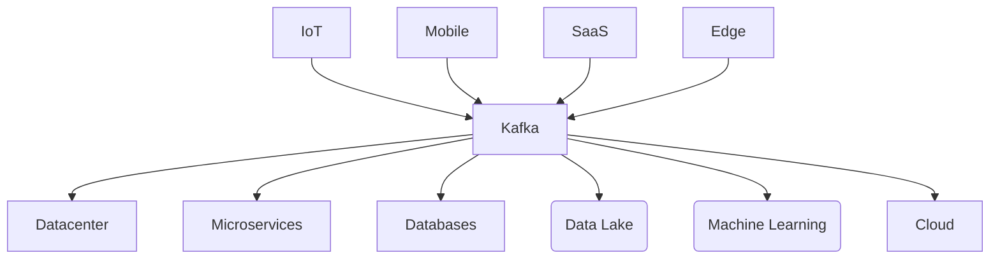
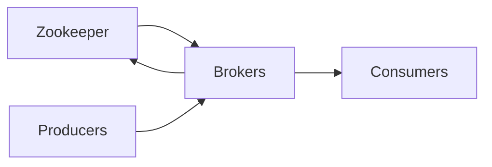
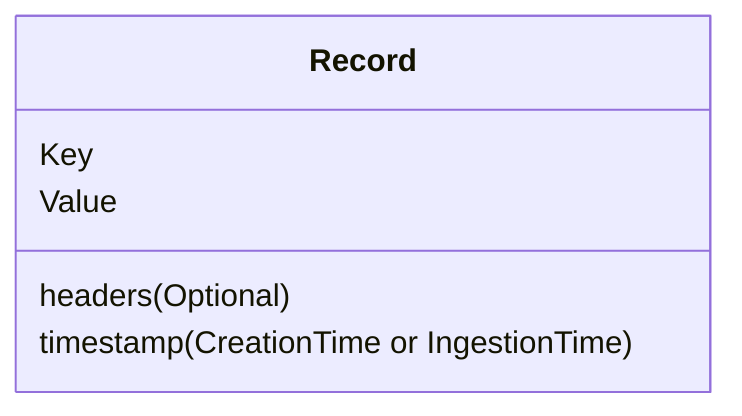

---
published: true
title: Kafka Fundamentals
subtitle: Data Streaming and Big Data using Apache Kafka
---

> Based on [this](https://www.youtube.com/watch?v=-DyWhcX3Dpc&list=PLa7VYi0yPIH2PelhRHoFR5iQgflg-y6JA) series

> AWS = MSK, Azure = Kafka

# Introduction

> Kafka is a distributed event log and pub/sub service

Data is moving towards streaming data and we need some kind of platform to connect these events and allow us to use this data to do more useful things

Continuous data over simple chunks. Kafka provides a platform that allows us to:

- Scale globally
- Process in real time
- Store persistently
- Process streams

Kafka enables all sorts of connections like such:

Data on Kafka is stored as a stream of events

Used in industries like:

- Banking
- Automotive
- Commerce
- Healthcare
- Gaming
- Government

# Fundamentals

## Producer

Producers are things that create data that needs to go into a Kafka Cluser

## Broker

A broker is an individual machine/container/vm which is what Kafka uses to actually run this. A Kafka cluser is made up of a bunch of different brokers which allows for distribution of this data

## Consumer

Comsumers are applications that comsume data from Kafka and can then pass that data into other locations. Consumers basically Poll Kafka for any messages or events

## Architecture

The Kafka architecture looks like the diagram below, in the below diagram we use `Zookeepers` to handle things like consensus in a cluser

> Zookeeper is in the process of being removed from Kafka

Producers are decoupled from consumers so that they can be added or removed as needed. Additionally, consumers can also be added and they will be able to consume an entire history of events and not just the current ones

## Topics, Partitions, and Segments

Scaling is handled by splitting up a topic into partitions, this means that each partition within a topic can be placed into its own location/server which enables Kafka to scale such that we don't run out of actual computation and I/O

Every partition is a log of data and events

On Disk, a segment is a piece of a partition

Kafka has some different ideas of the types of topics we can use. Namely:

- Regular topics allow us to retreive all data from a topic
  - Something like streaming data
- Compacted topics allow us to retreive the latest record from a topic per key
  - Something like the latest change to a record or set of records

## Records

A piece of data in Kafka looks like so:

Messages with the same `Key` always end up in the same partition, a usecase for this is to use something like a producer's device ID (e.g. ID of an IoT Device) gets stored to a single partition and the order of these are gauranteed

## Broker Replication

Brokers replicate each partition, usually 3 replicants, per partition, and these are broken down into a **Leader** and **Followers** for each partition. These are managed by brokers

# General Comparisons with other Tech:

- [Kafka vs SQS vs Kinesis](https://dzone.com/articles/evaluating-message-brokers-kafka-vs-kinesis-vs-sqs)
- [Event Streaming DB with AWS](https://medium.com/nikeengineering/moving-faster-with-aws-by-creating-an-event-stream-database-dedec8ca3eeb)
