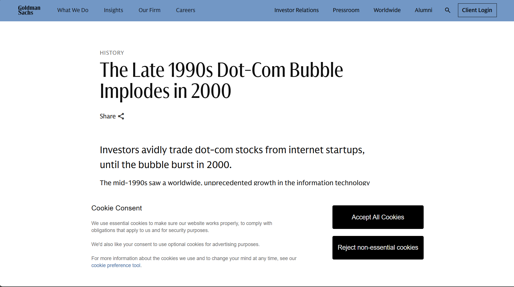
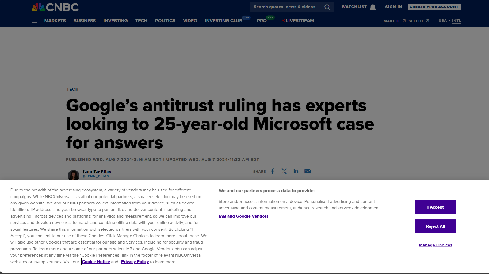
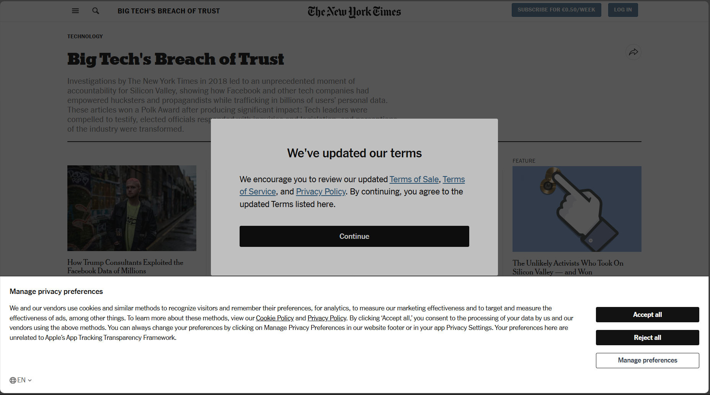
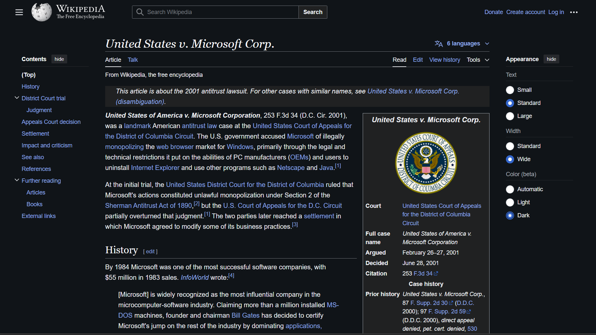
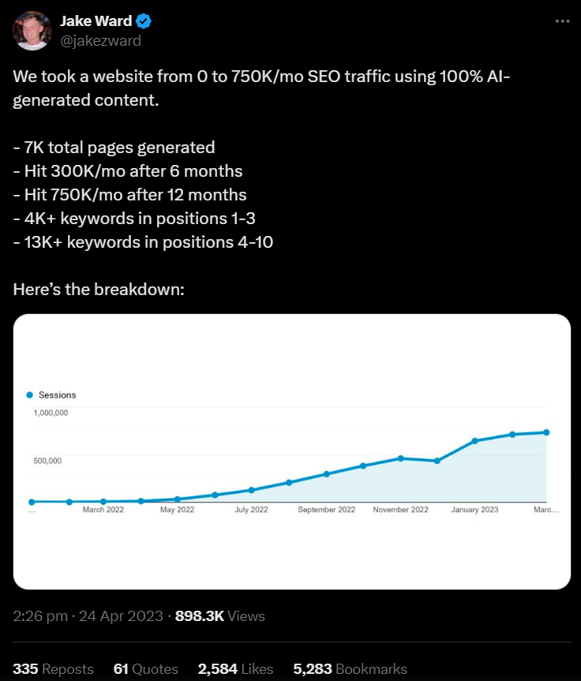
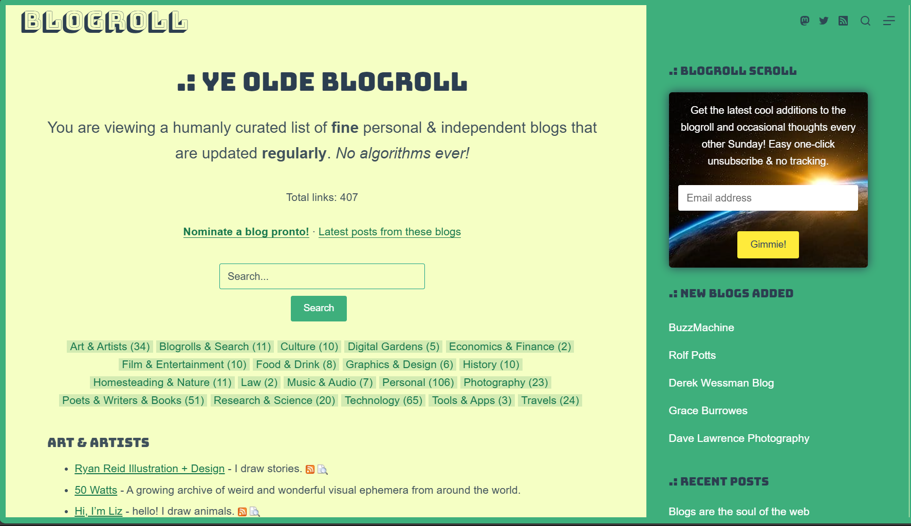
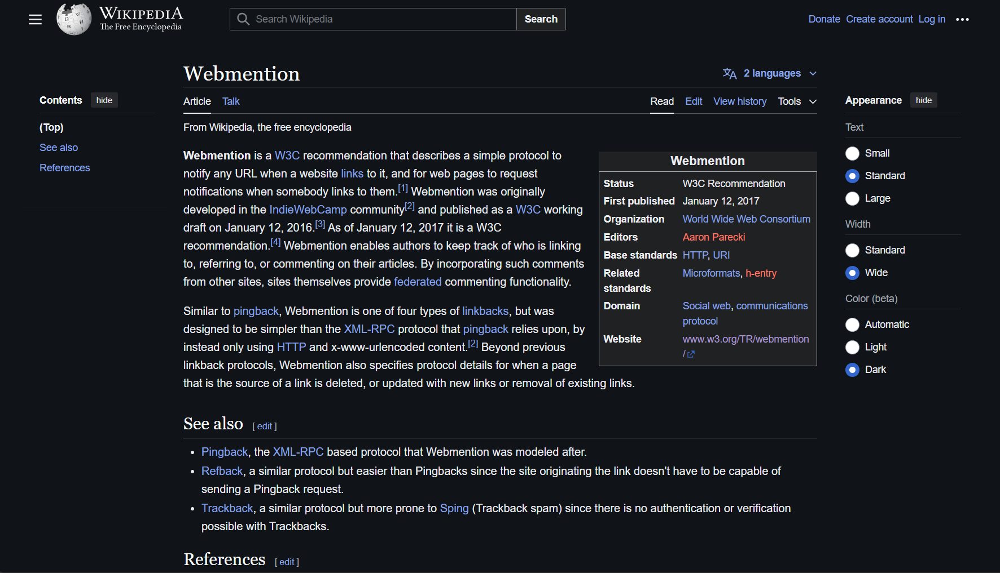

import { Slide, Presentation, SlideOnly, Note, About } from '@/components/slides'

<Presentation />

<Slide centered>
# ZOOOOOOM!

> Is everything big enough and are we in dark mode?

<Note>
- On the presenter screen
- Are the speaker notes big enough
</Note>

</Slide>

<Slide highlight centered>

# Software for you and your friends

</Slide>

<Slide centered>

# 410 Gone

> The web we lost

<Note>
- changed since invention
- academic sharing => space to explore
</Note>

</Slide>

How we use the internet had changed numerous times since it's invention. What started of as a repository for sharing academic information quickly spiraled into a new world for people to build and explore. 

In 2010, Tim Burners Lee wrote that the internet was a method by which "any person could share information with anyone else, anywhere"

<Slide centered>

> "The world wide web went live, on my physical desktop in Geneva, Switzerland, in December 1990. It consisted of one Web site and one browser, which happened to be on the same computer. The simple setup demonstrated a profound concept: that **any person could share information with anyone else, anywhere.**"
>
> - Tim Burners Lee, Long Live the Web: A Call for Continued Open Standards and Neutrality

<Note>
- In 2010 Tim Burners Lee wrote
- "any person could share information with anyone else, anywhere"
</Note>

</Slide>

This golden era was short lived however, with collapse of the dot com bubble and the later consolidation of internet power we ended up with a handful of companies that now run virtually every aspect of the world's economy. 

<Slide centered>

<Note>
- golden era short lived
- Dotcom bubble
- Consolidation of internet power
- run world economy
</Note>

</Slide>

Companies like Google gatekeeping information access at the price of ads and cookies

<Slide centered>

<Note>
- google gatekeeping info at price of ads and cookies
</Note>

</Slide>

Or Facebook toppling entire governments within a single news cycle

<Slide centered>
  

<Note>
- facebook toppling governments
</Note>
  
</Slide>

Oh, or that time that Microsoft tried to be the only browser

<Slide centered>

<Note>
- microsoft browser monopoly
- wikipedia no cookie banner, makes you think huh
</Note>

</Slide>

Yeah, Wikipedia actually doesn't have a cookie banner. Makes you think, huh.

<Slide>

# Welcome to 2024

- How did I get here?
- How do I leave?

<Note>
- course of the talk 
- where the past decades left us 
- problems we're faced with 
- mechanisms to understand where we are
- think about what the future of the internet can look like
</Note>

</Slide>

Over the course of this talk we're going to take a bit of an accounting of where the past few decades of the web has left us and what problems we're faced with as a result of it. We'll take a look at some different mechanisms through which we can understand our current position, and think about what the next few years of the internet need to look like

## Conway's law

Most of us have been in this industry long enough to have heard of Conway's law which loosely states that a system's design is constrained to mirror the structure of the organization that designed them

<Slide centered>

> "Organizations which design systems are constrained to produce designs which are copies of the communication structures of these organizations."
>
> — Melvin E. Conway, How Do Committees Invent?

<Note>
- conway's law
- system's design mirrors the structure of the organization that designed it
</Note>

</Slide>

This law is often used to talk about the development and architecture of the software we build.

It lets us think about why highly coupled organizations produce highly coupled software or how deeply hierarchical organizations always end up with some microservice driven mess. 

<Slide centered>

> It's difficult to manage software that is not well aligned to our structure

<Note>
- we can think about why software is unmaintainable
- architecture is not aligned to the structure of the org
</Note>

</Slide>

It also lets us consider why some software ends up being inherently unmanageable because of how the the architecture doesn't align to the way a company operates

<Slide centered>

<Note>
- phenomenon in which disabled-friendly features benefit browder groups than intended
- made for wheelchairs
- benefits
    - mothers with prams
    - you and your much too large cart of groceries
</Note>

</Slide>

There's a phenomenon known as the Curb Cut Effect in which disability-friendly features end up benefiting groups much larger than they were intended for. An example is in the Curb Cut above. Although initially designed for wheelchairs it ends up serving mothers with prams and you with your much-too-large cart of groceries

<Slide centered>

## The software we use

<Note>
- curb cuts let us navigate our spaces 
- sofware design forces us into patterns of behaviour 
- inversion of conways law
    - herds communities into specific shapes
</Note>

</Slide>

Just like curb cuts give us ways to navigate our spaces, certain styles of software design force us into certain patterns of behaviour

I think we can view this as an inversion of Conway's law - software forces us into the spaces it's left, herding us into communities of its choosing

There's a lot of danger when we consider who does this and the intentionality behind it. The organizations that control this structure in turn control the very social fabric that we participate in

<Slide centered>

## Who's the product

<Note>
- software we use is free
- do we think google just sells ads? 
- is value from the data in their ad platform?
- see product in real life, see later online 
- platforms know us better than we know ourselves
- behavior directed in so many unidentifiable ways
</Note>

</Slide>

Most of the software we use on a daily basis is "free". It's often not a huge leap to understand how these companies make money - do we think Google "just sells ads" or does the value come from the data they've built into their ad platform

Oftentimes we look at our phones and see a product that we just walked past in a store, or were just speaking to someone about - these platforms often know us better than we know ourselves. Our behavior is directed in so many unidentifiable ways

<Slide centered>

## Teenage face coverings

<Note>
- Early this year young people started covering their faces
- concern for how photos would be used 
- fear of beeing deepfaked
- right to be concerned
- people using video and audio deepfakes to scam 
- we're the product
- our data fuels the money printers
- our attention is the paper it's printed on
</Note>

</Slide>

Early this year we had the trend of young people refusing to be photographed, or covering their faces in photos out of concern for how their pictures would be used. General concerns of consent aside, the greater fear of being deep faked. And they were right to be concerned

Over the past few months we've seen the proliferation of scammers using video and audio fakes to scam people in a variety of different ways. Sometimes generated from just a short video of someone on the internet

It's clear to see that we're the product, our data is the fuel that's fed to the money printers. Our attention is the paper that it's printed on

<Slide centered>

## We can change things

<Note>

- There is hope
- We're in a position to change things 
- people who care about using technology to improve the world around us

</Note>

</Slide>

Don't despair, I think we're in a position to change this. Not just as people who make the internet but (I hope) as people who care about using technology to improve the world around us

<Slide centered>

## The Dark Forest

<Note>
 
- book the Three Body Problem
    - Dark forest theory of the universe 
    - sending message gets no response 
    - universe seemingly empty
    - actually it's quiet
    - everything in hiding away from predators
- dark forest theory of the web in 2019
    - internet as a dark forest
    - predators = ads, trolls, bots
    - rest of us have hidden into own private spaces, e.g. whatsapp, slack, discord
    - unable to reach anyone significantly far away from us
- feels like the opposite of the internet

</Note>

</Slide>

In the book The Three Body Problem, author Liu Cixin presents the dark forest theory of the universe. The author presents us with the "The Dark Forest Hypothesis" which describes a universe that is seemingly empty, as we send signals into it and get no response - surely there is no one out there - we believe the universe to be empty

However, if we view the universe as a forest at night, with predators waiting to attack - we understand why it's so quiet, everything is in hiding

"The Dark Forest Theory of the Web", introduced by Yancy Strickler in 2019 uses this as a perspective of the internet a few years ago, and I think it's more relevant now than ever. The internet as a dark forest, where the predators - ads, trolls and bots lurk. And as a result the rest of us have hidden away in our own private spaces, unable to reach anyone significantly far away from us

This seems like the opposite of what the internet is meant to be. This seems the opposite of what technology promised us

<Slide centered>

## Generative AI

<Note>

- Maggie Appleton  - Expanding Dark forest and generative AI 
- impact that gen AI will have on content 
- difficult to tell real peolpe from AI 
- content of the web will be lost in a sea of SEO garbage

</Note>

</Slide>

About a year ago Maggie Appleton published an article called "The Expanding Dark Forest and Generative AI". In it she talks about the impact that tools like Generative AI will have on the content around us. How it will become difficult for us to tell real people from AI, and how the information and content of the web will be lost in a mess of SEO optimized garbage

<Slide centered>

<Note>

- A short while later we see tweet about AI marketing
- thousands of articles 
- every chatGPT article, every midjourney image - hurts us in the long term 
- destroys the internet we have worked to build

</Note>

</Slide>

Just a few months ago I saw a tweet where someone in marketing shared how they managed to ramp up the traffic to their content sites by generating hundreds of thousands of articles. Every ChatGPT generated article, every Midjourney image - hurts us more and more in the long term and destroys the internet we've all worked so hard to create

<Slide centered highlight>

# 404 Internet Not Found

<Note>

- it looks like we're losing the web 
- we've discussed the current state 
- and how technology influences behavior
- but there's another internet out there

</Note>

</Slide>

Thus far we've established the relationship that we have with the web and how this technology forms our behavior

The thing is, this isn't the only way to use the internet. There's a whole world out there, you just need a way to see it

<Slide centered>

## An internet that can be

> Honesty, utility, community

<Note>

I have a vision of a web that's more than just ads and cookie banners

- honesty = use it to express ourselves, personal
- utility = get things done, news, taxes, notes 
- community = meet friends, share moments we care about, schedule next dinner
- as developers we're in a position to make this ideallistic vision accessible 
- there are a few ways we can do this

</Note>

</Slide>

The internet should be honest, informative, and personal. We should be able to use the web in a way that we want to within the boundaries that we draw, not in the spaces between the cookie banners

It's where we go to get things done. It's where we find our news, do out taxes, or keep our notes

But it's also where we meet our friends. It's where we share moments we care about or schedule the next dinner

As developers, we have a bit of a responsibility here. We're in a position to make this ideallistic vision accessible to everyone around this, and there are a few ways we can do this

<Slide centered>

## Honesty

> Digital gardens and the small web

<Note>
 
- small web of people 
- participate on our own terms, just an HTML file 
- growing trend of calling these spaces digital gardens
- public spaces, privately curated
- take the form of websites or wikis, can have communites
- organic spaces, explore ideas, share thoughts, express ourselves
- linkable, indexable pieces of our mind we put out into the world 
- take control of the internet we use
- allow people to find us and us to find them

</Note>

</Slide>

The small web is an internet made of people. Where we all can participate on our own terms. It's as easy a single HTML file

There's a growing trend of referring to these spaces as Digital Gardens. Digital gardens are public spaces that are privately curated, they're loose pieces of the internet that we allow to grow freely over time, that we occasionally tend to, add to, and clean up

Digital gardens usually take the form of websites or wikis, these can have communities around them. The idea is that these spaces are organic and allow us to explore ideas, share thoughts, and express ourselves

These are linkable and indexable pieces of our mind that we put into the world. Digital gardens let us take control of the internet we use. It's a place for our friends to find us and for us to find them

<Slide centered>

## Utility

> Open source, open formats

<Note>

- Most of the things we use can be =  open source + open formats
- Contribute to code as well as educate those around us
- Better experiences with propreity software with open formats
    - Open Document Format 
    - Markdown 
    - HTML - like PDFs but you can copy text from it

</Note>

</Slide>

Open source is great. Most of the things we use the internet for on a daily basis can be done using a combination of open source software or open formats

We can contribute here by educating and contributing. Open source isn't just about writing code, but also sharing value

There are loads of open source applications that we can use and make easier for others to use

Above this, there are ways that we can make our experiences within propreity software better well by making use of open formats like ODF or even markdown

Or heck, even HTML - it's like a PDF but you can actualy copy text from it

<Slide centered>

## Community

> Independent but not isolated

<Note>

- Owning spaces doesn't mean they need to be isolated 
- Small web can be connected 
- not just Hyperlinks - but a lot more

</Note>

</Slide>

Owning our spaces doesn't mean they need to be isolated. The small web can also be connected. The simplest way is by linking to things we care about but there are also other ways we can build into this

<Slide centered>

<Note>

- share content 
- more importantly consume it how we want 
- respect our preferences and privacy

</Note>

</Slide>

RSS feeds let us share our content, and more importantly - consume it in ways that we want and respect our privacy

<Slide centered>

<Note>

- groups of blogs or websites 
- interconnected communities 
- around a purpose or just some friends

</Note>

</Slide>

Blogrolls are groups of blogs and personal websites that are interconnected. Often driven by a specific purpose or theme but it can just as well be a group of your friends

<Slide>

<Note>

- open standards like web mentions 
- enable us to interact with content across the web
- kind of cross-site comments/tweets

</Note>

</Slide>

Additionally, there are also open standards such as WebMentions that enable us to share content across the web. Kind of like cross-site comments or tweets

<Slide centered>

# 301 Moved Permanently

<Note>

- While it looks a little bleak, we can change our trajectory 
- By being aware of how we fit into the context of the internet
- We can leave things better than we found it

</Note>

</Slide>

So, while the web we have looks a little bleak, there are things that we can do to change the trajectory of the internet. Through understanding how we fit into the greater context of the web we can hopefully leave it better than we found it

<Slide>

> Presentation @ [nabeelvalley.co.za/talks](https://www.nabeelvalley.co.za/talks/2024/24-10/software-for-your-friends)

</Slide>

# References and things to read 

- [Long Live the Web, Tim Burners Lee](https://www.scientificamerican.com/article/long-live-the-web/)
- [The Dark Forest and the Cozy Web, Maggie Appleton](https://maggieappleton.com/cozy-web)
- [The Expanding Dark Forest and Generative AI, Maggie Appleton](https://maggieappleton.com/ai-dark-forest)
- [The Dark Forest Theory of the Internet, Yancey Strickler](https://ystrickler.medium.com/the-dark-forest-theory-of-the-internet-7dc3e68a7cb1)
- [Blogrolls](https://blogroll.org/)
- [HTTP Status Codes, MDN](https://developer.mozilla.org/en-US/docs/Web/HTTP/Status)
- [Curb Cuts, 99% Invisible](https://99percentinvisible.org/episode/curb-cuts/)
- [Curb Cut Effect, Wikipedia](https://en.wikipedia.org/wiki/Curb_cut_effect)
- [Webmentions, Wikipedia](https://en.wikipedia.org/wiki/Webmention)
- [United States v. Microsoft Corp., Wikipedia](https://en.wikipedia.org/wiki/United_States_v._Microsoft_Corp.)
