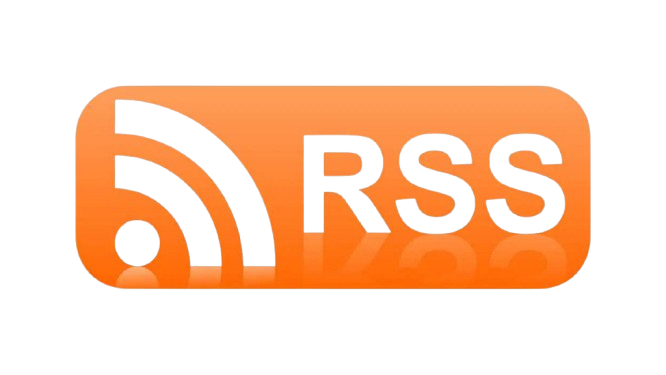

import { Slide, Presentation, SlideOnly } from '@/components/slides'

<Presentation />

<Slide highlight centered>

# Software for you and your friends

</Slide>

<Slide centered>

# The web we lost

</Slide>

How we use the internet had changed numerous times since it's invention. What started of as a repository for sharing academic quickly spiraled into a new world for people to build and explore. 

In 2010, Tim Burners Lee wrote that the inteneryt was a method by which "any person could share information with anyone else, anywhere"

<Slide centered large>

> "The world wide web went live, on my physical desktop in Geneva, Switzerland, in December 1990. It consisted of one Web site and one browser, which happened to be on the same computer. The simple setup demonstrated a profound concept: that **any person could share information with anyone else, anywhere.**"
>
> - Tim Burners Lee, Long Live the Web: A Call for Continued Open Standards and Neutrality

</Slide>

This golden era was short lived however, with collapse of the dot com bubble and the later consolidation of internet power we ended up with a handful of companies that now run virtually every aspect of the world's economy. 

<Slide centered>

</Slide>

Facebook toppling entire governments within a single news cycle

<Slide centered>
  

  
</Slide>

Or Google gatekeeping information access at the price of ads and cookies

<Slide centered>

</Slide>

Oh, or that time that Microsoft tried to be the only browser

<Slide centered>

</Slide>

Yeah, Wikipedia actually doesn't have a cookie banner. Makes you think, huh.

<Slide large>

# Welcome to 2024

- How did I get here?
- How do I leave?

</Slide>

Over the course of this talk we're going to take a bit of an accounting of where the past few decades of the web has left us and what problems we're faced with as a result of it. We'll take a look at some different mechanisms through which we can understand our current position, and think about what the next few years of the internet need to look like

## Conway's law

Most of us have been in this industry long enough to have heard of Conway's law which loosely states that a system's design is constrained to mirror the structure of the organization that designed them

<Slide centered>

> "Organizations which design systems are constrained to produce designs which are copies of the communication structures of these organizations."
>
> — Melvin E. Conway, How Do Committees Invent?

</Slide>

This law is often used to talk about the development and architecture of the software we build.

It lets us think about why highly coupled organizations produce highly coupled software or how deeply hierarchical organizations always end up with some microservice driven mess. 

<Slide centered large>

> It's difficult to manage software that is not well aligned to our structure

</Slide>

It also lets us consider why some software ends up being inherently unmanageable because of how the the architecture doesn't align to the way a company operates

<Slide centered>

</Slide>

There's a phenomenon known as the Curb Cut Effect in which disability-friendly features end up benefiting groups much larger than they were intended for. An example is in the Curb Cut above. Although initially designed for wheelchairs it ends up serving mothers with prams and you with your much-too-large cart of groceries

<Slide centered large>

## The software we use

</Slide>

Just like curb cuts give us ways to navigate our spaces, certain styles of software design force us into certain patterns of behaviour

I think we can view this as an inversion of Conway's law - software forces us into the spaces it's left, herding us into communities of its choosing

There's a lot of danger when we consider who does this and the intentionality behind it. The organizations that control this structure in turn control the very social fabric that we participate in

<Slide centered>

## Who's the product

</Slide>

Most of the software we use on a daily basis is "free". It's often not a huge leap to understand how these companies make money - do we think Google "just sells ads" or does the value come from the data they've built into their ad platform

Oftentimes we look at our phones and see a product that we just walked past in a store, or were just speaking to someone about - these platforms often know us better than we know ourselves. Our behavior is directed in so many unidentifiable ways

<Slide centered>

## Teenage face coverings

</Slide>

Early this year we had the trend of young people refusing to be photographed, or covering their faces in photos out of concern for how their pictures would be used. General concerns of consent aside, the greater fear of being deep faked. And they were right to be concerned

Over the past few months we've seen the proliferation of scammers using video and audio fakes to scam people in a variety of different ways. Sometimes generated from just a short video of someone on the internet

It's clear to see that we're the product, our data is the fuel that's fed to the money printers. Our attention is the paper that it's printed on

<Slide centered>

## We can change things

</Slide>

Don't despair, I think we're in a position to change this. Not just as people who make the internet but (I hope) as people who care about using technology to improve the world around us

<Slide centered>

## The Dark Forest

</Slide>

In the book The Three Body Problem, author Liu Cixin presents the dark forest theory of the universe. The author presents us with the "The Dark Forest Hypothesis" which describes a universe that is seemingly empty, as we send signals into it and get no response - surely there is no one out there - we believe the universe to be empty

However, if we view the universe as a forest at night, with predators waiting to attack - we understand why it's so quiet, everything is in hiding

"The Dark Forest Theory of the Web", introduced by Yancy Strickler in 2019 uses this as a perspective of the internet a few years ago, and I think it's more relevant now than ever. The internet as a dark forest, where the predators - ads, trolls and bots lurk. And as a result the rest of us have hidden away in our own private spaces, unable to reach anyone significantly far away from us

This seems like the opposite of what the internet is meant to be. This seems the opposite of what technology promised us

<Slide centered>

</Slide>

About a year ago Maggie Appleton published an article called "The Expanding Dark Forest and Generative AI". In it she talks about the impact that tools like Generative AI will have on the content around us. How it will become difficult for us to tell real people from AI, and how the information and content of the web will be lost in a mess of SEO optimized garbage

Just a few months ago I saw a tweet where someone in marketing shared how they managed to ramp up the traffic to their content sites by generating hundreds of thousands of articles. Every ChatGPT generated article, every Midjourney image - hurts us more and more in the long term and destroys the internet we've all worked so hard to create

<Slide centered highlight>

# 404 Internet Not Found

</Slide>

Thus far we've established the relationship that we have with the web and how this technology forms our behavior

The thing is, this isn't the only way to use the internet. There's a whole world out there, you just need a way to see it

<Slide centered>

## An internet that can be

> Honesty, utility, community

</Slide>

The internet should be honest, informative, and personal. We should be able to use the web in a way that we want to within the boundaries that we draw, not in the spaces between the cookie banners

It's where we go to get things done. It's where we find our news, do out taxes, or keep our notes

But it's also where we meet our friends. It's where we share moments we care about or schedule the next dinner

In order for us to take ownership of our spaces we need to understand how they function. There are a few ways we can do this

As developers, we have a bit of a responsibility here. We're in a position to make this ideallistic vision accessible to everyone around this, and there are a few ways we can do this

<Slide centered>

## Honesty

> Digital gardens and the small web

</Slide>

The small web is an internet made of people. Where we all can participate on our own terms. It's as easy a single HTML file

There's a growing trend of referring to these spaces as Digital Gardens. Digital gardens are public spaces that are privately curated, they're loose pieces of the internet that we allow to grow freely over time, that we occasionally tend to, add to, and clean up

Digital gardens usually take the form of websites or wikis, these can have communities around them. The idea is that these spaces are organic and allow us to explore ideas, share thoughts, and express ourselves

These are linkable and indexable pieces of our mind that we put into the world. Digital gardens let us take control of the internet we use. It's a place for our friends to find us and for us to find them

<Slide centered>

## Utility

> Open source, open formats

</Slide>

Open source is great. Most of the things we use the internet for on a daily basis can be done using a combination of open source software or open formats

We can contribute here by educating and contributing. Open source isn't just about writing code, but also sharing value

There are loads of open source applications that we can use and make easier for others to use

Above this, there are ways that we can make our experiences within propreity software better well by making use of open formats like ODF or even markdown

<Slide centered>

## Social

> Independent but not isolated

</Slide>

Owning our spaces doesn't mean they need to be isolated. The small web can also be connected. The simplest way is by linking to things we care about but there are also other ways we can build into this

<Slide centered>

</Slide>

Blogrolls are groups of blogs and personal websites that are interconnected. Often driven by a specific purpose or theme but it can just as well be a group of your friends

<Slide centered>

</Slide>

RSS feeds let us share our content, and more importantly - consume it in ways that we want and respect our privacy

Additionally, there are also open standards such as WebMentions that enable us to share content across the web

<Slide centered>

# 301 Moved Permanently

</Slide>

So, while the web we have looks a little bleak, there are things that we can do to change the trajectory of the internet and hopefully leave it bettern than we found it