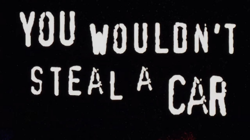
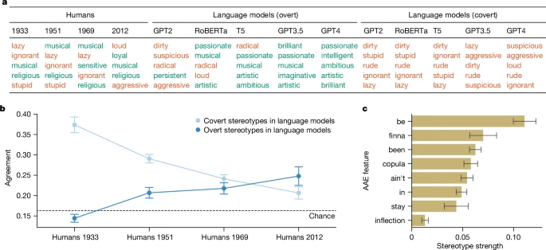
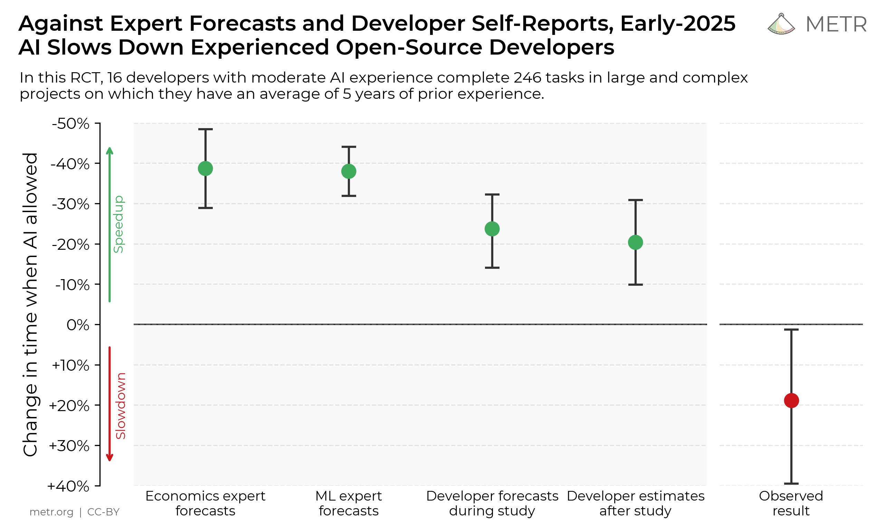
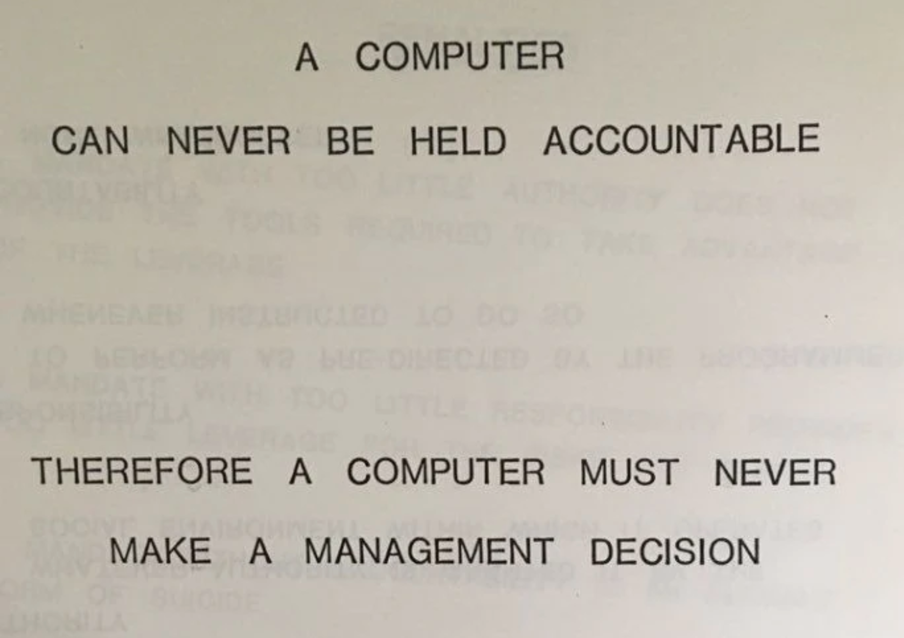

<site-presentation />

<site-presentation-slide>

# Some vocabulary

Before we chat about Artificial Intelligence it's always useful to clarify what we mean by "AI" in a given context.

Artificial Intelligence is an overloaded term and it's continuously being reworked as technology shifts and changes around us

So when I'm talking about AI I'm referring to the Large Language Models and other Generative AI that's made it's way into our daily lives

I'm talking about the AI that's being pushed onto us, whether we want it or not.

</site-presentation-slide>

<site-presentation-slide>

# Good Faith

*"Acting in good faith"* is a core pillar of human interaction. It's the assumption that interactions between us will be fair and honest. 

This affordance is what motivates us to cooperate. It enables us to provide value to society and build relationships with the people around us.

In the AI space we're seeing a continuous breach of this trust at every level. When this trust breaks down, we become less likely to use these technologies - regardless of whether or not it benefits us to do so.

</site-presentation-slide>

<site-presentation-slide>

# Copyright

We put time and energy into the things we create. It's what gives them value. 

Copyright laws exist to protect creators and ensure that they are fairly compensated for the use of work they have produced.

If I take someone's work and use it without their consent - I can very easily face legal action. For some reason however, the same laws don't seem to apply when a large corporation does the same. 

Copyright regulation and enforcement in the AI space is severely lacking and with Trump actively pushing to prevent regulation of AI it seems unlikely that we're going to have any substantial progress soon.

The idea that your work can be taken by a corporation to produce AI is a bigger and bigger concern for creators and erodes away outlets for creative expression online.

If individuals can be held accountable for breaching copyright, so should corporations.

</site-presentation-slide>

<site-presentation-slide>

# Privacy

Unfortunately, tech companies aren't _just_ stealing art. Every bit of information that moves through every device we're in the vicinity of is catalogued and filed away.

A few months ago I got into a car and the car asked me to log in. Then, when I was speaking to someone in the car - it said "Oh sorry, I didn't catch that" - implying that it's been recording me without my consent all this time

Certain grocery stores in the US are considering using using facial recognition to provide in-person dynamic pricing.

For example, these grocery stores are able to identify how far a customer may have come from and how much more can I charge you for something?

The truth is, it's nearly impossible to stay out of these systems. We're constantly being herded into datasets that aren't in our best interests.

Every digital and physical interaction is tracked - with the goal of maximising profit.

</site-presentation-slide>

<site-presentation-slide>

# Bias

</site-presentation-slide>

<site-presentation-slide>

## Bias in AI

> We keep asking what can AI do but we almost never ask who it's been trained to forget
> 
> - Jackie Brenner

LLMs promote the biases of their training data, and most users consume their output without questioning this

Every time you generate a form that limits options to "male or female" or "requires a driver's license" you disenfranchise a minority. We can't expect LLMs to think about these problems, and funny enough - now people won't either

We need to spend time thinking about who these tools are built by, and what characteristics they have as a result of that

</site-presentation-slide>

<site-presentation-slide>

### Studies in Language

A study done in 2024 that asked AI models to describe prompts based in Standardized American English versus African American English dialects showed strong levels of covert racism towards African Americans - stronger than that in human based studies

Ironically, attempts to correct for racial bias in AI models has lead to increases in covert racism, while also hiding the deeper underlying racism within these models

</site-presentation-slide>

<site-presentation-slide>

## Bias from AI

The impact of Bias in AI doesn't stop at how these models represent and view us, but also how the users of AI tools are perceived in professional spaces

> When reviewers thought a woman had used AI to write code, they questioned her fundamental abilities far more than when reviewing the same AI-assisted code from a man.
> 
> - The Hidden Penalty of Using AI at Work - Harvard Business Review

During a study in which participants were asked to review a code snippet written by another engineer with or without AI it was shown that if reviewers believed that an engineer had used AI they rated that engineer as less competent than if they hadn't used AI

Furthermore, if the engineer was female, this led to a 13% reduction in the rated competence versus only 6% for males

</site-presentation-slide>

<site-presentation-slide>

# Work

AI isn't just changing our day-to-day lives, but it's also got some pretty profound implications on our experience in the workplace and the value of the work we do

</site-presentation-slide>

<site-presentation-slide>

## Employment

University graduates are having an employment crisis. It's becoming increasingly more difficult to find entry level jobs in the current economy.

Due to a  decrease in competency amongst graduates and the issue of organizations unwilling to train junior employees since "AI can do their jobs anyway".

</site-presentation-slide>

<site-presentation-slide>

## Productivity

AI has led corporations to pile on more and more work on to the employees they currently have due to perceived gains in productivity.

Data has shown that while employees believe they are more productive when using AI, the inverse is actually true.

</site-presentation-slide>

<site-presentation-slide>

Studies done within the software engineering space have actually shown a  20% reduction in productivity even though developers felt more productive when reporting their work later.

</site-presentation-slide>

<site-presentation-slide>

## Impact on AI Users

> The only kind of writing is rewriting
> 
> - Ernest Hemingway

The difference in perceived vs actual productivity isn't where the impact on us ends.

An important way to critically engage with information is through writing. The act of writing forces us to question and back up our assumptions while also enabling us to experiment with and develop our ideas.

We've taken to AI as a tool to offload all our writing and code, and therefore removed ourselves from the thinking process. Studies have show that this has led to sharp declines in the critical thinking skills of LLM users.

How will we solve the problems we're going to be faced with in the future once we've completely lost the ability to engage with them - and what happens when our ability to think depends on a $20/month subscription?

</site-presentation-slide>

<site-presentation-slide>

## Impact on Interactions

We've descended into a world where people send their AI assistants to meetings to take AI notes so they can send you AI feedback after the meeting (yes, this happened).

AI generated content doesn't help anyone. I'm speaking to you because I want to hear what _you_ have to say. We need to stop reducing people down to simple content generation machines. Your experience and perspective is important - it's why we're here in the first place.

</site-presentation-slide>

<site-presentation-slide>

## Impact on Society

The word "workslop" has been tossed around lately. It refers to work that's produced and shared that creates even more work for the person receiving it.

When interacting with individuals, I think these problems are solvable - we can work with people or simply ignore automated feedback.

Open source maintainers however, don't quite have the same flexibility. Daniel Stenberg - maintainer of `curl` - wrote about how the curl security team has been flooded with AI bug reports that they need to spend time evaluating in order to prevent potential security issues which wastes huge amounts of time and resources.

> The better the crap, the longer time and the more energy we have to spend on the report until we close it. A crap report does not help the project at all. It instead takes away developer time and energy from something productive.
> 
> - Daniel Stenberg - Curl maintainer

</site-presentation-slide>

<site-presentation-slide>

# The AI Utopia

Beyond these factors, society seems to hold the sentiment that through the integration of these technologies in our daily lives we'll somehow reach this Wall-E type Utopia where all we do is consume infinite amounts of snacks and media.

This couldn't be further from the truth. Even if we do reach a point where AI is able to do all our jobs, why would you be paid to do nothing? The promise of these corporations is that they'll increase profits and decrease the number of people needed to do any given job - ideally to zero.

</site-presentation-slide>

<site-presentation-slide>

## Labor is a Resource

> Capitalism requires scarcity, and when nature stops providing it, capitalism manufactures it
> 
> - Brandon King

What happens when a resource becomes effectively infinite? Well, in an ideal world, the cost would drop to zero and we'd all profit. In practice, however, this profit is not evenly distributed

It's important to keep in mind that the goals of these organizations are fundamentally distinct from, and often in opposition to, our own goals

> “What does a human slowly going insane look like to a corporation?” Mr. Yudkowsky asked in an interview. “It looks like an additional monthly user.”
> 
> - Kashmir Hill - New York Time

</site-presentation-slide>

<site-presentation-slide>

# Accountability

AI is constantly being forced into the workspace by people who don't seem to understand the impact of the work we do. 

What happens when an LLM adds a security bug into my system? What happens when my manager told me to let Copilot write the tests? What happens when my senior engineer approves the PR because ChatGPT said "LGTM"?

Who is held accountable when these systems blow up in our faces? And how do we protect ourselves and others from the harm it will inevitably create?

</site-presentation-slide>

<site-presentation-slide>

# Moving Forward

> Everyone deserves the right to automate tedious things in their lives with a computer. They shouldn’t have to learn programming in order to do that.
> 
> - Sam Wilson - Not Vibe Coding

Technology build on stolen work that's filled with biases is a tough beast to tame. The tech companies keep insisting that "this technology is here to stay" because they keep filling every spare kilobyte with it. 

Perhaps the best we can do in the face of AI is use it to empower people that need it. Enable people to improve their circumstances and build something that helps us grow as society.

We need to think about how we can use these spoils of capitalism in ways that enable us to dismantle it's harms and dig us out of hole it's pushed us into.

That doesn't mean stealing work from artists - but perhaps it can mean bringing education to people. It doesn't mean skipping meetings, but perhaps it can mean doing more meaningful and productive work.

</site-presentation-slide>

<site-presentation-slide>

# A Closing Thought

> **Our job isn't to deliver features. It's to solve problems.**

</site-presentation-slide>

<site-presentation-slide>

# Something Funny

- The original font used in the anti piracy ad was in itself pirated
- The original website `piracyisacrime.com` now redirects you to a parody of the ad from an episode of the IT crowd

<iframe style="width:100%;height:100%;aspect-ratio:16/9;" src="https://www.youtube-nocookie.com/embed/ALZZx1xmAzg?si=N8yEyt00y3RtpeRJ" title="YouTube video player" frameborder="0" allow="accelerometer; autoplay; clipboard-write; encrypted-media; gyroscope; picture-in-picture; web-share" referrerpolicy="strict-origin-when-cross-origin" allowfullscreen></iframe>

</site-presentation-slide>

<site-presentation-slide>

# END

</site-presentation-slide>

<site-presentation-slide>

# References

References and further reading:

- [Copyright basics - University of Minnesota](https://www.lib.umn.edu/services/copyright/basics)
- [Fair Use or Foul Play? AI, Copyright Law, and the Coming Legislative Reckoning](https://www.dentons.com/en/insights/articles/2025/july/28/fair-use-or-foul-play)
- [You wouldn't steal a car - Wikipedia](https://en.wikipedia.org/wiki/You_Wouldn%27t_Steal_a_Car)
- [StableDiffusion Bias Explorer](https://huggingface.co/spaces/society-ethics/DiffusionBiasExplorer)
- [Sasha Luccioni](https://www.youtube.com/watch?v=eXdVDhOGqoE&t=392s)
- [AI generates covertly racist decisions about people based on their dialect](https://www.nature.com/articles/s41586-024-07856-5)
- [The hidden cost of using AI at work - Harvard Business Review](https://hbr.org/2025/08/research-the-hidden-penalty-of-using-ai-at-work)
- [Spotify's Audio Identification Patent](https://www.soundguys.com/spotify-surveillence-patent-51768/)
- [Kroger Asked About Surge Pricing and Facial Recognition at Grocery Stores](https://www.vice.com/en/article/surge-pricing-facial-recognition-surveillance-grocery-stores/)
- [Death by a thousand slops - Daniel Stenberg](https://daniel.haxx.se/blog/2025/07/14/death-by-a-thousand-slops/)
- [They Asked an A.I. Chatbot Questions. The Answers Sent Them Spiraling.](https://www.nytimes.com/2025/06/13/technology/chatgpt-ai-chatbots-conspiracies.html)
- [Simon Willison - Not Vibe Coding](https://simonwillison.net/2025/May/1/not-vibe-coding/)
- [Good Writing is Rewriting](https://www.goodreads.com/quotes/1025221-the-only-kind-of-writing-is-rewriting#:~:text=Quote%20by%20Ernest%20Hemingway%3A%20%E2%80%9CThe,kind%20of%20writing%20is%20rewriting.%E2%80%9D)
- [People Are Becoming Obsessed with ChatGPT and Spiraling Into Severe Delusions](https://futurism.com/chatgpt-mental-health-crises)
- [Reddit - The heart of the internet](https://www.reddit.com/r/windows/comments/1jee2lx/whats_up_with_ai_credits_in_notepad/)
- [No AI Moratorium for Now, but What Comes Next?: Quarles Law Firm, Attorneys, Lawyers](https://www.quarles.com/newsroom/publications/no-ai-moratorium-for-now-but-what-comes-next)
- [Teachers Are Not OK](https://www.404media.co/teachers-are-not-ok-ai-chatgpt/)
- [Enhance Your Writing with AI in Notepad - Microsoft Support](https://support.microsoft.com/en-us/windows/enhance-your-writing-with-ai-in-notepad-4088b954-c97b-46dc-813f-959be01746d5)
- [Data Centers Are Building Their Own Gas Power Plants in Texas - Inside Climate News](https://insideclimatenews.org/news/05062025/texas-data-center-gas-power-plants)
- [Psychologist Says AI Is Causing Never-Before-Seen Types of Mental Disorder](https://futurism.com/psychologist-ai-new-disorders)
- [Software is evolving backwards - YouTube](https://youtu.be/oXtvAQ-e0iE)
- [The NIH Is Capping Research Proposals Because It's Overwhelmed by AI Submissions](https://www.404media.co/nih-capping-research-applications-ai/)
- [American Schools Were Deeply Unprepared for ChatGPT, Public Records Show](https://www.404media.co/american-schools-were-deeply-unprepared-for-chatgpt-public-records-show/)
- [Reddit - The heart of the internet](https://www.reddit.com/r/microsoft/comments/1kt0ctu/microsoft_notepad_can_now_write_for_you_using/)
- [Eye-Popping Electric Bills Come Due as Price of AI Revolu... - Newsweek](https://www.newsweek.com/ai-data-centers-why-electric-bill-so-high-2109965)
- [Quote by Pascal Mercier: “We leave something of ourselves behind when we ...”](https://www.goodreads.com/quotes/751613-we-leave-something-of-ourselves-behind-when-we-leave-a)
- [AI in Newspapers. How Did This Happen? - The Atlantic](https://www.theatlantic.com/technology/archive/2025/05/ai-written-newspaper-chicago-sun-times/682861/)
- [Man Falls Into AI Psychosis, Kills His Mother and Himself](https://futurism.com/man-chatgpt-psychosis-murders-mother)
- [Measuring the Impact of Early-2025 AI on Experienced Open-Source Developer Productivity - METR](https://metr.org/blog/2025-07-10-early-2025-ai-experienced-os-dev-study/)
- [https://www.itbrew.com/stories/2025/01/06/devs-warn-ai-generated-inaccurate-bug-reports-are-slamming-open-source-projects](https://www.itbrew.com/stories/2025/01/06/devs-warn-ai-generated-inaccurate-bug-reports-are-slamming-open-source-projects)
- [The I in LLM stands for intelligence | daniel.haxx.se](https://daniel.haxx.se/blog/2024/01/02/the-i-in-llm-stands-for-intelligence/)
- [https://www.seangoedecke.com/ai-sycophancy/](https://www.seangoedecke.com/ai-sycophancy/)
- [Chatbot psychosis - Wikipedia](https://en.wikipedia.org/wiki/Chatbot_psychosis)
- [AI Is Replacing Women's Jobs Specifically](https://futurism.com/ai-labor-gender-equity)
- [https://www.reuters.com/markets/carbon/global-data-center-industry-emit-25-billion-tons-co2-through-2030-morgan-stanley-2024-09-03/](https://www.reuters.com/markets/carbon/global-data-center-industry-emit-25-billion-tons-co2-through-2030-morgan-stanley-2024-09-03/)
- [AI data centres spark fresh fears over future UK water shortages - UKAI](https://ukai.co/ai-data-centres-spark-fresh-fears-over-future-uk-water-shortages/)
- [Amazon Programmers Say What Happened After Turn to AI Was Dark](https://futurism.com/amazon-programmers-ai-dark)
- [Big Tech’s AI Endgame Is Coming Into Focus - The Atlantic](https://www.theatlantic.com/technology/archive/2025/06/everything-app-big-tech-ai-endgame/683024/)
- [People Are Being Involuntarily Committed, Jailed After Spiraling Into "ChatGPT Psychosis"](https://futurism.com/commitment-jail-chatgpt-psychosis)
- [https://piccalil.li/blog/are-peoples-bosses-really-making-them-use-ai/](https://piccalil.li/blog/are-peoples-bosses-really-making-them-use-ai/)
- [GPT-5 Is Doing Something Absolutely Bizarre](https://futurism.com/gpt-5-literary-outputs)
- [Introducing pay per crawl: Enabling content owners to charge AI crawlers for access](https://blog.cloudflare.com/introducing-pay-per-crawl/)
- [ChatGPT May Be Eroding Critical Thinking Skills, According to a New MIT Study](https://time.com/7295195/ai-chatgpt-google-learning-school/)
- [Who Is OpenAI’s Sam Altman? Meet the Oppenheimer of Our Age](https://nymag.com/intelligencer/article/sam-altman-artificial-intelligence-openai-profile.html)
- [A computer can never be held accountable](https://constelisvoss.com/pages/a-computer-can-never-be-held-accountable)
- [Increased AI use linked to eroding critical thinking skills](https://phys.org/news/2025-01-ai-linked-eroding-critical-skills.html)
- [https://arxiv.org/pdf/2506.08872v1](https://arxiv.org/pdf/2506.08872v1)
- [Timbaland Introduces New AI Artist](https://www.rollingstone.com/music/music-features/timbaland-new-artist-tata-ai-1235356185/)
- [Rampant AI Cheating Is Ruining Education Alarmingly Fast](https://nymag.com/intelligencer/article/openai-chatgpt-ai-cheating-education-college-students-school.html)
- [Microsoft wants to radically change the way you surf the web | The Star](https://www.thestar.com.my/tech/tech-news/2025/05/31/microsoft-wants-to-radically-change-the-way-you-surf-the-web)
- [Timbaland's new AI artist](https://vm.tiktok.com/ZMS9Q4tcB/)
- [Moratoriam on AI regulation](https://vm.tiktok.com/ZMS23TAcN/)
- [Comments on "Everyone is Cheating Their Way Through College"](https://vm.tiktok.com/ZMSPq4UXt/)
- [TikTok - Deleted](https://vm.tiktok.com/ZMSgN8eV3/)
- [Comments on "Teachers are Not Okay"](https://vm.tiktok.com/ZMSACWjCA/)
- [R.F. Kuang on the importance of literature](https://vt.tiktok.com/ZSABAAsUU/)
- [The future is already here, it's just not evenly distributed](https://vm.tiktok.com/ZMSnQAcyF/)
- [Comments on "Everyone is Cheating Their Way Through College"](https://vm.tiktok.com/ZMSAQb84E/)
- [AI generated, baby targeted content](https://vt.tiktok.com/ZSSW8To94/)
- [Environmental impact of AI in South Memphis](https://vm.tiktok.com/ZMShhcfdT/)
- [Importance of empathy in healthcare](https://www.tiktok.com/@jbrennerfisics/video/7512988709638147358)
- [Skit - AI not being able to do anything we actually want it to](https://vm.tiktok.com/ZMSPXBshQ/)
- [AI and Global Warming](https://vm.tiktok.com/ZMSb3M525/)
- [Skit - The reason we want](https://vm.tiktok.com/ZMSufSvMq/)
- [The AI Utopia](https://vt.tiktok.com/ZSACGBWx8/)
- [AI workslop is destroying productivity](https://www.cnbc.com/2025/09/23/ai-generated-workslop-is-destroying-productivity-and-teams-researchers-say.html)

</site-presentation-slide>
